<div align="center">

# 🐳 Docker Mastery — Zero to Interview-Ready

### The complete, beginner-friendly guide to Docker: Fundamentals → Dockerfiles → Compose → Security → CI/CD → Kubernetes → Interview Prep → 13 Hands-on Projects

[](#)
[](#)
[](#14--docker-interview-preparation)

</div>

---

## 👋 Who This Guide Is For

You don't need to know **anything** about Docker to start. If you can open a terminal, you're ready.

By the end of this single document, you will be able to:

- ✅ Explain what Docker is and why it exists — in your own words, not memorized lines
- ✅ Containerize any application (Python, Node, React, full stacks)
- ✅ Write clean, secure, optimized Dockerfiles
- ✅ Run multi-container apps with Docker Compose
- ✅ Debug a broken container like an engineer, not by guessing
- ✅ Walk into a Docker interview and answer confidently — fundamentals, scenarios, and troubleshooting alike

> **How this guide was built:** grounded in Docker's official documentation, community roadmaps, the most-starred Docker learning repositories on GitHub, real interview experiences shared across developer communities, and the questions companies are actually asking in 2025–2026 — not just recycled textbook explanations.

Read it top to bottom if you're a beginner. Already comfortable with the basics? Jump straight to whatever section you need from the table of contents below.

---

## 🧭 How to Read the Callout Boxes in This Guide

> 📝 **Note** — Extra context that helps a concept click.

> 💡 **Tip** — A shortcut, habit, or trick used by experienced engineers.

> ⚠️ **Warning** — A mistake that will cost you time (or an outage) if you miss it.

> 🎯 **Interview Tip** — Exactly how this topic tends to show up in interviews.

---

## 📚 Table of Contents

### Learning Path
- [00 — Prerequisites: What You Need to Know Before Docker Makes Sense](#00-prerequisites-what-you-need-to-know-before-docker-makes-sense)
- [01 — Docker Fundamentals: What It Is and Why It Exists](#01-docker-fundamentals-what-it-is-and-why-it-exists)
- [02 — Docker Architecture & Core Objects](#02-docker-architecture-core-objects)
- [03 — Docker CLI & Working with Images](#03-docker-cli-working-with-images)
- [04 — Dockerfile Mastery](#04-dockerfile-mastery)
- [05 — Volumes, Bind Mounts & Data Persistence](#05-volumes-bind-mounts-data-persistence)
- [06 — Docker Networking](#06-docker-networking)
- [07 — Docker Compose: Running Multi-Container Applications](#07-docker-compose-running-multi-container-applications)
- [08 — Environment Variables, Secrets, Resource Limits & Health Checks](#08-environment-variables-secrets-resource-limits-health-checks)
- [09 — Docker Security Best Practices](#09-docker-security-best-practices)
- [10 — Debugging & Troubleshooting Docker](#10-debugging-troubleshooting-docker)
- [11 — Performance Optimization](#11-performance-optimization)
- [12 — CI/CD Integration: Docker with GitHub Actions](#12-cicd-integration-docker-with-github-actions)
- [13 — Docker in the Cloud & Introduction to Kubernetes](#13-docker-in-the-cloud-introduction-to-kubernetes)
- [14 — 🎯 Docker Interview Preparation](#14-docker-interview-preparation)

### Reference
- [🧰 Docker Cheat Sheet & Command Reference](#docker-cheat-sheet-command-reference)

### Hands-on Projects (progressively harder)
- [Project 01 — Hello World 🐣](#project-01-hello-world)
- [Project 02 — Nginx Static Site 🌐](#project-02-nginx-static-site)
- [Project 03 — Ubuntu Sandbox 🧪](#project-03-ubuntu-sandbox)
- [Project 04 — MySQL 🗄️](#project-04-mysql)
- [Project 05 — Redis ⚡](#project-05-redis)
- [Project 06 — Python App 🐍](#project-06-python-app)
- [Project 07 — Flask App 🌶️](#project-07-flask-app)
- [Project 08 — Node App 🟢](#project-08-node-app)
- [Project 09 — React App ⚛️](#project-09-react-app)
- [Project 10 — MERN Stack 🍃⚛️](#project-10-mern-stack)
- [Project 11 — Flask + MySQL 🌶️🗄️](#project-11-flask-mysql)
- [Project 12 — FastAPI + PostgreSQL ⚡🐘](#project-12-fastapi-postgresql)
- [Project 13 — Multi-Container Capstone 🏆](#project-13-multi-container-capstone)

---

## 🚀 Quick Start

```bash
# 1. Verify Docker is installed
docker --version
docker compose version

# 2. Try the simplest possible container
docker run hello-world

# 3. Then jump into Project 01 near the bottom of this guide and build your way up
```

Don't have Docker installed yet? Grab **Docker Desktop** (Windows/Mac) or **Docker Engine** (Linux) from the [official install docs](https://docs.docker.com/get-started/get-docker/) — installation steps change often enough that it's better to follow the live page than a snapshot here.

---

## 00 — Prerequisites: What You Need to Know Before Docker Makes Sense

Docker is not magic. It's built entirely on top of ordinary Linux features. If you understand a handful of basic ideas first, every future Docker concept will feel obvious instead of mysterious. This chapter takes 15 minutes and will save you hours of confusion later.

You do **not** need to be a Linux expert. You just need these building blocks.

---

### 1. What is a Process?

A **process** is simply a running program. When you double-click a game, open a browser, or run `python app.py`, the operating system creates a process for it — gives it some memory, some CPU time, and an identity (a Process ID, or PID).

```bash
# See all running processes on Linux/Mac
ps aux

# See it live, updating
top
```

> 📝 **Note** — A container, at its core, is just **one or more isolated processes** running on your machine. There is no separate "container operating system" running underneath — it's the same Linux kernel your host uses, just with the process fenced off. This single idea unlocks almost everything else in this repo.

---

### 2. What is a Port?

Programs that talk over a network (web servers, databases, APIs) don't just "run" — they **listen** on a numbered door called a **port**, so incoming traffic knows where to go.

- A web server usually listens on port `80` (HTTP) or `443` (HTTPS)
- MySQL usually listens on port `3306`
- Postgres usually listens on port `5432`
- Redis usually listens on port `6379`

| Concept | Analogy |
|---|---|
| IP Address | The street address of a building |
| Port | The specific apartment number inside that building |

When you later see `docker run -p 8080:80`, you're saying: *"Take traffic arriving at port 8080 on my machine, and forward it to port 80 inside the container."* That single idea — port mapping — is 90% of Docker networking confusion, solved.

---

### 3. What is Networking (the 2-minute version)?

You need just three ideas:

1. **Localhost / 127.0.0.1** — a special address that always means "this machine, talking to itself."
2. **DNS** — a phonebook that turns names (`google.com`) into IP addresses (`142.250.premium.something`). Docker has its own mini-DNS system for containers to find each other by name.
3. **Client vs Server** — the server listens and waits; the client connects to it. A browser is a client; a web server is a server. Containers can be either, or both.

---

### 4. Basic Linux Commands You'll Actually Use

You don't need to memorize Linux — you need enough to not be scared of a terminal.

| Command | What it does |
|---|---|
| `pwd` | Print current directory |
| `ls -la` | List files (including hidden ones) |
| `cd folder/` | Change directory |
| `cat file.txt` | Print file contents |
| `mkdir myfolder` | Create a folder |
| `rm -rf folder/` | Delete a folder (⚠️ permanent, no trash bin) |
| `chmod +x script.sh` | Make a file executable |
| `env` | List environment variables |
| `whoami` | Show current user |
| `sudo command` | Run a command as an administrator/root |

> 💡 **Tip** — If you're on Windows, install **WSL2** (Windows Subsystem for Linux). Docker Desktop on Windows actually runs on top of WSL2 under the hood, so learning a little WSL pays double.

---

### 5. Environment Variables (in plain English)

An environment variable is a named value that lives in the "environment" a process runs in — a way to pass configuration into a program **without** changing its code.

```bash
export APP_ENV=production
echo $APP_ENV
# production
```

Why this matters for Docker: instead of hardcoding a database password inside your application code, you pass it in as an environment variable at container start time. Same image, different environments (dev/staging/prod), just by changing variables — no rebuild required.

---

### 6. Client-Server Architecture

Almost every tool you'll use with Docker follows this pattern:

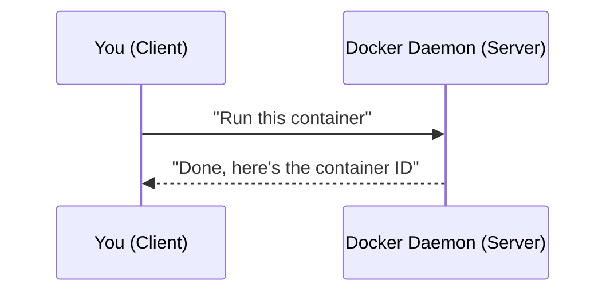

You type a command (client), it's sent to a background service (server/daemon) that actually does the work, and the result comes back to you. Docker itself is built this way — the `docker` command you type is a **client**; the real engine running in the background is the **daemon**. More on this in the next chapter.

---

### ✅ Self-Check Before Moving On

Ask yourself — can you explain each of these in one sentence?

- [ ] What is a process?
- [ ] What is a port, and why does a web server need one?
- [ ] What does "localhost" mean?
- [ ] What's the difference between a client and a server?
- [ ] What is an environment variable used for?

If yes to all — you're ready. If not, re-read the relevant section above; don't skip ahead with gaps, because Docker builds on these constantly.

---

### 🧠 Mini Quiz

1. What information does a port number provide that an IP address alone does not?
2. Why would a company want to change a database password without rebuilding their application?
3. True or False: A container needs its own separate operating system kernel to run.

<details>
<summary>📖 Click to see answers</summary>

1. It identifies *which* application/service on that machine should receive the traffic (the "apartment number").
2. Because passing it as an environment variable means the same built image can run in different environments securely, without a rebuild.
3. **False** — containers share the host machine's kernel; this is exactly what makes them lightweight compared to VMs (explained in the next chapter).

</details>

---


---

## 01 — Docker Fundamentals: What It Is and Why It Exists

### 1. The Problem Before Docker

Imagine you build an application on your laptop. It works perfectly. You send it to a teammate, and it crashes on their machine. You deploy it to a server, and it crashes there too.

This is the single most common complaint in software history:

> **"But it works on my machine!"**

It happens because your application doesn't run in isolation — it depends on:
- A specific version of a programming language (Python 3.9 vs 3.12)
- Specific system libraries
- Specific configuration files
- Specific environment variables
- Sometimes even a specific operating system

Every one of those can be slightly different between your laptop, your teammate's laptop, the testing server, and production. Docker exists to eliminate this entire category of problem.

---

### 2. What is Docker?

**Docker is a platform that packages an application together with everything it needs to run — code, runtime, system tools, libraries, and settings — into a single unit called a container, which behaves identically no matter where it runs.**

Think of it this way:

> 🧳 **Analogy — The Shipping Container**
>
> Before standardized shipping containers existed, loading a cargo ship was chaos — every crate was a different size and shape, loaded by hand, differently for each ship. Then the shipping industry standardized on one container shape. Now, any crane, any ship, any truck in the world can move that container without caring what's inside it.
>
> Docker did the same thing for software. It doesn't matter if what's inside is a Python app, a Node.js API, or a database — if it's in a Docker container, any machine running Docker can run it, identically, every time.

---

### 3. Why Do Companies Use Docker?

| Problem | How Docker Solves It |
|---|---|
| "Works on my machine" bugs | The container carries its entire environment with it |
| Slow onboarding for new developers | `docker compose up` replaces pages of setup instructions |
| Conflicting dependency versions on one machine | Each container has its own isolated dependencies |
| Slow, heavy virtual machines | Containers start in seconds and use far fewer resources |
| Inconsistent deployments | The exact image tested in staging is the exact image shipped to production |
| Scaling applications | Multiple identical containers can be started/stopped in seconds |

> 🎯 **Interview Tip** — If asked "Why do we use Docker?", don't just say "consistency." Explain the *mechanism*: it bundles the app with its dependencies into an immutable image, so the same artifact runs identically across dev, test, and production. Interviewers want to hear that you understand *why* it works, not just that it does.

---

### 4. Virtual Machines vs Containers

This is one of the **most frequently asked interview questions** in all of DevOps, so let's get it exactly right.

#### The old way: Virtual Machines

A **Virtual Machine (VM)** virtualizes an entire computer — including its own full operating system kernel — on top of your existing machine, using a layer called a **hypervisor**.

#### The new way: Containers

A **container** does not include its own operating system kernel. It shares the host machine's kernel, but keeps the application isolated from other processes using Linux features called **namespaces** and **cgroups** (explained fully in the next chapter).

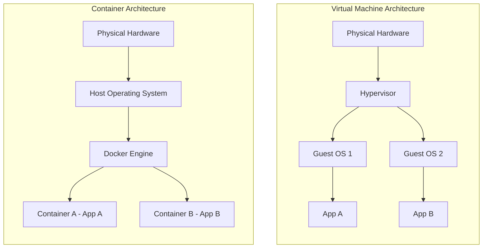

Notice the difference: every VM drags along a **full copy of an operating system** (gigabytes, minutes to boot). Every container just shares the one host OS kernel that's already running (megabytes, seconds to start).

#### Side-by-Side Comparison

| Aspect | Virtual Machine | Container |
|---|---|---|
| Includes own OS kernel? | ✅ Yes, full guest OS | ❌ No, shares host kernel |
| Typical size | Gigabytes | Megabytes |
| Startup time | Minutes | Seconds (often < 1 second) |
| Isolation strength | Very strong (separate kernel) | Strong, but shares host kernel |
| Resource overhead | High | Low |
| Portability | Less portable (large images) | Highly portable |
| Use case | Running fully different OSes, maximum isolation | Packaging and running applications consistently and efficiently |

> 📝 **Note** — VMs and containers are **not** enemies — they're often used together. Most cloud servers you deploy Docker onto are themselves virtual machines. You get VM-level infrastructure isolation *and* container-level application efficiency.

> 🎯 **Interview Tip** — A common follow-up: *"If containers share the host kernel, are they less secure than VMs?"* Honest answer: yes, theoretically the isolation boundary is a bit weaker than a VM's, which is exactly why Docker security practices (Chapter 09) — non-root users, dropped capabilities, read-only filesystems — matter so much in production.

---

### 5. What Docker Actually Solves (Concretely)

1. **Environment consistency** — "works on my machine" becomes "works everywhere"
2. **Dependency isolation** — Project A needs Python 3.9, Project B needs Python 3.12 — no conflict, ever
3. **Fast onboarding** — a new engineer runs one command instead of following a 40-step setup wiki page
4. **Efficient resource usage** — run far more containers than VMs on the same hardware
5. **Simplified deployment** — the same image goes from a laptop to a cloud server unchanged
6. **Easier scaling** — spin up 10 identical containers behind a load balancer in seconds
7. **Microservices enablement** — each small service can be packaged, versioned, and deployed independently

---

### ⚠️ Common Beginner Misconceptions

| Misconception | Reality |
|---|---|
| "A container is a lightweight VM" | It's a fundamentally different technology — no hypervisor, no guest kernel |
| "Docker containers are always insecure" | They can be very secure when hardened correctly (Chapter 09) |
| "Docker = Kubernetes" | Docker runs and builds containers; Kubernetes orchestrates many containers across many machines (Chapter 13) |
| "I need Docker installed inside my container to use Docker" | Almost never true — this is a common but rare pattern called Docker-in-Docker, and it's usually avoidable |

### ✅ Best Practices Introduced Here

- Always think in terms of "what does this app need to run, and can I package all of it?"
- Get comfortable with the idea that a container is disposable — you should be able to delete it and recreate it in seconds without losing anything important (real data belongs in volumes — Chapter 05).

---

### 🎯 Interview Questions for This Chapter

<details>
<summary><strong>Q1: What is Docker, in one sentence?</strong></summary>

A platform for packaging applications with all their dependencies into portable, isolated units called containers that run consistently across environments.
</details>

<details>
<summary><strong>Q2: What is the main architectural difference between a container and a VM?</strong></summary>

A VM virtualizes hardware and runs a full separate guest operating system via a hypervisor. A container shares the host machine's OS kernel and isolates processes using namespaces and cgroups, making it far lighter and faster.
</details>

<details>
<summary><strong>Q3: Why might a company choose containers over VMs for microservices?</strong></summary>

Lower resource overhead, faster startup, and easier horizontal scaling — you can run many more containers than VMs on the same hardware, which suits many small independent services.
</details>

<details>
<summary><strong>Q4: When would you still choose a VM over a container?</strong></summary>

When you need to run a completely different operating system than the host, need the strongest possible isolation boundary (e.g., untrusted multi-tenant workloads), or need to virtualize entire legacy systems.
</details>

---

### 📝 Summary

- Docker packages code + dependencies into a portable, consistent unit: the **container**.
- It solves the "works on my machine" problem by making environments reproducible.
- Containers are lightweight because they share the host OS kernel; VMs are heavier because they carry a full guest OS.
- Docker and VMs solve different problems and are often used **together**, not instead of each other.

### 🧪 Practice Task

No coding yet — write (in your own words, 3-4 sentences) an explanation of Docker you could give to a non-technical friend, using the shipping container analogy. This forces you to actually understand it rather than just recognize the words.

---


---

## 02 — Docker Architecture & Core Objects

Now that you know *why* Docker exists, let's open the hood and see *how* it actually works internally. This chapter is dense but foundational — almost every interview question about "how Docker works internally" comes from this chapter.

---

### 1. The Big Picture: Docker's Client-Server Architecture

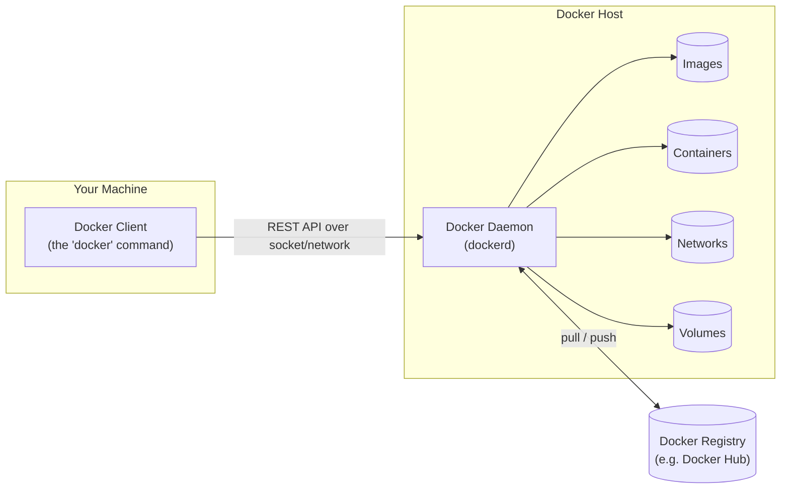

#### The Four Core Components

| Component | What it is | Analogy |
|---|---|---|
| **Docker Client** | The `docker` command you type in your terminal | The waiter who takes your order |
| **Docker Daemon (`dockerd`)** | The background service that does the actual work — building images, running containers, managing networks | The kitchen that actually cooks the food |
| **Docker Registry** | A storage/distribution service for images (e.g., Docker Hub) | A warehouse of pre-made meal kits anyone can grab |
| **Docker Objects** | Images, containers, networks, volumes — the "things" Docker manages | The ingredients, the dish, the delivery route, the fridge |

> 📝 **Note** — When you type `docker run nginx`, you (the client) are *not* running Nginx directly. You're sending an instruction to the daemon, which does everything: checks if the image exists locally, pulls it from a registry if not, creates the container, and starts it.

> 💡 **Tip** — The client and daemon don't have to be on the same machine. You can point your local `docker` client at a daemon running on a remote server using the `DOCKER_HOST` environment variable — this is exactly how tools like Docker Machine and some CI runners work.

---

### 2. Docker Engine

**Docker Engine** is the umbrella term for the whole client-server system: the daemon, the REST API, and the CLI together. When people say "install Docker Engine," they mean installing all three of these pieces on a Linux machine.

---

### 3. Docker Daemon (`dockerd`)

The daemon is the real workhorse. It:

- Listens for API requests (from the CLI, or any tool using the Docker API)
- Builds images
- Runs, stops, and removes containers
- Manages volumes and networks
- Talks to registries to pull/push images

```bash
# See daemon-level information
docker info

# See the daemon and client versions separately
docker version
```

> ⚠️ **Common Mistake** — Beginners often think `docker` commands run "locally" in some abstract sense. In reality, everything routes through the daemon. If the daemon isn't running (common error: *"Cannot connect to the Docker daemon"*), no command will work, even `docker ps`.

---

### 4. Docker Client

The client is simply the CLI tool (`docker`) that turns your typed commands into REST API calls sent to the daemon. Most of the time you'll talk to a daemon running on the same machine, over a local Unix socket (`/var/run/docker.sock` on Linux/Mac).

> 🎯 **Interview Tip** — A classic scenario question: *"What happens step-by-step when you run `docker run hello-world`?"* Structure your answer around client → daemon → local image check → registry pull (if needed) → container creation → container start. This shows you understand the architecture, not just the command.

---

### 5. Docker Registry & Docker Hub

A **registry** is a service that stores and distributes Docker images. **Docker Hub** is the default, most popular public registry — think of it as "GitHub, but for container images."

| Term | Meaning |
|---|---|
| Registry | A system that hosts image repositories (Docker Hub, GitHub Container Registry, AWS ECR, private registries) |
| Repository | A named collection of related image versions (e.g., `nginx`) |
| Tag | A specific version label within a repository (e.g., `nginx:1.27`) |

```bash
docker pull nginx:1.27       # Pull a specific version from Docker Hub
docker push myuser/myapp:1.0 # Push your own image to a registry (after docker login)
docker login                 # Authenticate with a registry
```

> ⚠️ **Warning** — Public images on Docker Hub are not automatically safe. Prefer **Official Images** (maintained by Docker/vendors) or **Verified Publisher** images, and always check when they were last updated. We'll cover scanning images for vulnerabilities in Chapter 09.

---

### 6. Docker Objects — The Things Docker Manages

#### 6.1 Images

An **image** is a read-only template used to create containers. It contains the application code, a runtime, libraries, environment variables, and configuration — everything needed to run, frozen in a file.

> 🧳 **Analogy** — An image is like a **recipe** or a **class** in programming. It defines what something *should* look like, but it isn't "running" by itself.

#### 6.2 Containers

A **container** is a running (or stopped) *instance* of an image — the same relationship as a class and an object in object-oriented programming.

> 🧳 **Analogy** — If the image is the recipe, the container is the actual **cooked meal** made from it. You can make many meals (containers) from one recipe (image), and eating one doesn't use up the recipe.

```bash
docker images     # List images (the recipes)
docker ps -a       # List containers (the meals, made and eaten or still on the table)
```

#### 6.3 Layers

Every image is built from a stack of **layers** — each Dockerfile instruction (like `RUN`, `COPY`) creates one. Layers are read-only, and Docker caches them.

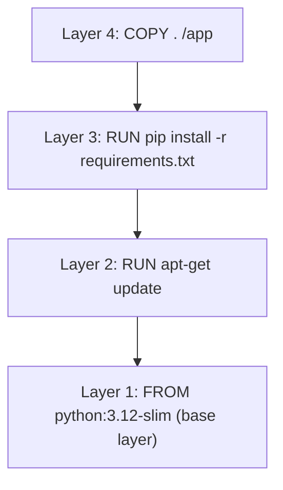

When a container runs, Docker adds one more special layer on top: a **thin writable layer**, unique to that container, where any file changes during runtime are stored. Delete the container, and that writable layer is gone — the underlying image layers are untouched and can be reused by other containers.

> 📝 **Note** — This is exactly why images are described as **immutable**. The image never changes when a container runs; only the container's own writable layer changes.

#### 6.4 Build Cache

Because layers are cached, if you rebuild an image and an instruction (and everything before it) hasn't changed, Docker reuses the cached layer instead of re-executing it — making rebuilds dramatically faster. We cover how to structure a Dockerfile to take full advantage of this in Chapter 04.

#### 6.5 Tags

A **tag** is a human-readable label pointing at a specific image version, e.g., `python:3.12-slim`, `nginx:latest`, `myapp:v2.3.1`.

> ⚠️ **Common Mistake** — Relying on `:latest` in production. `latest` is just a tag like any other — it does **not** automatically mean "newest" or "safest." It usually just means "whatever was last pushed without an explicit tag." Always pin explicit versions in production (e.g., `node:20.11-alpine`), and consider pinning by **digest** (`@sha256:...`) for maximum reproducibility.

---

### 7. What's Actually Happening Under the Hood (Linux Internals)

This is the section that separates people who've "used Docker" from people who **understand** Docker — and it's a favorite senior-level interview topic.

| Linux Feature | What it does for Docker |
|---|---|
| **Namespaces** | Give each container its own isolated view of PIDs, network interfaces, mount points, hostnames, and users — so a container "thinks" it's the only thing running on the machine |
| **cgroups (Control Groups)** | Limit and account for how much CPU, memory, and I/O a container can use, preventing one container from starving the whole host |
| **Union/Overlay Filesystems** | Let Docker stack read-only image layers plus one writable layer into what looks like a single unified filesystem to the container |

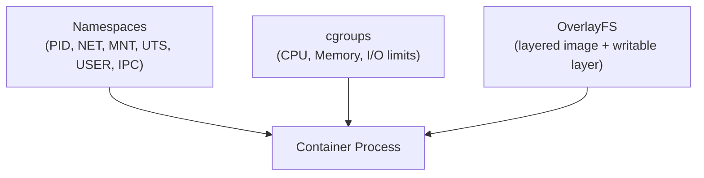

> 🎯 **Interview Tip** — If asked *"is a container just a lightweight VM?"*, the strongest answer is: *"No — a container is a normal Linux process, isolated using namespaces (what it can see) and constrained using cgroups (what it can use), running on the shared host kernel. There's no hypervisor and no guest kernel involved."* This single sentence, memorized well, answers a huge share of Docker fundamentals questions.

---

### ⚠️ Common Mistakes in This Area

- Confusing "image" and "container" in conversation — interviewers notice this immediately.
- Assuming containers are secure by default — namespaces/cgroups provide isolation, not a hard security boundary equivalent to a VM.
- Forgetting that stopping a container ≠ deleting it. `docker ps -a` still shows stopped containers (and their writable layer) until you `docker rm` them.

### ✅ Best Practices

- Always pin image tags to specific versions in anything beyond local experiments.
- Use `docker system df` periodically to see how much space images/containers/volumes are consuming.
- Get comfortable reading `docker inspect` output — it shows you the real underlying configuration of any object (see Chapter 10).

---

### 🎯 Interview Questions for This Chapter

<details><summary><strong>Q1: What's the difference between the Docker client and the Docker daemon?</strong></summary>
The client is the CLI tool you type commands into; the daemon (dockerd) is the background service that actually builds images and manages containers, networks, and volumes. The client talks to the daemon over the Docker API.
</details>

<details><summary><strong>Q2: What's the difference between an image and a container?</strong></summary>
An image is a read-only, immutable template (like a class or recipe). A container is a running instance of that image (like an object or a cooked meal) with its own writable layer on top.
</details>

<details><summary><strong>Q3: How does Docker achieve isolation without a hypervisor?</strong></summary>
Through Linux namespaces (isolating what a process can see: PIDs, network, mounts, hostname, users) and cgroups (limiting what a process can use: CPU, memory, I/O), combined with a union/overlay filesystem for the layered image system.
</details>

<details><summary><strong>Q4: Why shouldn't you rely on the `:latest` tag in production?</strong></summary>
Because `:latest` is not guaranteed to mean "newest" or "stable" — it's just the default tag applied when no tag is specified. It can silently change between builds, breaking reproducibility. Production should pin explicit versions or digests.
</details>

<details><summary><strong>Q5: What happens to a container's writable layer when the container is removed?</strong></summary>
It is permanently deleted. Any files written only to the container's writable layer (not to a mounted volume) are lost — this is why persistent data must live in volumes (Chapter 05).
</details>

---

### 📝 Summary

- Docker follows a client-server model: CLI client → Docker daemon → registry.
- Core objects: images (templates), containers (running instances), layers (stacked filesystem changes), tags (version labels).
- Under the hood, containers are Linux processes isolated by namespaces and limited by cgroups — not mini virtual machines.

### 🧪 Practice Task

Run these commands and, for each, write one sentence explaining what Docker object it's showing you:
```bash
docker info
docker images
docker ps -a
docker system df
```

---


---

## 03 — Docker CLI & Working with Images

Time to actually use Docker. This chapter is hands-on — every command here you should type yourself, not just read.

---

### 1. Your First Container

```bash
docker run hello-world
```

**What happens, step by step:**

1. The client sends `run hello-world` to the daemon.
2. The daemon checks: *do I have an image called `hello-world` locally?*
3. It doesn't (first time), so it **pulls** it from Docker Hub.
4. It creates a container from that image.
5. It starts the container, which prints a message and exits.

```bash
docker ps -a
# Shows the container, exited, with an ID and auto-generated name
```

> 🎯 **Interview Tip** — This exact "what happens when you run X" question is asked constantly. Always answer in this order: **client → daemon → local cache check → pull if needed → create → start**.

---

### 2. Essential Image Commands

| Command | Purpose |
|---|---|
| `docker pull <image>` | Download an image from a registry |
| `docker images` | List all local images |
| `docker rmi <image>` | Remove an image |
| `docker image prune` | Remove unused (dangling) images |
| `docker build -t <name>:<tag> .` | Build an image from a Dockerfile in the current directory |
| `docker tag <src> <target>` | Create an additional tag pointing to the same image |
| `docker history <image>` | Show the layers that make up an image |
| `docker inspect <image>` | Show detailed JSON metadata about an image |

```bash
# Pull a specific version
docker pull python:3.12-slim

# List images with size
docker images

# See the layers of an image, and how big each one is
docker history python:3.12-slim

# Remove an unused image
docker rmi python:3.12-slim
```

> 💡 **Tip** — Add `--no-trunc` to `docker history` to see the *full* command for each layer, not the truncated version.

---

### 3. Essential Container Commands

| Command | Purpose |
|---|---|
| `docker run <image>` | Create and start a new container |
| `docker run -it <image> bash` | Run interactively with a terminal attached |
| `docker run -d <image>` | Run in detached (background) mode |
| `docker ps` | List running containers |
| `docker ps -a` | List **all** containers, including stopped ones |
| `docker stop <container>` | Gracefully stop a running container |
| `docker start <container>` | Start a stopped container |
| `docker restart <container>` | Restart a container |
| `docker rm <container>` | Remove a stopped container |
| `docker rm -f <container>` | Force-remove a running container |
| `docker exec -it <container> bash` | Open a shell inside a running container |
| `docker logs <container>` | View a container's logs |
| `docker logs -f <container>` | Follow logs live (like `tail -f`) |

#### Important `docker run` Flags

| Flag | Meaning |
|---|---|
| `-d` | Detached mode (run in background) |
| `-it` | Interactive + allocate a terminal (for shells) |
| `-p host:container` | Publish/map a port |
| `-v host:container` | Mount a volume or bind mount |
| `--name` | Give the container a custom name |
| `-e KEY=value` | Set an environment variable |
| `--rm` | Automatically remove the container when it stops |
| `--network` | Attach to a specific network |
| `--restart` | Restart policy (`no`, `on-failure`, `always`, `unless-stopped`) |

```bash
# Run Nginx, mapping port 8080 on your machine to port 80 in the container
docker run -d -p 8080:80 --name my-nginx nginx

# Visit it
curl http://localhost:8080

# Look inside the running container
docker exec -it my-nginx bash

# Clean up
docker stop my-nginx && docker rm my-nginx
```

> ⚠️ **Common Mistake** — Forgetting `-p` and then wondering "why can't I reach my app?" A container's network is isolated by default — nothing on your host can reach it unless you explicitly publish a port.

> ⚠️ **Common Mistake** — Confusing `-p 8080:80` direction. It's always **`host_port:container_port`**. `docker run -p 80:8080` maps *host* 80 to *container* 8080 — the opposite of what most beginners intend.

---

### 4. A Full Container Lifecycle

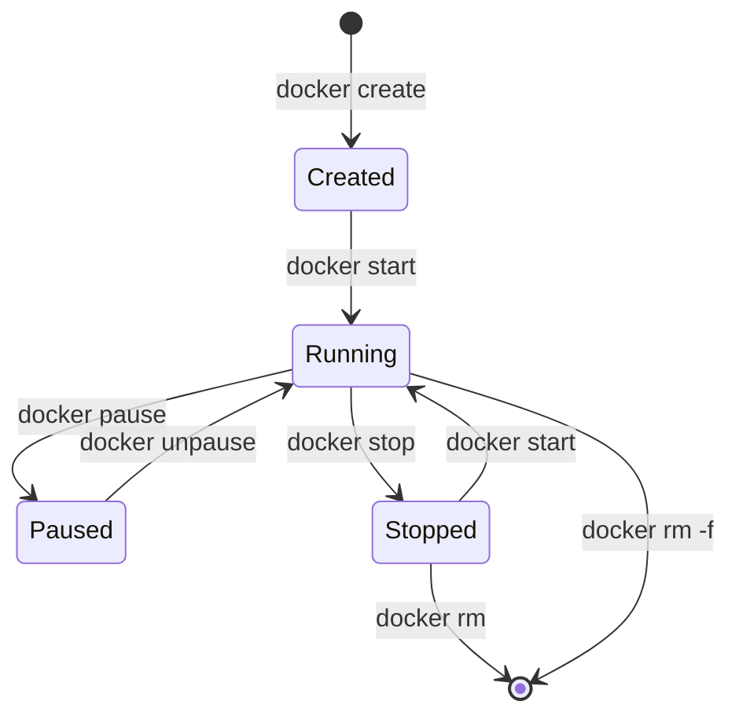

`docker run` is really shorthand for `docker create` + `docker start` in one step.

---

### 5. Image Naming, Tags, and Versioning in Practice

An image reference has this structure:

```
[registry_host/][namespace/]repository[:tag]
```

Examples:

```
nginx                              → docker.io/library/nginx:latest
nginx:1.27                         → docker.io/library/nginx:1.27
myuser/myapp:1.0                   → docker.io/myuser/myapp:1.0
ghcr.io/myorg/myapp:2.1.0          → GitHub Container Registry
gcr.io/myproject/myapp:prod        → Google Container Registry
```

```bash
# Tagging: create a new label pointing at the SAME image
docker build -t myapp:1.0 .
docker tag myapp:1.0 myapp:latest
docker tag myapp:1.0 myuser/myapp:1.0   # tag for pushing to a registry

# Push (requires docker login first)
docker push myuser/myapp:1.0
```

> ✅ **Best Practice** — Use **semantic versioning** (`1.0.0`, `1.1.0`, `2.0.0`) for your own images, and consider tagging with the Git commit SHA too (`myapp:a1b2c3d`) for perfect traceability between a running container and the exact code that built it.

---

### 6. Filtering, Formatting, and Cleaning Up

```bash
# Only show container IDs (useful for scripting)
docker ps -aq

# Stop and remove ALL containers at once
docker rm -f $(docker ps -aq)

# Remove all unused images, containers, networks, and build cache
docker system prune -a

# See disk usage breakdown
docker system df -v
```

> ⚠️ **Warning** — `docker system prune -a` is destructive. It removes **all** images not currently used by a running container, not just "old" ones. Never run this blindly on a shared build server without checking first.

---

### 🧠 Mini Quiz

1. What's the difference between `docker stop` and `docker rm`?
2. In `-p 3000:8080`, which port is on your host machine?
3. What does `--rm` do, and when would you use it?

<details>
<summary>📖 Answers</summary>

1. `docker stop` gracefully halts a running container (it still exists, just not running). `docker rm` permanently deletes the container object.
2. `3000` — the format is always `host:container`.
3. `--rm` automatically deletes the container as soon as it exits. Great for one-off/testing containers you don't want cluttering `docker ps -a`.
</details>

---

### 🎯 Interview Questions for This Chapter

<details><summary><strong>Q1: What's the difference between `docker run` and `docker start`?</strong></summary>
`docker run` creates a brand-new container from an image and starts it (equivalent to `docker create` + `docker start`). `docker start` only restarts an existing, previously stopped container — it does not create a new one.
</details>

<details><summary><strong>Q2: How do you get a shell inside a running container, and why might `docker attach` not be what you want?</strong></summary>
Use `docker exec -it <container> bash` (or `sh` for minimal images). `docker attach` connects to the container's main process's own stdin/stdout — if you accidentally exit that shell, you can stop the container's main process entirely. `docker exec` opens a *separate* new process inside the container, which is much safer for debugging.
</details>

<details><summary><strong>Q3: What does the `:latest` tag actually mean?</strong></summary>
It's just the default tag Docker applies when no tag is specified during a push — not a guarantee of "the newest" or "most stable" version. Relying on it in production risks unpredictable behavior when the underlying image changes.
</details>

---

### 📝 Summary

- `docker run` = create + start; almost everything else is a variation on managing that lifecycle.
- Ports must be explicitly published with `-p host:container`.
- Tags are just labels — pin explicit versions in anything beyond local testing.
- `docker exec` is the safe way to get a shell inside a running container.

### 🧪 Practice Task

1. Run an Nginx container in detached mode, mapped to port 8081.
2. Exec into it and view `/usr/share/nginx/html/index.html` using `cat`.
3. Check its logs.
4. Stop it, then remove it, in two separate commands.

---


---

## 04 — Dockerfile Mastery

A **Dockerfile** is a text file containing step-by-step instructions that Docker reads to build an image automatically, instead of you configuring everything by hand every time.

> 🧳 **Analogy** — A Dockerfile is a **recipe card**. Anyone (or any machine) that follows the exact same recipe card gets the exact same dish, every time. `docker build` is the act of a chef (the Docker Engine) following that recipe.

---

### 1. Why Dockerfiles Exist

Before Dockerfiles, you'd have to manually run commands inside a container, then save it as an image with `docker commit`. This is not reproducible, not reviewable in Git, and not automatable. A Dockerfile fixes all three: it's plain text, version-controlled, and rebuildable identically anywhere.

---

### 2. Anatomy of a Simple Dockerfile

```dockerfile
# 1. Start from a base image
FROM python:3.12-slim

# 2. Set the working directory inside the image
WORKDIR /app

# 3. Copy dependency file first (see caching section below — order matters!)
COPY requirements.txt .

# 4. Install dependencies
RUN pip install --no-cache-dir -r requirements.txt

# 5. Copy the rest of the application code
COPY . .

# 6. Document which port the app uses
EXPOSE 8000

# 7. Define the command that runs when the container starts
CMD ["python", "app.py"]
```

```bash
docker build -t my-python-app .
docker run -p 8000:8000 my-python-app
```

---

### 3. Every Major Dockerfile Instruction, Explained

#### `FROM` — The starting point

```dockerfile
FROM node:20-alpine
```
Declares the base image every subsequent instruction builds on top of. Every Dockerfile must start with a `FROM` (except in special "scratch" cases). You can use multiple `FROM` statements for multi-stage builds (see below).

> ✅ **Best Practice** — Prefer official, minimal base images (`-slim`, `-alpine`) over full OS images when possible — smaller size, smaller attack surface.

#### `WORKDIR` — Set the working directory

```dockerfile
WORKDIR /app
```
Every instruction after this runs relative to `/app`. It also creates the directory if it doesn't exist.

> ⚠️ **Common Mistake** — Using `RUN cd /app` instead of `WORKDIR`. `cd` only affects that single `RUN` layer — the next instruction resets to the previous directory. `WORKDIR` persists across the whole file.

#### `COPY` vs `ADD`

```dockerfile
COPY ./src /app/src
ADD https://example.com/file.tar.gz /app/
```

| | `COPY` | `ADD` |
|---|---|---|
| Copies local files | ✅ | ✅ |
| Auto-extracts local `.tar` archives | ❌ | ✅ |
| Can fetch remote URLs | ❌ | ✅ |
| Recommended default | ✅ Yes | ❌ Only for its special cases |

> 🎯 **Interview Tip** — This is one of the **most-asked** Dockerfile questions. Correct answer: *"Use `COPY` for almost everything — it's explicit and predictable. Use `ADD` only when you specifically need automatic tar extraction or a remote URL fetch, because its 'magic' behavior can cause surprises."*

#### `RUN` — Execute a command at build time

```dockerfile
RUN apt-get update && apt-get install -y curl && rm -rf /var/lib/apt/lists/*
```
Each `RUN` creates a new layer. Chaining commands with `&&` in a single `RUN` avoids creating unnecessary intermediate layers and lets you clean up cache files (`rm -rf /var/lib/apt/lists/*`) within the *same* layer, keeping image size down.

> ⚠️ **Common Mistake** — Writing separate `RUN apt-get update` and `RUN apt-get install` instructions. Because layers are cached independently, a later rebuild might reuse the old, stale `apt-get update` layer while installing a *new* package — silently pulling outdated package indexes. Always combine them into a single `RUN`.

#### `CMD` vs `ENTRYPOINT`

This is **the single most common Docker interview question about Dockerfiles.** Get this exactly right.

```dockerfile
# CMD: the default command — easily overridden
CMD ["python", "app.py"]

# ENTRYPOINT: the fixed command — arguments get appended, not replaced
ENTRYPOINT ["python", "app.py"]
```

| | `CMD` | `ENTRYPOINT` |
|---|---|---|
| Purpose | Default command/arguments | The container's main, fixed executable |
| Overridable at `docker run`? | Fully replaced by any arguments passed | Arguments passed are appended, not replaced |
| Typical use | Simple default behavior | Making the container behave like an executable |

```bash
docker run myimage echo "hi"
```
- If the Dockerfile used `CMD ["python", "app.py"]` → the container instead runs `echo "hi"` (CMD is completely replaced).
- If it used `ENTRYPOINT ["python", "app.py"]` → Docker tries to run `python app.py echo hi` (arguments are appended).

**They're often combined**, so `CMD` supplies *default arguments* to a fixed `ENTRYPOINT`:

```dockerfile
ENTRYPOINT ["python", "app.py"]
CMD ["--port", "8000"]
```
Running `docker run myimage` → `python app.py --port 8000`
Running `docker run myimage --port 9000` → `python app.py --port 9000`

> 🎯 **Interview Tip** — Say it like this: *"ENTRYPOINT defines what the container **is**; CMD defines its default arguments, which the user can override at runtime."*

#### `EXPOSE` — Document a port

```dockerfile
EXPOSE 8080
```
This is **documentation only** — it does not actually publish the port to your host. You still need `-p` at `docker run` time. It's useful for tooling and for other developers reading the Dockerfile.

> ⚠️ **Common Mistake** — Believing `EXPOSE` makes a port accessible from outside. It doesn't. You still need `docker run -p host:container`.

#### `ENV` — Set environment variables

```dockerfile
ENV NODE_ENV=production
ENV PORT=3000
```
Available both at build time (to later instructions) and at container runtime. Great for setting sane defaults that can still be overridden with `docker run -e`.

#### `ARG` — Build-time-only variables

```dockerfile
ARG APP_VERSION=1.0
RUN echo "Building version $APP_VERSION"
```
```bash
docker build --build-arg APP_VERSION=2.0 -t myapp .
```

| | `ARG` | `ENV` |
|---|---|---|
| Available at build time | ✅ | ✅ |
| Available inside the running container | ❌ | ✅ |
| Set via | `--build-arg` | Dockerfile default or `docker run -e` |

> ⚠️ **Warning** — Never pass secrets (passwords, API keys) via `ARG`. Build args get baked into the image history and can be extracted with `docker history`. Use Docker secrets or runtime environment variables instead (Chapter 08).

#### `VOLUME` — Declare a mount point

```dockerfile
VOLUME /app/data
```
Tells Docker that this path should be treated as a mount point holding persistent/externally-managed data. Covered in depth in Chapter 05.

#### `USER` — Run as a non-root user

```dockerfile
RUN useradd -m appuser
USER appuser
```
By default, containers run as `root`. Switching to a dedicated non-root user is one of the single highest-impact security practices (Chapter 09).

#### `LABEL` — Add metadata

```dockerfile
LABEL maintainer="you@example.com"
LABEL version="1.0"
LABEL description="My awesome app"
```
Purely informational metadata, useful for automation and organization.

#### `HEALTHCHECK` — Let Docker monitor container health

```dockerfile
HEALTHCHECK --interval=30s --timeout=3s --retries=3 \
  CMD curl -f http://localhost:8000/health || exit 1
```
Docker will periodically run this command and mark the container as `healthy`, `unhealthy`, or `starting`. Covered fully in Chapter 08.

#### `.dockerignore` — Exclude files from the build context

```
node_modules
.git
.env
*.log
Dockerfile
README.md
```
Works exactly like `.gitignore`. Everything in the build directory is sent to the Docker daemon as the "build context" before the build even starts — a `.dockerignore` prevents you from wasting time/space sending huge or sensitive files (like `node_modules` or `.env`) that shouldn't be in the image anyway.

> ⚠️ **Common Mistake** — Forgetting `.dockerignore` and accidentally baking `.env` files (with real secrets!) or `.git` history straight into an image layer, where anyone with the image can extract them.

---

### 4. Full Instruction Reference Table

| Instruction | Purpose |
|---|---|
| `FROM` | Set the base image |
| `WORKDIR` | Set/create the working directory |
| `COPY` | Copy files from build context into the image |
| `ADD` | Like `COPY`, plus tar extraction and remote URL support |
| `RUN` | Execute a command at build time, creating a new layer |
| `CMD` | Default command/arguments for the container |
| `ENTRYPOINT` | Fixed main executable for the container |
| `EXPOSE` | Document which port the app listens on |
| `ENV` | Set environment variables (build + runtime) |
| `ARG` | Set build-time-only variables |
| `VOLUME` | Declare a persistent/externally-managed mount point |
| `USER` | Set the user the container runs as |
| `LABEL` | Add metadata to the image |
| `HEALTHCHECK` | Define how Docker checks container health |
| `STOPSIGNAL` | Set the system call signal used to stop the container |
| `SHELL` | Override the default shell used for `RUN` |
| `ONBUILD` | Trigger an instruction when *this* image is used as a base for another build |

---

### 5. Build Cache — Ordering Your Dockerfile for Speed

Docker caches each layer. On a rebuild, it reuses cached layers **up until the first instruction that changed** — everything after that is rebuilt from scratch, even if unrelated.

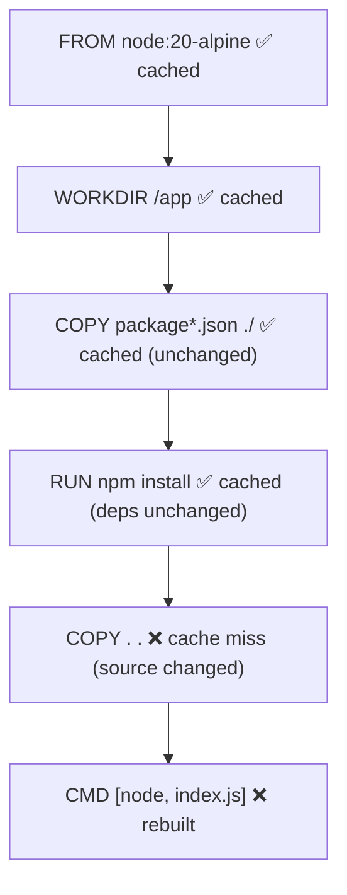

**Golden rule: order instructions from least-frequently-changing to most-frequently-changing.**

```dockerfile
# ✅ GOOD — dependencies cached separately from source code
FROM node:20-alpine
WORKDIR /app
COPY package*.json ./
RUN npm ci --omit=dev
COPY . .
CMD ["node", "index.js"]
```

```dockerfile
# ❌ BAD — any source change invalidates the expensive npm install layer
FROM node:20-alpine
WORKDIR /app
COPY . .
RUN npm ci --omit=dev
CMD ["node", "index.js"]
```

In the bad example, editing a single line of application code forces `npm ci` to re-run on every build — even though your dependencies didn't change. The good example keeps `npm install`/`pip install` cached until `package.json`/`requirements.txt` actually changes.

> 💡 **Tip** — Use `docker build --progress=plain --no-cache` when debugging cache-related weirdness, to see exactly what's executing.

---

### 6. Multi-Stage Builds

A **multi-stage build** uses multiple `FROM` instructions in one Dockerfile. Earlier stages can contain heavy build tools (compilers, dev dependencies); only the files you explicitly `COPY --from=` into the final stage end up in the final image.

```dockerfile
# Stage 1: build
FROM node:20 AS build
WORKDIR /app
COPY package*.json ./
RUN npm ci
COPY . .
RUN npm run build

# Stage 2: run — a tiny, clean final image
FROM nginx:1.27-alpine AS final
COPY --from=build /app/dist /usr/share/nginx/html
EXPOSE 80
CMD ["nginx", "-g", "daemon off;"]
```

> 🧳 **Analogy** — Think of a kitchen (build stage) full of mixing bowls, flour dust, and cooking tools, versus the clean plated dish (final stage) you actually serve to the customer. Multi-stage builds let you keep the mess in the kitchen and only ship the plate.

**Why this matters:**

| Without Multi-Stage | With Multi-Stage |
|---|---|
| Final image contains compilers, dev dependencies, source maps | Final image contains only the built output |
| Image size: often 800MB–1.5GB+ | Image size: often 20–50MB |
| Larger attack surface | Minimal attack surface |
| Slower to pull/deploy | Fast to pull/deploy |

> 🎯 **Interview Tip** — If asked "How would you reduce a 1.2GB image to under 50MB?", multi-stage builds + a minimal final base image (`alpine`, `distroless`) is almost always the expected answer.

---

### 7. Image Optimization Checklist

- [ ] Use a minimal base image (`-slim`, `-alpine`, or distroless) where possible
- [ ] Combine related `RUN` commands to minimize layers and clean up in the same layer
- [ ] Order instructions from least to most frequently changing
- [ ] Use multi-stage builds to exclude build-time tools from the final image
- [ ] Add a `.dockerignore` file
- [ ] Avoid installing unnecessary packages (`--no-install-recommends` on Debian/Ubuntu)
- [ ] Remove package manager caches in the same `RUN` layer that created them
- [ ] Pin specific base image versions, not `latest`
- [ ] Run as a non-root `USER`

```bash
# Compare image sizes
docker images | grep myapp

# See exactly what's taking up space, layer by layer
docker history myapp:latest
```

---

### ⚠️ Common Mistakes Recap

| Mistake | Fix |
|---|---|
| `COPY . .` before installing dependencies | Copy dependency manifests first, install, *then* copy the rest |
| Using `ADD` out of habit | Use `COPY` unless you specifically need `ADD`'s extra behavior |
| Secrets in `ARG`/`ENV` | Use secrets management (Chapter 08) |
| No `.dockerignore` | Always add one, especially excluding `.git`, `node_modules`, `.env` |
| Everything in one giant `RUN` with no cleanup | Clean package caches within the same layer |
| Running as root | Add a `USER` instruction |

### ✅ Best Practices Recap

- Multi-stage builds for compiled/bundled languages (Go, Java, React, TypeScript)
- Explicit, pinned base image tags
- Cache-aware instruction ordering
- Non-root user
- Small, purpose-built final images

---

### 🎯 Interview Questions for This Chapter

<details><summary><strong>Q1: What's the difference between CMD and ENTRYPOINT?</strong></summary>
CMD provides default arguments that are completely overridden if the user supplies arguments to `docker run`. ENTRYPOINT defines the fixed executable the container runs; any arguments passed at runtime are appended to it, not replaced. They're often combined: ENTRYPOINT sets the program, CMD sets its default arguments.
</details>

<details><summary><strong>Q2: Why does instruction order matter in a Dockerfile?</strong></summary>
Because of layer caching — Docker reuses cached layers up to the first instruction that changed. Placing rarely-changing instructions (like dependency installation) before frequently-changing ones (like copying source code) maximizes cache hits and speeds up rebuilds.
</details>

<details><summary><strong>Q3: What problem do multi-stage builds solve?</strong></summary>
They let you use a "heavy" image with build tools/compilers/dev dependencies to build the application, then copy only the final build artifacts into a clean, minimal final image — dramatically reducing final image size and attack surface without needing separate Dockerfiles.
</details>

<details><summary><strong>Q4: Why shouldn't secrets be passed via ARG?</strong></summary>
Build arguments are recorded in the image's build history and can be extracted with `docker history`, even if they're not in the final running container's environment. Secrets should be injected at runtime or via dedicated secrets mechanisms (e.g., BuildKit `--secret`, Docker secrets, or environment variables set outside the image).
</details>

<details><summary><strong>Q5: What does `.dockerignore` do and why is it important?</strong></summary>
It excludes specified files/folders from the build context sent to the Docker daemon, just like `.gitignore`. This speeds up builds, reduces final image size, and — critically — prevents sensitive files like `.env` or `.git` from accidentally being copied into an image layer.
</details>

---

### 📝 Summary

- A Dockerfile is a reproducible, version-controlled recipe for building an image.
- `CMD` vs `ENTRYPOINT`, `COPY` vs `ADD`, and cache-aware ordering are the three most interview-tested details in this chapter.
- Multi-stage builds are the standard technique for small, secure production images.
- `.dockerignore` and non-root `USER` are simple, high-impact habits from day one.

### 🧪 Practice Task

Take any small script you have (Python or Node) and:
1. Write a Dockerfile for it using proper instruction ordering for caching.
2. Add a `.dockerignore`.
3. Convert it into a multi-stage build (even if the second stage is small) and compare `docker images` sizes before and after.

---


---

## 05 — Volumes, Bind Mounts & Data Persistence

### 1. The Problem: Containers Are Disposable

Remember from Chapter 02: a container's writable layer disappears forever when the container is removed. That's great for keeping containers stateless and disposable — but terrible if that container is a database holding real customer data.

```bash
docker run -d --name test-db mysql:8
# ... data gets written ...
docker rm -f test-db
# 💥 All that data is gone. Permanently.
```

Docker solves this with **three storage mechanisms**, each suited to a different situation.

---

### 2. The Three Storage Types

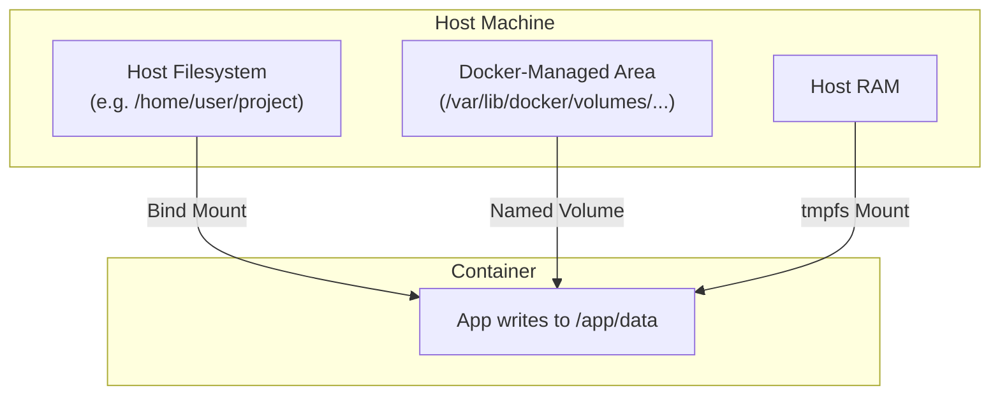

| Type | Where data lives | Managed by | Survives container removal? | Best for |
|---|---|---|---|---|
| **Named Volume** | Docker's own managed area on disk | Docker | ✅ Yes | Databases, persistent app data |
| **Bind Mount** | Anywhere you choose on the host filesystem | You | ✅ Yes | Local development, config files, source code live-reload |
| **tmpfs Mount** | Host machine's RAM only | Docker | ❌ No — gone on container stop | Temporary/sensitive data that should never touch disk |

---

### 3. Named Volumes

**Named volumes** are the recommended way to persist data in Docker. Docker fully manages where they live on disk — you just refer to them by name.

```bash
# Create a volume explicitly (optional — Docker can create it automatically too)
docker volume create db-data

# Use it
docker run -d --name my-db -v db-data:/var/lib/mysql mysql:8

# List volumes
docker volume ls

# Inspect one (see the real path on disk, labels, etc.)
docker volume inspect db-data

# Remove it (only works if no container is using it)
docker volume rm db-data

# Remove all unused volumes
docker volume prune
```

> 🧳 **Analogy** — A named volume is like a **storage unit** you rent from a moving company. You don't need to know or care exactly which warehouse aisle it's in — you just give it a name, and the company (Docker) manages the physical location for you.

> ✅ **Best Practice** — Use named volumes for anything you'd be devastated to lose: databases, uploaded files, persistent queues.

---

### 4. Bind Mounts

A **bind mount** links a specific path on your host machine directly into the container. Unlike named volumes, *you* choose and control the exact host path.

```bash
docker run -d --name my-app \
  -v /home/user/myproject/src:/app/src \
  myapp
```

Modern, more explicit syntax (recommended):

```bash
docker run -d --name my-app \
  --mount type=bind,source=/home/user/myproject/src,target=/app/src \
  myapp
```

**Most common real-world use case: live-reloading local development.**

```bash
docker run -it \
  -v $(pwd):/app \
  -w /app \
  -p 3000:3000 \
  node:20-alpine npm run dev
```
Any file you edit on your host is instantly visible inside the container — no rebuild needed.

> ⚠️ **Common Mistake** — Using bind mounts in *production* for application code. This ties your container to the exact filesystem layout of a specific host, defeating the purpose of a portable, reproducible image. Bind mounts for source code are a **development-only** pattern; production images should have code baked in via `COPY`.

---

### 5. `-v` vs `--mount` Syntax

| | `-v` (short) | `--mount` (long) |
|---|---|---|
| Syntax | `-v source:target:options` | `--mount type=...,source=...,target=...` |
| Readability | Compact but easy to mistype | Explicit, self-documenting |
| Creates missing host directories automatically? | ✅ Yes (can hide typos) | ❌ No (fails loudly instead) |
| Recommended for | Quick local commands | Docker Compose files, production, scripts |

> 💡 **Tip** — `-v` silently creating a host directory if you typo a path is a classic source of "why is my data missing?!" bugs. `--mount` fails with a clear error instead — prefer it in anything beyond quick throwaway commands.

---

### 6. tmpfs Mounts

A **tmpfs mount** stores data only in the host's memory (RAM) — never written to disk at all, and wiped the moment the container stops.

```bash
docker run -d --tmpfs /app/cache myapp
```

Use cases:
- Storing temporary secrets you don't want ever touching disk
- Scratch space for performance-sensitive temporary files
- Any data that genuinely should not persist

> 📝 **Note** — tmpfs mounts are Linux-only (not supported on Windows containers).

---

### 7. Volumes in Docker Compose

```yaml
services:
  db:
    image: postgres:16
    volumes:
      - db-data:/var/lib/postgresql/data   # named volume
      - ./init.sql:/docker-entrypoint-initdb.d/init.sql  # bind mount

volumes:
  db-data:   # declare the named volume so Compose manages it
```

More on this in Chapter 07.

---

### 8. Comparison Table: Volume vs Bind Mount vs tmpfs

| Feature | Named Volume | Bind Mount | tmpfs |
|---|---|---|---|
| Location control | Docker decides | You decide (exact host path) | RAM only |
| Persists after container removed | ✅ | ✅ | ❌ |
| Portable across hosts | ✅ (name-based) | ❌ (host-specific path) | N/A |
| Good for production data | ✅ | ⚠️ Not for app code | For ephemeral/sensitive data |
| Good for local dev live-reload | ❌ | ✅ | ❌ |
| Backed up easily via Docker | ✅ | Manual (it's just a host folder) | N/A |

> 🎯 **Interview Tip** — This exact comparison table is a near-guaranteed interview question, often phrased as *"When would you use a volume vs a bind mount?"* Answer: *"Named volumes for anything Docker should own and persist — like a database. Bind mounts when I need direct control over the host path — most commonly local development live-reload, or exposing specific config files."*

---

### 9. Backing Up and Restoring a Volume

```bash
# Backup: run a temporary container that tars up the volume's contents
docker run --rm \
  -v db-data:/data \
  -v $(pwd):/backup \
  alpine tar czf /backup/db-backup.tar.gz -C /data .

# Restore
docker run --rm \
  -v db-data:/data \
  -v $(pwd):/backup \
  alpine tar xzf /backup/db-backup.tar.gz -C /data
```

> 💡 **Tip** — This "throwaway helper container" pattern (mount two things into a minimal image like `alpine`, run one command, let it exit and clean itself up with `--rm`) is an extremely common and reusable Docker trick — memorize the shape of it.

---

### ⚠️ Common Mistakes

- Storing important data only in a container's writable layer (no volume at all) — gone the moment `docker rm` runs.
- Using bind mounts for production application code, coupling the image to a specific host filesystem.
- Forgetting `docker volume prune` can silently delete volumes not currently attached to *any* container — always double check before running it on a shared/production host.
- Confusing "removing a container" with "removing its volumes" — `docker rm` does **not** delete named volumes unless you add `-v`: `docker rm -v <container>`.

### ✅ Best Practices

- Named volumes for anything persistent and important (databases, uploads).
- Bind mounts for local development convenience and specific config file injection.
- tmpfs for sensitive/ephemeral data.
- Regularly back up volumes holding production data — Docker doesn't do this automatically.

---

### 🎯 Interview Questions for This Chapter

<details><summary><strong>Q1: Why would data be lost if you don't use a volume?</strong></summary>
Because a container's own filesystem changes live in its writable layer, which is deleted along with the container. Volumes and bind mounts exist outside that writable layer's lifecycle, so they survive container removal.
</details>

<details><summary><strong>Q2: When would you choose a bind mount over a named volume?</strong></summary>
When you need direct control over the exact host path — most commonly for local development live-reload workflows, or to inject specific configuration files from a known host location.
</details>

<details><summary><strong>Q3: What's the risk of `docker volume prune`?</strong></summary>
It removes all volumes not currently attached to any container — which can permanently delete data from volumes that were only temporarily detached (e.g., between a container recreation), if you're not careful.
</details>

---

### 📝 Summary

- Containers are disposable; data that must survive belongs in a **volume**, not the container's writable layer.
- Named volumes: Docker-managed, portable, ideal for databases.
- Bind mounts: host-controlled path, ideal for local dev.
- tmpfs: RAM-only, ideal for ephemeral/sensitive data.

### 🧪 Practice Task

1. Run a MySQL container with a named volume for its data directory.
2. Insert some data.
3. Remove the container (but not the volume).
4. Start a **new** container pointing at the same volume, and confirm your data is still there.

---


---

## 06 — Docker Networking

### 1. Why Networking Matters

Real applications are rarely one container. A typical app is a **frontend**, an **API**, a **database**, and maybe a **cache** — all needing to talk to each other, while staying isolated from things they shouldn't reach. Docker networking controls exactly that.

---

### 2. The Five Network Drivers

```bash
docker network ls
```

| Driver | What it does | Typical use case |
|---|---|---|
| **bridge** | Default. Creates a private internal network on the host; containers get their own IP and can reach each other | Default choice for most single-host applications |
| **host** | Removes network isolation — the container shares the host's network stack directly | Maximum network performance, when isolation isn't needed |
| **none** | No networking at all | Fully isolated batch jobs that need zero network access |
| **overlay** | Connects containers across **multiple Docker hosts** (used with Swarm/clusters) | Multi-host clustered deployments |
| **macvlan** | Assigns a container its own MAC address, making it appear as a physical device on the network | Legacy apps expecting to be a distinct physical device on the LAN |

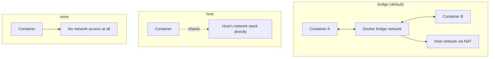

---

### 3. Bridge Networking (Deep Dive — the one you'll use most)

By default, every container you run gets attached to Docker's **default bridge network**. But the default bridge has a big limitation: containers can only reach each other by IP address, not by name.

```bash
# ❌ Default bridge: no automatic DNS between containers
docker run -d --name api myapi
docker run -d --name db mydb
# 'api' CANNOT reach 'db' by the hostname "db" on the default bridge
```

The fix: create your **own** user-defined bridge network.

```bash
docker network create my-app-network

docker run -d --name db --network my-app-network mydb
docker run -d --name api --network my-app-network myapi

# ✅ Now, inside the 'api' container, this works:
# curl http://db:5432
```

> ✅ **Best Practice** — Always create a user-defined bridge network for multi-container apps (or let Docker Compose do it for you automatically — Chapter 07). Never rely on the default bridge network for anything beyond a single, isolated container.

> 🎯 **Interview Tip** — This exact limitation ("why can't my containers see each other by name?") is one of the most common real troubleshooting questions asked in interviews. The answer is always: *"They're probably on the default bridge network, which doesn't provide automatic DNS resolution between containers. A user-defined bridge network does."*

---

### 4. Host Networking

```bash
docker run -d --network host nginx
```

The container uses the host's network directly — no port mapping needed or even possible (`-p` is ignored). Faster (no NAT translation overhead), but you lose network isolation and risk port conflicts with the host.

> 📝 **Note** — `--network host` only works on Linux. Docker Desktop on Mac/Windows runs inside a lightweight VM, so "host" networking there means the VM's network, not your actual machine.

---

### 5. None Networking

```bash
docker run -d --network none myisolatedjob
```

The container has only a loopback interface — no external network access whatsoever. Useful for security-sensitive batch processing that has no business calling out to the network.

---

### 6. Overlay Networking (Multi-Host)

```bash
docker network create -d overlay my-overlay-net
```

Used in Docker Swarm or clustered setups, overlay networks let containers on **different physical/virtual machines** communicate as if they were on the same local network, using an encapsulation protocol (VXLAN) under the hood. You won't need this for single-host development, but it's a common interview topic when discussing orchestration (Chapter 13).

---

### 7. Macvlan Networking

```bash
docker network create -d macvlan \
  --subnet=192.168.1.0/24 \
  --gateway=192.168.1.1 \
  -o parent=eth0 \
  my-macvlan-net
```

Gives a container its own MAC address so it appears as a distinct physical device directly on your LAN, with its own IP from your router's DHCP range. Rare in typical web app development — mostly used for legacy network appliances or apps that must be directly addressable on a physical network.

---

### 8. Port Publishing, Recapped

```bash
docker run -p 8080:80 nginx      # host:container
docker run -p 127.0.0.1:8080:80 nginx  # bind only to localhost, not all interfaces
docker run -P nginx               # publish ALL exposed ports to random host ports
```

| Flag | Behavior |
|---|---|
| `-p host:container` | Map a specific host port to a container port |
| `-p ip:host:container` | Bind to a specific host network interface only |
| `-P` (capital) | Publish all `EXPOSE`d ports to random available host ports |

---

### 9. Container-to-Container DNS

On any **user-defined** network (bridge, overlay, etc.), Docker runs an internal DNS server. Containers can reach each other simply by **container name** or **service name** (in Compose).

```bash
docker network create appnet
docker run -d --name cache --network appnet redis
docker run -it --network appnet alpine ping cache
# PING cache (172.x.x.x): works! resolved automatically
```

---

### 10. Inspecting and Debugging Networks

```bash
docker network ls                     # list all networks
docker network inspect my-app-network # see connected containers, subnet, gateway
docker network connect appnet mycontainer     # attach a running container to a network
docker network disconnect appnet mycontainer  # detach it
docker network rm my-app-network      # delete an unused network
docker network prune                  # remove all unused networks
```

---

### ⚠️ Common Mistakes

| Mistake | Fix |
|---|---|
| Expecting containers to resolve each other by name on the default bridge | Create/use a user-defined bridge network |
| Mixing up `-p` direction | Remember: always `host:container` |
| Using `--network host` and then still adding `-p` | `-p` is ignored/unnecessary with host networking |
| Forgetting a container needs to be on the *same* network as its peers to reach them | Explicitly attach every related container to a shared user-defined network |

### ✅ Best Practices

- Default to user-defined **bridge** networks for local/single-host multi-container apps.
- Use **overlay** networks only when orchestrating across multiple hosts (Swarm/Kubernetes-adjacent contexts).
- Bind published ports to `127.0.0.1` for services that should only be reachable locally (e.g., a database you don't want exposed to the internet).
- Name your networks meaningfully per project/environment (`myapp-dev-net`, `myapp-prod-net`).

---

### 🎯 Interview Questions for This Chapter

<details><summary><strong>Q1: Why can't two containers on the default bridge network reach each other by container name?</strong></summary>
The default bridge network does not provide built-in DNS resolution between containers — only user-defined networks (bridge or otherwise) do. On the default bridge, containers must use IP addresses (or legacy `--link`, which is deprecated).
</details>

<details><summary><strong>Q2: What's the difference between bridge and host networking?</strong></summary>
Bridge networking gives each container its own isolated network namespace and IP, requiring explicit port publishing to reach it from the host. Host networking removes that isolation entirely — the container shares the host's network stack directly, with no port mapping needed or possible.
</details>

<details><summary><strong>Q3: When would you use an overlay network?</strong></summary>
When containers need to communicate across multiple physical or virtual hosts — typically in a Docker Swarm cluster or similar multi-node orchestration setup — since overlay networks encapsulate traffic between hosts to make it look like one shared network.
</details>

<details><summary><strong>Q4: How would you troubleshoot two containers that can't communicate?</strong></summary>
Check they're on the same user-defined network with `docker network inspect`, verify the target container's actual listening port with `docker ps`/`docker inspect`, test DNS resolution and connectivity from inside the container with tools like `ping`, `curl`, or `nslookup`, and confirm there's no firewall or `--network none` misconfiguration.
</details>

---

### 📝 Summary

- Five network drivers: bridge (default, single-host), host (no isolation), none (no network), overlay (multi-host), macvlan (physical LAN presence).
- Always use a **user-defined bridge network** for multi-container apps — it gives you automatic container-name DNS resolution, unlike the default bridge.
- `-p host:container` publishes ports; without it, a container is unreachable from outside.

### 🧪 Practice Task

1. Create a user-defined network.
2. Run two containers (e.g., `alpine` and `redis`) attached to it.
3. From inside the `alpine` container, `ping` the Redis container by name.
4. Repeat the same test on the default bridge network and observe the difference.

---


---

## 07 — Docker Compose: Running Multi-Container Applications

### 1. The Problem Compose Solves

By Chapter 06, you've seen how to manually create a network, then run several `docker run` commands with matching flags to connect containers. Now imagine doing that for 5 services, every single day, remembering every flag exactly. That doesn't scale.

**Docker Compose** lets you describe your entire multi-container application — services, networks, volumes, environment variables — in a single declarative YAML file, and bring the whole thing up or down with one command.

> 🧳 **Analogy** — If individual `docker run` commands are like giving a chef verbal instructions one at a time, a Compose file is a **written recipe for the entire meal** — starter, main, and dessert — that anyone can follow to reproduce the exact same feast.

---

### 2. Compose V2 and the Modern `compose.yaml`

> 📝 **Note (2026 update)** — Docker Compose has evolved significantly. The old standalone Python tool (`docker-compose`, hyphenated) is legacy. Today, Compose ships as a **first-class Docker CLI plugin** invoked as `docker compose` (space, not hyphen), and file format versions (`version: '3.8'`, etc.) are obsolete — modern Compose uses a version-agnostic **Compose Specification** and automatically applies the latest schema. Including a `version:` key today just produces a harmless deprecation warning; the current best practice is to **omit it entirely**.

```bash
docker compose version   # confirm you're on the modern plugin
```

```yaml
# ✅ Modern style — no "version:" key needed
services:
  web:
    build: .
    ports:
      - "3000:3000"
```

---

### 3. Anatomy of a `compose.yaml` File

```yaml
services:
  api:
    build: ./api
    ports:
      - "8000:8000"
    environment:
      - DATABASE_URL=postgresql://user:pass@db:5432/mydb
    depends_on:
      db:
        condition: service_healthy
    networks:
      - app-net

  db:
    image: postgres:16
    environment:
      POSTGRES_USER: user
      POSTGRES_PASSWORD: pass
      POSTGRES_DB: mydb
    volumes:
      - db-data:/var/lib/postgresql/data
    healthcheck:
      test: ["CMD-SHELL", "pg_isready -U user"]
      interval: 5s
      timeout: 3s
      retries: 5
    networks:
      - app-net

networks:
  app-net:

volumes:
  db-data:
```

#### Top-Level Keys

| Key | Purpose |
|---|---|
| `services` | The containers that make up your application |
| `networks` | Custom networks (Compose creates one automatically even if you don't declare this) |
| `volumes` | Named volumes used by your services |
| `configs` | Non-sensitive configuration files shared with services |
| `secrets` | Sensitive values injected securely (Chapter 08) |

#### Key Fields Inside a Service

| Field | Purpose |
|---|---|
| `image` | Use a pre-built image from a registry |
| `build` | Build from a local Dockerfile instead |
| `ports` | Publish ports, `host:container` |
| `environment` | Set environment variables |
| `env_file` | Load environment variables from a file |
| `volumes` | Mount named volumes or bind mounts |
| `depends_on` | Control startup order (and optionally wait for health) |
| `networks` | Attach to specific networks |
| `restart` | Restart policy |
| `healthcheck` | Define a container health check |
| `command` | Override the image's default `CMD` |

---

### 4. The Core Commands

```bash
docker compose up            # create and start everything (foreground, logs streaming)
docker compose up -d         # same, but detached (background)
docker compose up --build    # force a rebuild of images before starting
docker compose down          # stop and remove containers + default network
docker compose down -v       # ALSO remove named volumes (⚠️ destructive)
docker compose ps            # list running services
docker compose logs -f       # follow logs for all services
docker compose logs -f api   # follow logs for just one service
docker compose exec api sh   # shell into a running service
docker compose build         # build/rebuild images without starting
docker compose stop          # stop containers without removing them
docker compose start         # start previously stopped containers
docker compose restart api   # restart just one service
docker compose config        # validate and print the fully resolved config
```

> ⚠️ **Warning** — `docker compose down -v` deletes named volumes too. If your database's data lives there, that data is gone. Only use `-v` when you genuinely want a clean slate.

---

### 5. `depends_on` — Startup Order vs Real Readiness

```yaml
services:
  api:
    depends_on:
      db:
        condition: service_healthy   # ✅ waits for db's healthcheck to pass
```

> ⚠️ **Common Mistake** — A plain `depends_on: [db]` (without a `condition`) only waits for the container to **start**, not for the database inside it to actually be **ready** to accept connections. This is a classic source of "connection refused" errors on first boot. Always pair `depends_on` with a proper `healthcheck` on the dependency (Chapter 08) and a `condition: service_healthy`.

---

### 6. Environment Variables and `.env` Files

Compose automatically loads a `.env` file in the same directory, letting you parameterize your compose file:

```bash
# .env
POSTGRES_PASSWORD=supersecret
APP_PORT=8000
```

```yaml
services:
  api:
    ports:
      - "${APP_PORT}:8000"
  db:
    environment:
      POSTGRES_PASSWORD: ${POSTGRES_PASSWORD}
```

> ⚠️ **Warning** — Never commit a `.env` file containing real secrets to Git. Commit a `.env.example` template instead, and add `.env` to `.gitignore`.

---

### 7. Profiles — Optional Services

Profiles let you define services that only start when explicitly requested — great for optional tooling (like an admin UI) that shouldn't run by default.

```yaml
services:
  api:
    build: .
  adminer:
    image: adminer
    profiles: ["dev-tools"]
```

```bash
docker compose up               # 'api' only
docker compose --profile dev-tools up   # 'api' AND 'adminer'
```

---

### 8. Scaling Services

```bash
docker compose up -d --scale worker=3
```

Runs three instances of the `worker` service. Note: this doesn't work cleanly with a static `ports` mapping to a single host port — you'd typically pair scaled services with a load balancer or let Docker assign dynamic ports.

---

### 9. Multiple Compose Files (Overrides)

A common pattern: a base `compose.yaml` plus environment-specific overrides.

```bash
docker compose -f compose.yaml -f compose.override.yaml up   # dev (override is auto-loaded by default)
docker compose -f compose.yaml -f compose.prod.yaml up       # prod
```

`compose.override.yaml` is automatically merged in if present — useful for adding bind mounts and debug ports only in local development, without touching the base file used in production.

---

### 10. A Realistic Multi-Service Example

```yaml
services:
  frontend:
    build: ./frontend
    ports:
      - "3000:3000"
    depends_on:
      - api

  api:
    build: ./api
    ports:
      - "8000:8000"
    environment:
      - DATABASE_URL=postgresql://user:pass@db:5432/appdb
      - REDIS_URL=redis://cache:6379
    depends_on:
      db:
        condition: service_healthy
      cache:
        condition: service_started

  db:
    image: postgres:16-alpine
    environment:
      POSTGRES_USER: user
      POSTGRES_PASSWORD: pass
      POSTGRES_DB: appdb
    volumes:
      - db-data:/var/lib/postgresql/data
    healthcheck:
      test: ["CMD-SHELL", "pg_isready -U user -d appdb"]
      interval: 5s
      retries: 5

  cache:
    image: redis:7-alpine
    volumes:
      - cache-data:/data

volumes:
  db-data:
  cache-data:
```

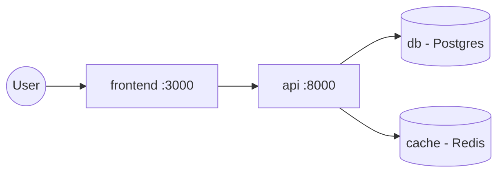

---

### ⚠️ Common Mistakes

| Mistake | Fix |
|---|---|
| Adding `version: '3.8'` and getting warnings | Omit the `version:` key entirely — modern Compose doesn't need it |
| Assuming `depends_on` waits for the app inside to be ready | Add a `healthcheck` + `condition: service_healthy` |
| Committing `.env` with real secrets | Use `.env.example`, add `.env` to `.gitignore` |
| Running `docker compose down -v` out of habit | Only use `-v` when you intend to delete volume data |
| Hardcoding secrets directly in `compose.yaml` | Use `.env`, or Compose `secrets:` (Chapter 08) |

### ✅ Best Practices

- Omit `version:` — rely on the Compose Specification.
- Always add healthchecks to services other services depend on.
- Use `.env` for configuration, never for anything truly secret in shared/production files.
- Split base + override files for dev vs prod differences.
- Name your project (`-p myproject` or a `.env` `COMPOSE_PROJECT_NAME`) when running multiple Compose projects on one machine to avoid name collisions.

---

### 🎯 Interview Questions for This Chapter

<details><summary><strong>Q1: What problem does Docker Compose solve that plain `docker run` doesn't?</strong></summary>
It lets you declaratively define an entire multi-container application — services, networks, volumes, environment variables, dependencies — in one version-controlled file, and manage its full lifecycle with single commands instead of chains of manually-typed `docker run`/`docker network` commands.
</details>

<details><summary><strong>Q2: Why is `depends_on` alone often not enough to guarantee a service starts correctly?</strong></summary>
By default, `depends_on` only waits for the dependency's container process to start, not for the application inside it to be ready to accept traffic (e.g., a database still initializing). Pairing it with a `healthcheck` and `condition: service_healthy` waits for actual readiness.
</details>

<details><summary><strong>Q3: How do you avoid committing secrets in a Compose project?</strong></summary>
Store secrets in a `.env` file excluded via `.gitignore`, commit only a `.env.example` template, and/or use Compose's `secrets:` top-level key for sensitive values that shouldn't even live in plain environment variables.
</details>

<details><summary><strong>Q4: What's the difference between `docker compose down` and `docker compose down -v`?</strong></summary>
`down` stops and removes containers and the default network created for the project. `down -v` additionally removes named volumes — permanently deleting any data stored in them.
</details>

---

### 📝 Summary

- Compose describes multi-container apps declaratively in `compose.yaml`.
- Modern Compose is version-agnostic — drop the `version:` key.
- Pair `depends_on` with `healthcheck` for real startup ordering.
- Use `.env` for config, `secrets:` for sensitive values, and override files for environment-specific differences.

### 🧪 Practice Task

Write a `compose.yaml` with two services: a simple web app and a Redis cache. Add a healthcheck to Redis, make the web app `depends_on` it with `condition: service_healthy`, and bring the whole stack up with `docker compose up -d`.

---


---

## 08 — Environment Variables, Secrets, Resource Limits & Health Checks

### 1. Environment Variables — Configuration Without Rebuilding

We introduced environment variables in Chapter 00. Here's how they work in practice with Docker.

```bash
docker run -e NODE_ENV=production -e PORT=3000 myapp
docker run --env-file .env myapp
```

```yaml
# compose.yaml
services:
  api:
    environment:
      - NODE_ENV=production
      - PORT=3000
    env_file:
      - .env
```

> ✅ **Best Practice** — Use environment variables for *configuration* (URLs, feature flags, ports, log levels) — never for *secrets* (passwords, API keys, private keys) in anything beyond local development. Environment variables are visible via `docker inspect`, process listings on the host, and often get logged accidentally.

---

### 2. Secrets — The Right Way to Handle Sensitive Data

#### Why Environment Variables Aren't Enough for Secrets

```bash
docker inspect mycontainer
# Environment variables are visible here in plain text to anyone with Docker access
```

#### Docker Secrets (Compose / Swarm)

```yaml
services:
  api:
    image: myapi
    secrets:
      - db_password

secrets:
  db_password:
    file: ./secrets/db_password.txt
```

Inside the container, the secret is mounted as a **file** at `/run/secrets/db_password` — not an environment variable — so it doesn't leak through `docker inspect` or process listings the way env vars can.

```python
# Reading it in application code
with open("/run/secrets/db_password") as f:
    db_password = f.read().strip()
```

#### BuildKit Build-Time Secrets

For secrets needed only *during* the build (e.g., a private package registry token), never bake them into a layer with `ARG`. Use BuildKit's dedicated secret mounting instead:

```dockerfile
# syntax=docker/dockerfile:1
RUN --mount=type=secret,id=npm_token \
    NPM_TOKEN=$(cat /run/secrets/npm_token) npm install
```

```bash
docker build --secret id=npm_token,src=./npm_token.txt -t myapp .
```
This secret is available only during that specific `RUN` step and is **never** written into any image layer — a critical difference from `ARG`.

> ⚠️ **Warning** — `ARG`/`ENV` secrets get permanently baked into image history (recoverable via `docker history` even after the value is "removed" in a later layer). Always use BuildKit secret mounts for build-time secrets and Docker/orchestrator secrets for runtime secrets.

---

### 3. Resource Limits — Stopping One Container From Starving the Host

By default, a single container can consume unlimited CPU and memory, potentially starving everything else on the host. Resource limits fix this, using the cgroups mechanism introduced in Chapter 02.

```bash
docker run -d \
  --memory="512m" \
  --memory-swap="512m" \
  --cpus="1.5" \
  myapp
```

```yaml
# compose.yaml
services:
  api:
    deploy:
      resources:
        limits:
          cpus: "1.5"
          memory: 512M
        reservations:
          cpus: "0.5"
          memory: 256M
```

| Flag | Meaning |
|---|---|
| `--memory` | Hard memory limit; container is killed (OOM) if exceeded |
| `--memory-swap` | Total memory + swap allowed |
| `--cpus` | Number of CPU cores available (can be fractional, e.g., `0.5`) |
| `--pids-limit` | Maximum number of processes inside the container |

```bash
# Watch live resource usage
docker stats
```

> 🎯 **Interview Tip** — A classic scenario question: *"A container was suddenly killed — what would you check?"* Look for exit code `137` (OOM killed) and check `docker inspect <container>` for `OOMKilled: true`. This is exactly why memory limits + monitoring matter — an unbounded container can be silently killed by the kernel's OOM killer, or worse, take down other workloads first.

---

### 4. Health Checks

A **health check** tells Docker how to actively verify a container is not just *running*, but actually **working**.

#### In a Dockerfile

```dockerfile
HEALTHCHECK --interval=30s --timeout=3s --start-period=10s --retries=3 \
  CMD curl -f http://localhost:8000/health || exit 1
```

#### In Compose

```yaml
services:
  api:
    build: .
    healthcheck:
      test: ["CMD", "curl", "-f", "http://localhost:8000/health"]
      interval: 30s
      timeout: 3s
      retries: 3
      start_period: 10s
```

| Field | Meaning |
|---|---|
| `test` | The command to run; exit code 0 = healthy |
| `interval` | How often to check |
| `timeout` | How long to wait before considering the check failed |
| `retries` | Consecutive failures before marking `unhealthy` |
| `start_period` | Grace period at startup before failures count (avoids false negatives while the app boots) |

```bash
docker ps
# STATUS column shows: Up 2 minutes (healthy) / (unhealthy) / (health: starting)

docker inspect --format='{{json .State.Health}}' mycontainer
```

> 📝 **Note** — A container can be `running` and still `unhealthy` at the same time — "running" only means the main process hasn't exited. Health checks are what let orchestration tools (and `depends_on: condition: service_healthy` in Compose) know whether a container is actually *ready to serve traffic*.

---

### 5. Restart Policies

```bash
docker run -d --restart unless-stopped myapp
```

| Policy | Behavior |
|---|---|
| `no` (default) | Never restart automatically |
| `on-failure[:max-retries]` | Restart only if it exits with a non-zero code |
| `always` | Always restart, even after a manual stop, unless explicitly removed |
| `unless-stopped` | Like `always`, but won't restart if you explicitly stopped it |

> ✅ **Best Practice** — `unless-stopped` is usually the right default for production services — it survives host reboots and crashes, but respects an intentional `docker stop`.

---

### ⚠️ Common Mistakes

| Mistake | Fix |
|---|---|
| Storing secrets as plain environment variables in production | Use Docker secrets / BuildKit build secrets / a secrets manager |
| No memory limit on a container | Set `--memory` to prevent one runaway container from taking down the host |
| No health check on services other containers depend on | Add one — otherwise `depends_on` only checks "started," not "ready" |
| Assuming "Up" in `docker ps` means "working" | Check the `(healthy)`/`(unhealthy)` status, not just "Up" |

### ✅ Best Practices

- Environment variables for config, secrets mechanisms for secrets.
- Always set memory and CPU limits for production containers.
- Add health checks to every service another service depends on.
- Choose `unless-stopped` as a sane default restart policy.

---

### 🎯 Interview Questions for This Chapter

<details><summary><strong>Q1: Why shouldn't you pass a database password as a plain Docker environment variable in production?</strong></summary>
Environment variables are visible via `docker inspect`, host process listings, and can leak into logs or crash reports. Dedicated secrets mechanisms (Docker secrets, BuildKit build secrets, or a vault/secrets manager) keep sensitive values out of these easily-accessible places, typically by mounting them as files instead.
</details>

<details><summary><strong>Q2: What's the difference between a container being "running" and "healthy"?</strong></summary>
"Running" only means the main process inside the container hasn't exited. "Healthy" means a defined HEALTHCHECK command has been succeeding — actively verifying the application inside is functioning, not just alive.
</details>

<details><summary><strong>Q3: What does exit code 137 usually indicate?</strong></summary>
It typically means the container was killed by SIGKILL, most commonly due to the Linux OOM (Out Of Memory) killer terminating it after it exceeded its memory limit.
</details>

<details><summary><strong>Q4: What restart policy would you choose for a production web service, and why?</strong></summary>
`unless-stopped` — it automatically restarts the container after crashes or host reboots, while still respecting an intentional manual stop, unlike `always` which would restart it even after being deliberately stopped.
</details>

---

### 📝 Summary

- Environment variables configure; dedicated secrets mechanisms protect sensitive values.
- Resource limits (`--memory`, `--cpus`) use cgroups to prevent one container from starving the host.
- Health checks give Docker (and Compose's `depends_on`) real insight into application readiness, not just process liveness.
- Restart policies determine resilience to crashes and reboots.

### 🧪 Practice Task

Add a `HEALTHCHECK` to any of your own Dockerfiles, set a memory limit when running it, and use `docker inspect` to confirm both the health status and the applied resource limits.

---


---

## 09 — Docker Security Best Practices

### 1. The Uncomfortable Truth About Default Docker

Out of the box, Docker prioritizes convenience over security: containers run as `root` by default, share the host kernel, and can be given broad access if you're not careful. None of this is dangerous *by itself* — but it means security is something **you** have to actively configure, not something you get for free.

> 🎯 **Interview Tip** — If asked "is Docker secure by default?", the strong answer is: *"Docker provides the isolation primitives — namespaces, cgroups — but the default configuration favors convenience. Real security comes from deliberately hardening images and runtime configuration: non-root users, minimal images, dropped capabilities, and scanning."*

---

### 2. Image Security

#### Use Minimal, Trusted Base Images

```dockerfile
FROM python:3.12-alpine   # ~50MB, small attack surface
# instead of
FROM python:3.12          # ~900MB+, many more packages = more potential CVEs
```

| Base Image Type | Relative Size | Attack Surface |
|---|---|---|
| Full OS (`ubuntu`, `debian`) | Large (100s of MB) | Large |
| Slim (`-slim` variants) | Medium | Medium |
| Alpine | Small (~5-50MB) | Small |
| Distroless / Hardened images | Very small, no shell, no package manager | Minimal |

> 💡 **Tip** — "Distroless" images (e.g., Google's `gcr.io/distroless/*`) contain *only* your application and its runtime dependencies — no shell, no package manager, nothing for an attacker to abuse even after a successful exploit. Docker also now offers **Docker Hardened Images** — pre-built, minimal, continuously patched base images for exactly this purpose.

#### Pin Versions — Ideally by Digest

```dockerfile
# Good: pinned tag
FROM node:20.11-alpine

# Best for maximum reproducibility: pinned by digest
FROM node:20.11-alpine@sha256:abcd1234...
```

A tag can be *re-pushed* to point at a different image later; a digest cannot change — it's a cryptographic hash of the exact content.

#### Scan Images for Vulnerabilities

```bash
# Docker's built-in scanner
docker scout cves myapp:latest

# Trivy (very popular, fast, open-source)
trivy image myapp:latest

# Fail a CI pipeline on critical vulnerabilities
trivy image --exit-code 1 --severity CRITICAL,HIGH myapp:latest
```

> ✅ **Best Practice** — Scan on every build in CI, not just occasionally by hand. Catching a critical CVE before it reaches a registry is far cheaper than finding it in production.

---

### 3. Build-Time Hardening

- **Multi-stage builds** (Chapter 04) — exclude compilers, dev dependencies, and source maps from the final image.
- **`.dockerignore`** — never let `.git`, `.env`, or credential files enter the build context.
- **Never bake secrets into layers** — use BuildKit `--mount=type=secret` (Chapter 08), not `ARG`.
- **Rebuild regularly** — even an unchanged Dockerfile can accumulate new CVEs in its base image over time; rebuild on a schedule to pick up security patches.

---

### 4. Runtime Hardening

#### Run as a Non-Root User

```dockerfile
FROM node:20-alpine
RUN addgroup -S appgroup && adduser -S appuser -G appgroup
WORKDIR /app
COPY --chown=appuser:appgroup . .
USER appuser
CMD ["node", "index.js"]
```

Or at runtime:
```bash
docker run --user 1000:1000 myapp
```

> 🎯 **Interview Tip** — Widely considered *the single most important* Docker security practice. If a process is compromised while running as root inside a container, an attacker is far closer to a full container breakout than if it's running as an unprivileged user.

#### Drop Linux Capabilities

By default, Docker grants a broad set of Linux capabilities. Most applications need almost none of them.

```bash
docker run --cap-drop=ALL --cap-add=NET_BIND_SERVICE myapp
```

```yaml
services:
  api:
    cap_drop:
      - ALL
    cap_add:
      - NET_BIND_SERVICE
```

#### Read-Only Root Filesystem

```bash
docker run --read-only --tmpfs /tmp myapp
```

```yaml
services:
  api:
    read_only: true
    tmpfs:
      - /tmp
```

With a read-only filesystem, even a compromised process can't modify application files, plant malware, or persist changes across restarts — it can only write to explicitly provided writable paths (like a `tmpfs` for `/tmp`).

#### Disable Privilege Escalation

```bash
docker run --security-opt=no-new-privileges myapp
```
Prevents a process from gaining more privileges than it started with (e.g., via a setuid binary) — closes off a common escalation path.

#### Never Mount the Docker Socket Unless Absolutely Necessary

```bash
# ⚠️ Extremely dangerous unless you fully understand the implications
docker run -v /var/run/docker.sock:/var/run/docker.sock myapp
```
Mounting the Docker socket into a container effectively grants that container **root access to the entire host**, since it can now issue arbitrary commands to the daemon (including running new privileged containers). Only do this for trusted, well-understood tooling (like certain CI runners), never for general application containers.

#### Consider Rootless Docker

Beyond running *containers* as non-root, you can run the **Docker daemon itself** without root privileges ("rootless mode"). It's a bigger architectural change with some networking/storage tradeoffs, but eliminates an entire class of host-level risk. For most teams, non-root containers (the `USER` directive) already capture most of the benefit with far less friction.

---

### 5. Network & Secrets Hardening

- Put containers on purpose-specific networks, not the shared default bridge (Chapter 06).
- Only publish the ports that genuinely need external access; bind local-only services to `127.0.0.1`.
- Never store secrets in images, environment variables in production, or plaintext compose files — use secrets mechanisms (Chapter 08).
- Set resource limits (Chapter 08) to prevent one compromised or runaway container from affecting others.

---

### 6. A Practical Security Checklist

```
Image Security
  [ ] Minimal, trusted base image (alpine / distroless / hardened image)
  [ ] Pinned version, ideally by digest
  [ ] Scanned in CI (Docker Scout / Trivy / Grype)
  [ ] Multi-stage build — no build tools in final image
  [ ] .dockerignore excludes .git, .env, secrets
  [ ] No secrets baked into layers

Runtime Security
  [ ] Runs as non-root (USER directive)
  [ ] Capabilities dropped, only required ones re-added
  [ ] Read-only root filesystem where possible
  [ ] no-new-privileges enabled
  [ ] Memory/CPU/PID limits set
  [ ] Docker socket NOT mounted (unless explicitly required)
  [ ] Health check defined

Network & Secrets
  [ ] Purpose-specific network, not default bridge
  [ ] Only necessary ports exposed
  [ ] Secrets via secrets manager / Docker secrets, not env vars
  [ ] Sensitive services bound to 127.0.0.1 where appropriate
```

---

### ⚠️ Common Mistakes

| Mistake | Why it's risky |
|---|---|
| Running everything as root | The default; largest single risk factor in container security |
| Using `:latest` in production | Unpredictable, unpinned, hard to audit |
| Mounting the Docker socket casually | Grants effective root access to the host |
| No image scanning | CVEs ship silently into production |
| Storing secrets in `ENV`/`ARG` | Recoverable from image history / `docker inspect` |
| Skipping resource limits | One container can exhaust host resources, affecting everything else |

### ✅ Best Practices Recap

- Minimal base images, pinned by digest, scanned continuously.
- Non-root `USER`, dropped capabilities, read-only filesystem.
- Secrets via dedicated mechanisms, never baked into images.
- Least privilege everywhere: network access, filesystem access, Linux capabilities.

---

### 🎯 Interview Questions for This Chapter

<details><summary><strong>Q1: What is the single most impactful Docker security practice, and why?</strong></summary>
Running containers as a non-root user. Since containers share the host kernel, a process compromised while running as root is significantly closer to a full container breakout / host compromise than the same process running unprivileged.
</details>

<details><summary><strong>Q2: Why is mounting the Docker socket into a container dangerous?</strong></summary>
It gives that container the ability to issue commands directly to the Docker daemon — including starting new, potentially privileged containers — which is functionally equivalent to giving it root access to the host machine.
</details>

<details><summary><strong>Q3: What's the difference between pinning an image by tag vs by digest?</strong></summary>
A tag (e.g., `:1.27`) can be reassigned later to point at different image content. A digest (`@sha256:...`) is a cryptographic hash of the exact image content and can never silently change — it guarantees you get exactly the same bytes every time.
</details>

<details><summary><strong>Q4: How would you reduce the attack surface of a production image?</strong></summary>
Use a minimal or distroless base image, multi-stage builds to exclude build tools, drop unnecessary Linux capabilities, run as non-root, make the filesystem read-only where possible, and continuously scan for vulnerabilities in CI.
</details>

---

### 📝 Summary

- Docker's defaults favor convenience; security requires deliberate configuration.
- Image security: minimal base, pinned digest, continuous scanning, multi-stage builds.
- Runtime security: non-root user, dropped capabilities, read-only filesystem, no privilege escalation, resource limits.
- Never casually mount the Docker socket or bake secrets into image layers.

### 🧪 Practice Task

Take any Dockerfile you've written in this repo so far and harden it: add a non-root `USER`, pin the base image to a specific version, and run it with `--read-only --tmpfs /tmp --cap-drop=ALL`. See what breaks — that tells you exactly what capabilities/writable paths your app genuinely needs.

---


---

## 10 — Debugging & Troubleshooting Docker

Every Docker engineer eventually stares at a container that won't start, a service that can't be reached, or an app that behaves differently inside a container than it did locally. This chapter is your systematic playbook.

---

### 1. The Debugging Toolkit

| Command | What it tells you |
|---|---|
| `docker ps -a` | Is the container even running? What's its exit code? |
| `docker logs <container>` | What did the app actually print before it died? |
| `docker logs -f --tail 100 <container>` | Live-follow the last 100 lines |
| `docker inspect <container>` | Full JSON: config, mounts, network, health, exit code |
| `docker exec -it <container> sh` | Get a shell inside a *running* container to poke around |
| `docker stats` | Live CPU/memory/network usage |
| `docker events` | Real-time stream of Docker daemon events |
| `docker diff <container>` | See what files changed vs the original image |
| `docker port <container>` | Confirm actual port mappings |

---

### 2. "My Container Exits Immediately"

```bash
docker ps -a
# STATUS: Exited (1) 5 seconds ago
```

**Step-by-step diagnosis:**

```bash
# 1. Check the exit code and last logs
docker logs mycontainer

# 2. Check the exit code meaning
docker inspect mycontainer --format='{{.State.ExitCode}}'
```

| Exit Code | Common Meaning |
|---|---|
| `0` | Clean exit — the process finished normally (common for one-shot scripts, not long-running services) |
| `1` | General application error — check logs |
| `125` | The `docker run` command itself was malformed |
| `126` | Command found but not executable (permissions issue) |
| `127` | Command not found (typo in `CMD`/`ENTRYPOINT`, or missing binary) |
| `137` | Killed (SIGKILL) — very often an **OOM kill**; check `docker inspect` for `OOMKilled: true` |
| `139` | Segmentation fault |
| `143` | Terminated gracefully (SIGTERM) — normal on `docker stop` |

> ⚠️ **Common Mistake** — For a web server or API, a container that exits immediately with code `0` almost always means your main process isn't actually staying in the foreground (e.g., you started a background daemon and the container had nothing left to do, so it exited). Docker containers stay alive only as long as their main (PID 1) process is running.

---

### 3. "I Can't Connect to My App"

Work through this checklist in order:

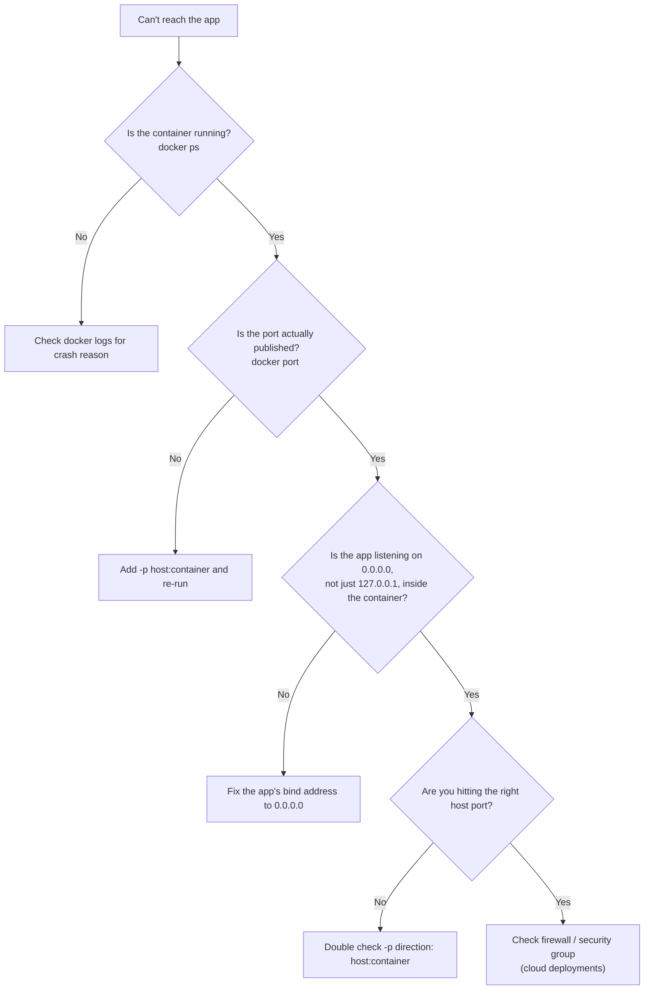

> ⚠️ **Common Mistake — The #1 cause of "connection refused" in containers**: the app inside binds to `127.0.0.1` (localhost) instead of `0.0.0.0`. Binding to `127.0.0.1` inside a container only accepts connections from *within that same container's network namespace* — Docker's port forwarding can't reach it. Always bind application servers to `0.0.0.0` inside a container.

```bash
# Confirm what's actually published
docker port mycontainer

# Confirm the app is really listening (from inside the container)
docker exec -it mycontainer sh -c "netstat -tulpn || ss -tulpn"
```

---

### 4. "Containers Can't Reach Each Other"

Covered fully in Chapter 06, but the checklist:

```bash
docker network inspect <network-name>   # are both containers actually attached?
docker exec -it containerA ping containerB   # DNS resolution + basic reachability
docker exec -it containerA curl http://containerB:PORT   # actual app-level check
```

> 💡 **Tip** — If `ping` works but `curl` doesn't, the network layer is fine — the problem is the *application* inside the target container (wrong port, not actually listening, crashed).

---

### 5. Reading `docker inspect` Effectively

```bash
docker inspect mycontainer
```

This dumps a huge JSON blob. Use `--format` (Go templates) to pull exactly what you need:

```bash
docker inspect --format='{{.State.Status}}' mycontainer
docker inspect --format='{{.State.ExitCode}}' mycontainer
docker inspect --format='{{.NetworkSettings.IPAddress}}' mycontainer
docker inspect --format='{{json .Mounts}}' mycontainer | jq
docker inspect --format='{{json .State.Health}}' mycontainer | jq
```

> 💡 **Tip** — Pipe `docker inspect` output through `jq` for readable, filterable JSON: `docker inspect mycontainer | jq '.[0].State'`.

---

### 6. Debugging Build Failures

```bash
docker build --progress=plain --no-cache -t myapp .
```

`--progress=plain` shows full, unbuffered build output (instead of the collapsed default), and `--no-cache` rules out stale-cache weirdness while you debug.

**Isolate the failing step** by temporarily commenting out later Dockerfile instructions, or by building an intermediate stage directly:

```bash
docker build --target build -t myapp:debug-stage .
docker run -it myapp:debug-stage sh
```

---

### 7. "It Works Locally But Not in the Container"

This is the classic environment-mismatch bug. Systematic checks:

- [ ] Are you using the **same** language/runtime version inside the container as locally? (`python --version`, `node --version` — check both)
- [ ] Are environment variables actually being passed into the container (`docker exec mycontainer env`)?
- [ ] Is the app reading a config file path that doesn't exist inside the container's filesystem?
- [ ] Is a case-sensitivity issue biting you (common when developing on Mac/Windows, deploying on Linux)?
- [ ] Are file permissions different because the container runs as a different user than your host user?

```bash
# Compare what's really inside vs what you expect
docker exec -it mycontainer sh
ls -la /app
cat /app/config.yaml
env | sort
```

---

### 8. Common Errors Reference Table

| Error Message | Likely Cause | Fix |
|---|---|---|
| `Cannot connect to the Docker daemon` | Docker daemon isn't running, or you lack permission | Start Docker Desktop/service; check `docker context ls`; on Linux, ensure your user is in the `docker` group |
| `port is already allocated` | Another process/container already uses that host port | Choose a different host port, or stop the conflicting container |
| `no such file or directory` (in `COPY`) | Wrong path relative to the build context | Check the path is relative to where you run `docker build`, and check `.dockerignore` isn't excluding it |
| `exec format error` | Architecture mismatch (e.g., ARM image on an x86 host or vice versa) | Use a multi-platform image or build with `--platform` |
| `OCI runtime create failed` | Malformed `CMD`/`ENTRYPOINT`, or missing binary inside the image | Verify the command exists inside the image and the JSON array syntax is correct |
| `network ... not found` | Referencing a network that doesn't exist or was already removed | `docker network ls` to confirm, recreate if needed |
| `unhealthy` status | The container's `HEALTHCHECK` command is failing | Exec in and manually run the healthcheck command to see the real error |
| `OOMKilled: true` | Container exceeded its memory limit | Increase the limit, or investigate/fix a memory leak in the app |

---

### 9. `docker events` — Watching the Daemon in Real Time

```bash
docker events --filter 'type=container'
```
Streams every container lifecycle event (create, start, die, health_status, etc.) as it happens — extremely useful for catching intermittent crash-loops in real time.

---

### ⚠️ Common Mistakes

- Reading only the last line of logs instead of scrolling up to the actual first error.
- Debugging networking issues without first confirming the app is even listening inside the container.
- Assuming `docker ps` (which only shows running containers) means "everything is fine" without checking `docker ps -a` for silently-exited ones.
- Forgetting `0.0.0.0` vs `127.0.0.1` binding — the most common single mistake in this entire chapter.

### ✅ Best Practices

- Always check `docker logs` **before** anything else when something's wrong.
- Build a mental checklist (running? published? listening on 0.0.0.0? right network?) and run through it in order every time — don't guess randomly.
- Use `--format` with `docker inspect` to get exactly the field you need instead of scrolling a huge JSON blob.

---

### 🎯 Interview Questions for This Chapter

<details><summary><strong>Q1: A container exits immediately after `docker run`. How do you debug it?</strong></summary>
Check `docker ps -a` for the exit code, then `docker logs` for the actual error output. Cross-reference the exit code (e.g., 137 = OOM killed, 127 = command not found) with what the logs show, and check the Dockerfile's CMD/ENTRYPOINT for issues like the process not staying in the foreground.
</details>

<details><summary><strong>Q2: You can't connect to a web app running in a container even though the port is published. What's the most common cause?</strong></summary>
The application inside the container is bound to `127.0.0.1` instead of `0.0.0.0`. Binding to localhost inside the container makes it unreachable from outside that container's network namespace, even with correct port publishing.
</details>

<details><summary><strong>Q3: How would you debug a Dockerfile that fails partway through the build?</strong></summary>
Rebuild with `--progress=plain --no-cache` for full unbuffered output, and if needed, use `docker build --target <stage>` to build only up to a specific stage and drop into a shell in that intermediate image to inspect the filesystem manually.
</details>

---

### 📝 Summary

- `docker logs`, `docker ps -a`, and `docker inspect` are your first three stops for any problem.
- Exit codes are diagnostic gold — memorize the common ones (0, 1, 127, 137, 143).
- The #1 connectivity bug is binding to `127.0.0.1` instead of `0.0.0.0` inside the container.
- Debug builds with `--progress=plain --no-cache` and staged builds.

### 🧪 Practice Task

Intentionally break a container three different ways (wrong CMD, app bound to 127.0.0.1, missing dependency in the image) and practice diagnosing each using only the tools in this chapter — no peeking at the Dockerfile until you've formed a hypothesis from the symptoms.

---


---

## 11 — Performance Optimization

This chapter pulls together everything from earlier chapters into one focused lens: **making builds faster and containers run leaner.**

---

### 1. Faster Builds

#### Use BuildKit (the modern default builder)

Modern Docker uses BuildKit by default, which parallelizes independent build steps and supports advanced caching. Confirm it's active:

```bash
docker build --version
DOCKER_BUILDKIT=1 docker build -t myapp .   # explicit, if needed on older setups
```

#### Cache-Aware Instruction Ordering

Covered in depth in Chapter 04 — this remains the single highest-leverage build speed technique. Dependencies before source code, always.

#### Use `docker buildx` for Advanced Caching

```bash
docker buildx build \
  --cache-from=type=registry,ref=myrepo/myapp:cache \
  --cache-to=type=registry,ref=myrepo/myapp:cache,mode=max \
  -t myrepo/myapp:latest --push .
```
This lets CI pipelines reuse build cache **across different runners/machines**, not just locally — a huge speedup for CI/CD (Chapter 12).

#### Parallelize Independent Stages

In a multi-stage Dockerfile, stages that don't depend on each other build in parallel automatically under BuildKit — another reason to structure Dockerfiles with clear, independent stages where possible.

---

### 2. Smaller Images = Faster Everything

Image size affects build time, push/pull time, deploy time, and attack surface, all at once.

```bash
# Compare
docker images | grep myapp
docker history myapp:latest
```

| Technique | Typical Impact |
|---|---|
| Multi-stage builds | Often 5-20x smaller final images |
| Alpine/distroless base images | 100s of MB saved vs full OS images |
| Combining `RUN` layers + cleaning caches in the same layer | Tens to hundreds of MB saved |
| `.dockerignore` | Faster builds, no bloat from unnecessary files |
| Avoiding unnecessary packages (`--no-install-recommends`) | Smaller image, fewer CVEs |

```dockerfile
# Before
RUN apt-get update
RUN apt-get install -y curl git build-essential
# apt cache remains in the image — wasted space

# After
RUN apt-get update && \
    apt-get install -y --no-install-recommends curl git build-essential && \
    rm -rf /var/lib/apt/lists/*
```

---

### 3. Runtime Performance

#### Resource Limits, Tuned Correctly

Under-provisioning causes throttling/OOM kills (Chapter 08); over-provisioning wastes host capacity. Use `docker stats` under realistic load to find real numbers, not guesses.

```bash
docker stats --no-stream
```

#### Efficient Logging

```bash
docker run --log-opt max-size=10m --log-opt max-file=3 myapp
```
Unbounded logs can silently fill host disk over time and slow down `docker logs`. Always cap log size and rotation in production.

#### Choosing the Right Storage Driver / Volume Type

- Bind mounts and named volumes both bypass the container's overlay filesystem for I/O, so **database data directories should always live on a volume**, never on the container's writable layer — both for durability *and* performance (overlay filesystem write performance is noticeably worse for write-heavy workloads like databases).

#### Avoid Running Unnecessary Processes in One Container

Each container should generally run **one main process** (the "one process per container" principle). Bundling a database, a web server, and a cron job into a single container makes scaling, restarting, and resource-limiting each piece independently impossible.

> 🎯 **Interview Tip** — If asked *"should you run multiple processes in one container?"*, the nuanced answer: *"Generally no — one primary process per container is the standard practice, since it aligns container lifecycle, logging, health checks, and scaling with a single responsibility. Exceptions exist (e.g., a sidecar-style helper process), but they're deliberate, not default."*

---

### 4. Network & I/O Performance

- Use **user-defined bridge networks**, which have essentially the same performance as the default bridge but with the added benefit of DNS (Chapter 06) — there's no performance reason to avoid them.
- For maximum network throughput on Linux where isolation isn't a concern, `--network host` removes NAT overhead entirely.
- Keep chatty inter-service calls (e.g., API → DB) on the same Docker host/network when latency matters, rather than routing unnecessarily through external load balancers for internal traffic.

---

### 5. Monitoring Performance Over Time

```bash
docker stats                 # live snapshot
docker system df -v          # disk usage breakdown by images/containers/volumes
docker top <container>       # processes running inside a specific container
```

For production, container-level metrics are typically shipped to a dedicated monitoring stack (Prometheus + cAdvisor, Datadog, etc.) rather than watched manually — `docker stats` is best for local debugging and quick checks.

---

### ⚠️ Common Mistakes

| Mistake | Fix |
|---|---|
| Rebuilding from scratch every time (`--no-cache` habitually) | Only use `--no-cache` when actively debugging cache issues |
| Giant single-stage images with build tools left in | Multi-stage builds |
| No log rotation | Set `--log-opt max-size`/`max-file` |
| Cramming multiple unrelated processes into one container | One primary process per container |
| No resource limits, "it'll be fine" | Set and tune limits based on real `docker stats` data |

### ✅ Best Practices

- Structure Dockerfiles for maximum cache reuse.
- Multi-stage builds + minimal base images as the default, not the exception.
- Tune resource limits from real measured usage, not guesses.
- One primary process per container.
- Cap log size/rotation in production.

---

### 🎯 Interview Questions for This Chapter

<details><summary><strong>Q1: What are the top two techniques for reducing Docker image size?</strong></summary>
Multi-stage builds (excluding build tools/dependencies from the final image) and choosing a minimal base image (Alpine or distroless instead of a full OS image).
</details>

<details><summary><strong>Q2: Why should database data directories be stored in a volume rather than the container's writable layer?</strong></summary>
For durability (surviving container removal) and for I/O performance — the container's overlay/union filesystem has more write overhead than a volume, which is especially noticeable for write-heavy workloads like databases.
</details>

<details><summary><strong>Q3: Why is "one process per container" considered a best practice rather than a hard rule?</strong></summary>
It keeps container lifecycle, health checks, logging, and scaling aligned with a single responsibility, making operations simpler and more predictable. It's not an absolute rule — deliberate exceptions like sidecar patterns exist — but bundling unrelated processes together by default causes more operational pain than it saves.
</details>

---

### 📝 Summary

- Faster builds come from cache-aware Dockerfiles, BuildKit, and registry-backed build caches in CI.
- Smaller images come from multi-stage builds, minimal base images, and layer hygiene.
- Runtime performance comes from correctly-tuned resource limits, volumes for I/O-heavy data, and log rotation.

### 🧪 Practice Task

Take your largest image from this repo's projects, run `docker history` on it, and identify the single largest layer. Optimize it (multi-stage build, smaller base image, or combined `RUN` cleanup) and compare the before/after size with `docker images`.

---


---

## 12 — CI/CD Integration: Docker with GitHub Actions

### 1. Why Automate This?

Manually running `docker build` and `docker push` every time you change code is slow and error-prone. **CI/CD (Continuous Integration / Continuous Deployment)** automates: build the image → test it → scan it → push it to a registry → (optionally) deploy it, every time code is pushed.

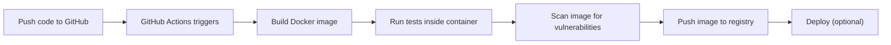

---

### 2. A Basic GitHub Actions Workflow

`.github/workflows/docker-build.yml`:

```yaml
name: Build and Push Docker Image

on:
  push:
    branches: [main]
  pull_request:
    branches: [main]

jobs:
  build:
    runs-on: ubuntu-latest
    steps:
      - name: Checkout code
        uses: actions/checkout@v4

      - name: Set up Docker Buildx
        uses: docker/setup-buildx-action@v3

      - name: Log in to Docker Hub
        if: github.ref == 'refs/heads/main'
        uses: docker/login-action@v3
        with:
          username: ${{ secrets.DOCKERHUB_USERNAME }}
          password: ${{ secrets.DOCKERHUB_TOKEN }}

      - name: Build image
        uses: docker/build-push-action@v6
        with:
          context: .
          push: false
          load: true
          tags: myapp:test
          cache-from: type=gha
          cache-to: type=gha,mode=max

      - name: Scan image for vulnerabilities
        uses: aquasecurity/trivy-action@master
        with:
          image-ref: myapp:test
          exit-code: '1'
          severity: 'CRITICAL,HIGH'

      - name: Push image
        if: github.ref == 'refs/heads/main'
        uses: docker/build-push-action@v6
        with:
          context: .
          push: true
          tags: |
            myuser/myapp:latest
            myuser/myapp:${{ github.sha }}
          cache-from: type=gha
          cache-to: type=gha,mode=max
```

#### What Each Piece Does

| Step | Purpose |
|---|---|
| `actions/checkout` | Pull your repo's code onto the runner |
| `docker/setup-buildx-action` | Enables BuildKit's advanced build features on the CI runner |
| `docker/login-action` | Authenticates with the registry using GitHub Secrets (never hardcode credentials) |
| `docker/build-push-action` | Builds (and optionally pushes) the image, with registry-aware caching |
| `trivy-action` | Fails the pipeline if critical/high vulnerabilities are found |

> ✅ **Best Practice** — Always store registry credentials as **GitHub Secrets** (`Settings → Secrets and variables → Actions`), never in the workflow file itself.

> 🎯 **Interview Tip** — A common scenario question: *"How would you prevent a vulnerable image from ever reaching production?"* Answer: integrate a scanner (Trivy/Docker Scout) into CI with a severity threshold that **fails the build** — don't just report vulnerabilities, block the pipeline on them.

---

### 3. Tagging Strategy in CI

Tag every built image with something traceable back to the exact code that produced it:

```yaml
tags: |
  myuser/myapp:latest
  myuser/myapp:${{ github.sha }}
  myuser/myapp:${{ github.ref_name }}
```

| Tag | Purpose |
|---|---|
| `latest` | Convenience pointer to the most recent build (never use in production deploys) |
| `<git-sha>` | Immutable, exact traceability — this is what you actually deploy |
| `<branch-name>` | Useful for environment-specific builds (e.g., `staging`, `main`) |
| `v1.2.3` (from a Git tag) | Semantic release versioning |

---

### 4. Running Tests Inside Containers in CI

```yaml
- name: Run tests in container
  run: |
    docker build -t myapp:test --target test .
    docker run --rm myapp:test npm test
```

A common pattern: add a dedicated `test` stage in a multi-stage Dockerfile that includes dev dependencies and a test runner, separate from the lean production stage.

```dockerfile
FROM node:20-alpine AS base
WORKDIR /app
COPY package*.json ./
RUN npm ci

FROM base AS test
COPY . .
RUN npm test

FROM base AS production
RUN npm prune --omit=dev
COPY . .
CMD ["node", "index.js"]
```

---

### 5. Deploying After a Successful Build

Depending on your target, the "deploy" step differs:

```yaml
- name: Deploy to server via SSH
  uses: appleboy/ssh-action@v1
  with:
    host: ${{ secrets.SERVER_HOST }}
    username: ${{ secrets.SERVER_USER }}
    key: ${{ secrets.SERVER_SSH_KEY }}
    script: |
      docker pull myuser/myapp:${{ github.sha }}
      docker compose -f /opt/myapp/compose.yaml up -d
```

For cloud-native deployments (ECS, Cloud Run, Kubernetes), the deploy step instead calls that platform's CLI/action to roll out the new image tag — covered conceptually in Chapter 13.

---

### 6. Build Caching in CI (Why It Matters More Here Than Locally)

Every CI run typically starts from a clean environment, so without explicit caching, you lose *all* Docker layer cache benefits on every single run.

```yaml
cache-from: type=gha
cache-to: type=gha,mode=max
```

`type=gha` stores build cache using GitHub Actions' own cache backend, so subsequent runs can reuse unchanged layers — often cutting CI build time dramatically.

> ⚠️ **Common Mistake** — Assuming Docker layer caching "just works" in CI the same way it does locally. Each CI job usually runs on a fresh runner with no prior Docker cache unless you explicitly configure a cache backend (registry cache or `type=gha`).

---

### ⚠️ Common Mistakes

| Mistake | Fix |
|---|---|
| Hardcoding registry credentials in the workflow file | Use GitHub Secrets |
| No image scanning step | Add Trivy/Docker Scout and fail on critical/high severity |
| Only ever pushing `:latest` | Also tag with immutable identifiers like the Git SHA |
| No CI build cache | Configure `type=gha` or registry-based cache |
| Deploying straight from a developer's laptop | Always deploy the exact image built and tested by CI |

### ✅ Best Practices

- Build once, promote the same immutable image through environments — don't rebuild per environment.
- Fail the pipeline on scan results above your risk threshold.
- Tag with both a human-readable and an immutable (SHA-based) identifier.
- Use registry or `type=gha` caching to keep CI fast.

---

### 🎯 Interview Questions for This Chapter

<details><summary><strong>Q1: Why should you avoid deploying whatever's on a developer's laptop directly to production?</strong></summary>
Because it breaks reproducibility and traceability — the point of CI/CD is that every deployed artifact is built, tested, and scanned identically and automatically, and can be traced back to an exact commit. Manual local builds bypass all of that.
</details>

<details><summary><strong>Q2: How would you stop a vulnerable image from ever being deployed?</strong></summary>
Add a vulnerability scanning step (e.g., Trivy or Docker Scout) to the CI pipeline configured to fail the build when vulnerabilities at or above a chosen severity threshold are found, before the push/deploy steps run.
</details>

<details><summary><strong>Q3: Why is Docker build caching in CI different from local caching?</strong></summary>
CI runners typically start from a clean environment with no prior Docker cache, so without explicitly configuring a cache backend (like a registry cache or GitHub Actions' `type=gha` cache), every build effectively runs uncached, regardless of how well the Dockerfile is structured for caching.
</details>

---

### 📝 Summary

- CI/CD automates build → test → scan → push → deploy, removing manual, error-prone steps.
- Tag images with immutable identifiers (Git SHA) in addition to human-friendly tags.
- Explicitly configure build caching in CI — it doesn't happen automatically.
- Fail pipelines on vulnerability scan results, don't just report them.

### 🧪 Practice Task

Create a GitHub Actions workflow for one of this repo's projects (Chapter/`projects/` folder) that builds the image, runs a scan with Trivy, and (if on `main`) pushes it to Docker Hub with both `:latest` and `:${{ github.sha }}` tags.

---


---

## 13 — Docker in the Cloud & Introduction to Kubernetes

### 1. From "It Runs Locally" to "It Runs in Production"

Everything so far has run on your laptop. Production means running containers reliably, at scale, on infrastructure you don't manually babysit. There are several common paths.

---

### 2. Deployment Options, From Simplest to Most Complex

| Approach | What it is | Good for |
|---|---|---|
| **Single VM + Docker Compose** | One cloud server (EC2, DigitalOcean Droplet, etc.) running `docker compose up -d` | Small apps, side projects, early-stage startups |
| **Managed container services** | Cloud-managed platforms that run individual containers for you (AWS ECS/Fargate, Google Cloud Run, Azure Container Apps) | Medium apps, teams that don't want to manage servers or orchestration |
| **Container orchestration (Kubernetes)** | A full system for automatically scheduling, scaling, healing, and networking many containers across many machines | Large-scale, complex, multi-service production systems |
| **Docker Swarm** | Docker's own built-in, simpler orchestrator | Small-to-medium clusters wanting orchestration without Kubernetes' complexity |

> 📝 **Note** — There's no single "correct" choice. Many real companies run perfectly successful production systems on a single well-configured server with Docker Compose. Reach for Kubernetes when you *actually* have the scaling/complexity problems it solves — not by default.

---

### 3. Single VM + Compose (The Simple, Legitimate Path)

```bash
# On a cloud server
git clone https://github.com/you/myapp.git
cd myapp
docker compose -f compose.prod.yaml up -d
```

Add a reverse proxy (Nginx, Caddy, or Traefik) in front for TLS termination and routing:

```yaml
services:
  reverse-proxy:
    image: caddy:2
    ports:
      - "80:80"
      - "443:443"
    volumes:
      - ./Caddyfile:/etc/caddy/Caddyfile
      - caddy-data:/data
  api:
    build: ./api
    expose:
      - "8000"
```

> ✅ **Best Practice** — Even on a "simple" single-server deploy, apply everything from Chapter 09 (Security): non-root users, resource limits, pinned image versions, and a `restart: unless-stopped` policy on every service.

---

### 4. Managed Container Services

Platforms like **AWS Fargate**, **Google Cloud Run**, and **Azure Container Apps** take your Docker image and run it without you managing any servers — you just say "run this image, with these resources, scale between X and Y instances."

```bash
# Example: Google Cloud Run
gcloud run deploy myapp \
  --image=gcr.io/myproject/myapp:latest \
  --platform=managed \
  --allow-unauthenticated \
  --memory=512Mi \
  --cpu=1
```

The appeal: you get scaling, load balancing, and infrastructure management "for free," in exchange for less low-level control than a self-managed cluster.

---

### 5. Docker vs Kubernetes — Getting This Exactly Right

This is possibly **the single most asked comparison question** in DevOps interviews.

| | Docker | Kubernetes |
|---|---|---|
| What it is | A platform for building and running **individual** containers | A system for **orchestrating many containers** across **many machines** |
| Scope | Single host (by default) | Cluster of many hosts (nodes) |
| Handles scaling? | Not natively | Yes — a core feature |
| Handles self-healing? | No (unless you add restart policies manually) | Yes — automatically replaces failed containers |
| Handles load balancing across replicas? | No (needs an external proxy) | Yes, built in (Services) |
| Handles rolling updates? | Not natively | Yes — built-in deployment strategies |
| Relationship | Kubernetes runs containers *using* a container runtime (which may be `containerd`, historically Docker Engine) | Kubernetes is the "manager" that decides where/how containers run |

> 🎯 **Interview Tip** — The cleanest way to phrase this: *"Docker builds and runs individual containers. Kubernetes takes many containers, across many machines, and automates scheduling, scaling, networking, and self-healing between them. They're complementary, not competing — you typically build images with Docker, and orchestrate them with Kubernetes."*

> 📝 **Note** — A subtlety worth knowing: Kubernetes no longer uses Docker Engine directly as its container runtime (it uses the **Container Runtime Interface**, commonly backed by `containerd`). But images are still built in the standard OCI format that `docker build` produces — so your Docker skills transfer directly.

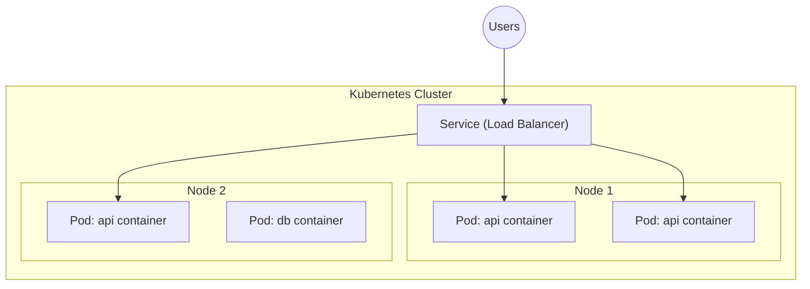

---

### 6. Core Kubernetes Concepts (Just Enough to Speak the Language)

| Term | Plain-English Meaning |
|---|---|
| **Pod** | The smallest deployable unit — usually one container (sometimes a couple of tightly coupled ones) |
| **Node** | A physical or virtual machine in the cluster that runs pods |
| **Deployment** | Describes the *desired state* (e.g., "run 3 replicas of this image") — Kubernetes continuously works to match reality to it |
| **Service** | A stable network endpoint/load balancer in front of a group of pods, so callers don't need to track individual pod IPs |
| **Ingress** | Rules for routing external HTTP(S) traffic into services inside the cluster |
| **ConfigMap / Secret** | Kubernetes' equivalent of environment variables / secrets, decoupled from the image |
| **Namespace** | A way to logically partition a cluster (e.g., `dev`, `staging`, `prod`) |

```yaml
# A minimal Kubernetes Deployment — for context, not memorization
apiVersion: apps/v1
kind: Deployment
metadata:
  name: myapp
spec:
  replicas: 3
  selector:
    matchLabels:
      app: myapp
  template:
    metadata:
      labels:
        app: myapp
    spec:
      containers:
        - name: myapp
          image: myuser/myapp:1.0.0
          ports:
            - containerPort: 8000
```

> 💡 **Tip** — This repo focuses on Docker, not a full Kubernetes course. If this section clicks for you, the natural next step is a dedicated Kubernetes roadmap — the concepts above (Pod, Deployment, Service) are the 20% that unlocks 80% of understanding.

---

### 7. Docker Swarm — The "Simpler Kubernetes"

```bash
docker swarm init
docker stack deploy -c compose.yaml mystack
```

Swarm reuses the Compose file format and gives you basic orchestration (multi-node scheduling, scaling, rolling updates) with far less operational complexity than Kubernetes — at the cost of a smaller ecosystem and fewer advanced features. Good to know it exists; increasingly less common in new production systems compared to Kubernetes or managed container platforms.

---

### ⚠️ Common Mistakes

| Mistake | Fix |
|---|---|
| Jumping straight to Kubernetes for a small project | Start with the simplest option (single VM + Compose or a managed container service) that meets your actual needs |
| Assuming Docker and Kubernetes are competitors | They're complementary — Docker builds images, Kubernetes orchestrates their execution |
| Forgetting production hardening on "simple" deploys | Apply Chapter 09's security checklist regardless of deployment complexity |

### ✅ Best Practices

- Choose deployment complexity based on actual current needs, not anticipated future scale.
- Keep images and orchestration decoupled — a well-built Docker image should run identically on a single VM, a managed platform, or Kubernetes.
- Learn Kubernetes vocabulary even before you need it deeply — it's the shared language of modern infrastructure conversations.

---

### 🎯 Interview Questions for This Chapter

<details><summary><strong>Q1: What's the core difference between Docker and Kubernetes?</strong></summary>
Docker builds and runs individual containers on a single host. Kubernetes orchestrates many containers across many hosts — handling scheduling, scaling, self-healing, load balancing, and rolling updates automatically.
</details>

<details><summary><strong>Q2: What is a Kubernetes Pod?</strong></summary>
The smallest deployable unit in Kubernetes — typically wrapping a single container (occasionally a small group of tightly-coupled containers that must share network/storage), scheduled onto a node by the cluster.
</details>

<details><summary><strong>Q3: When might you NOT need Kubernetes?</strong></summary>
When your application is small/medium scale, doesn't need automated multi-node scaling or self-healing beyond simple restart policies, and a single well-configured server with Docker Compose (or a managed container service) fully meets your reliability and scale requirements.
</details>

---

### 📝 Summary

- Deployment complexity ranges from a single VM with Compose, to managed container platforms, to full Kubernetes clusters — pick based on real needs.
- Docker and Kubernetes are complementary: Docker builds images, Kubernetes (or Swarm) orchestrates them at scale.
- Core Kubernetes vocabulary (Pod, Node, Deployment, Service) is valuable to know even before you need to operate a cluster yourself.

### 🧪 Practice Task

Take the multi-container project from `projects/13-multi-container-compose` and sketch (on paper or in a markdown file) what it would look like as a Kubernetes Deployment + Service for each component — you don't need to actually deploy it, just map the concepts across.

---


---

## 14 — 🎯 Docker Interview Preparation

This is the distilled, high-density chapter. If you've worked through Chapters 00-13, everything here should feel like *recognizing* answers, not memorizing new ones. If something here surprises you, jump back to the linked chapter.

Questions are organized: **Beginner → Intermediate → Advanced → Scenario/Production → Dockerfile-specific → Compose-specific → Troubleshooting**, followed by comparison tables and one-line revision notes.

---

### 📗 Beginner Questions

<details><summary><strong>1. What is Docker?</strong></summary>
A platform for packaging applications with all their dependencies into portable, isolated units called containers, so they run consistently across any environment. (Ch. 01)
</details>

<details><summary><strong>2. What is a container?</strong></summary>
A running instance of an image — an isolated process (or group of processes) using Linux namespaces and cgroups, sharing the host kernel but with its own filesystem view, network, and resource limits. (Ch. 01, 02)
</details>

<details><summary><strong>3. What is a Docker image?</strong></summary>
A read-only template built from a stack of layers, containing everything needed to run an application: code, runtime, dependencies, and configuration. (Ch. 02)
</details>

<details><summary><strong>4. What is the difference between an image and a container?</strong></summary>
An image is a static, immutable template (like a class); a container is a running instance of that image (like an object), with its own writable layer on top. (Ch. 02)
</details>

<details><summary><strong>5. How is a container different from a virtual machine?</strong></summary>
A VM virtualizes hardware and runs a full separate guest OS via a hypervisor. A container shares the host's OS kernel and is isolated via namespaces/cgroups — making it far lighter and faster to start. (Ch. 01)
</details>

<details><summary><strong>6. What is a Dockerfile?</strong></summary>
A text file of instructions Docker reads to automatically and reproducibly build an image. (Ch. 04)
</details>

<details><summary><strong>7. What is Docker Hub?</strong></summary>
The default public registry for storing and distributing Docker images. (Ch. 02)
</details>

<details><summary><strong>8. What command creates and starts a new container?</strong></summary>
<code>docker run &lt;image&gt;</code> — internally equivalent to <code>docker create</code> followed by <code>docker start</code>. (Ch. 03)
</details>

<details><summary><strong>9. How do you list running containers? All containers?</strong></summary>
<code>docker ps</code> for running containers; <code>docker ps -a</code> for all containers including stopped ones. (Ch. 03)
</details>

<details><summary><strong>10. How do you view a container's logs?</strong></summary>
<code>docker logs &lt;container&gt;</code>, or <code>docker logs -f &lt;container&gt;</code> to follow them live. (Ch. 10)
</details>

<details><summary><strong>11. What does the `-p` flag do in `docker run`?</strong></summary>
Publishes/maps a port: <code>-p host_port:container_port</code>. Without it, the container's ports aren't reachable from the host. (Ch. 03)
</details>

<details><summary><strong>12. What is Docker Compose?</strong></summary>
A tool for defining and running multi-container applications declaratively via a <code>compose.yaml</code> file, instead of chaining many manual <code>docker run</code> commands. (Ch. 07)
</details>

---

### 📘 Intermediate Questions

<details><summary><strong>13. What's the difference between CMD and ENTRYPOINT?</strong></summary>
CMD sets default arguments, fully overridden if the user supplies arguments to <code>docker run</code>. ENTRYPOINT sets the fixed main executable; runtime arguments are appended, not replaced. They're commonly combined. (Ch. 04)
</details>

<details><summary><strong>14. What's the difference between COPY and ADD?</strong></summary>
COPY only copies local files/directories. ADD does that too, but also auto-extracts local tar archives and can fetch remote URLs. COPY is preferred by default for its predictability. (Ch. 04)
</details>

<details><summary><strong>15. What is a multi-stage build and why use one?</strong></summary>
A Dockerfile with multiple FROM instructions, where earlier stages can contain build tools/dependencies, and only explicitly copied artifacts make it into the final stage — dramatically shrinking final image size and attack surface. (Ch. 04)
</details>

<details><summary><strong>16. What is Docker's build cache, and how do you optimize for it?</strong></summary>
Docker caches each layer and reuses it on rebuild if the instruction and its inputs haven't changed. Ordering instructions from least to most frequently changing (e.g., dependency installation before source code copy) maximizes cache hits. (Ch. 04)
</details>

<details><summary><strong>17. What's the difference between a named volume and a bind mount?</strong></summary>
A named volume is fully managed by Docker (location, lifecycle) and is portable; a bind mount links a specific host path you choose directly into the container, giving you control but tying it to that host's filesystem layout. (Ch. 05)
</details>

<details><summary><strong>18. Why can't two containers on the default bridge network reach each other by name?</strong></summary>
The default bridge network doesn't provide automatic DNS resolution between containers — only user-defined networks do. (Ch. 06)
</details>

<details><summary><strong>19. What are the main Docker network drivers?</strong></summary>
bridge (default, single-host isolated network), host (shares host's network stack), none (no networking), overlay (multi-host), macvlan (container gets its own MAC address on the physical LAN). (Ch. 06)
</details>

<details><summary><strong>20. What's the difference between EXPOSE and publishing a port with -p?</strong></summary>
EXPOSE is documentation only — it doesn't actually make the port reachable. You still need <code>-p host:container</code> at runtime to actually publish it. (Ch. 04)
</details>

<details><summary><strong>21. What's the difference between ARG and ENV?</strong></summary>
ARG is only available at build time (via <code>--build-arg</code>) and not inside the running container. ENV is available at both build time and runtime, and can be overridden with <code>docker run -e</code>. (Ch. 04)
</details>

<details><summary><strong>22. What does `depends_on` do in Compose, and what's its limitation?</strong></summary>
It controls startup order. By default it only waits for the dependency's container to *start*, not for the app inside to be *ready* — pair it with a healthcheck and <code>condition: service_healthy</code> for real readiness. (Ch. 07, 08)
</details>

<details><summary><strong>23. What is a Docker health check?</strong></summary>
A command Docker runs periodically inside a container to verify the application is actually working, not just that the process is alive — reported as healthy/unhealthy/starting. (Ch. 08)
</details>

<details><summary><strong>24. Why shouldn't you rely on the `:latest` tag in production?</strong></summary>
It's just the default tag applied when none is specified — not a guarantee of "newest" or "stable." It can silently change, breaking reproducibility. Pin explicit versions or digests instead. (Ch. 02, 09)
</details>

---

### 📙 Advanced Questions

<details><summary><strong>25. How does Docker achieve isolation without a hypervisor?</strong></summary>
Through Linux namespaces (isolating what a process can *see*: PIDs, network, mounts, hostname, users, IPC) and cgroups (limiting what it can *use*: CPU, memory, I/O, process count), on top of a union/overlay filesystem for layered images. (Ch. 02)
</details>

<details><summary><strong>26. What actually happens, step-by-step, when you run `docker run nginx`?</strong></summary>
The client sends the request to the daemon → daemon checks for the image locally → pulls from the registry if missing → creates a container (new writable layer + namespaces + cgroup limits) → starts the container's main process. (Ch. 02, 03)
</details>

<details><summary><strong>27. How would you reduce a 1.2GB image to under 50MB?</strong></summary>
Multi-stage build to strip out build tools/dependencies, switch to a minimal base image (Alpine/distroless), combine and clean up RUN layers, and add a proper `.dockerignore`. (Ch. 04, 11)
</details>

<details><summary><strong>28. What is the single most important Docker security practice, and why?</strong></summary>
Running containers as a non-root user — since containers share the host kernel, a root-privileged process compromised inside a container is significantly closer to a full host breakout than an unprivileged one. (Ch. 09)
</details>

<details><summary><strong>29. Why is mounting the Docker socket into a container dangerous?</strong></summary>
It gives that container the ability to issue arbitrary commands to the Docker daemon — including launching new privileged containers — effectively granting it root access to the host. (Ch. 09)
</details>

<details><summary><strong>30. What's the difference between pinning by tag vs by digest?</strong></summary>
A tag can be reassigned to different content later. A digest (`@sha256:...`) is a cryptographic hash of exact content and can never silently change — the strongest reproducibility guarantee. (Ch. 09)
</details>

<details><summary><strong>31. What's the difference between Docker and Kubernetes?</strong></summary>
Docker builds and runs individual containers, typically on a single host. Kubernetes orchestrates many containers across many hosts — scheduling, scaling, self-healing, load balancing, and rolling updates. They're complementary. (Ch. 13)
</details>

<details><summary><strong>32. What is BuildKit, and why does it matter?</strong></summary>
BuildKit is Docker's modern build engine — it parallelizes independent build steps, supports advanced caching (including registry-backed cache for CI), and enables secure build-time secret mounting without baking secrets into layers. (Ch. 08, 11)
</details>

<details><summary><strong>33. How would you handle a secret needed only during the build (e.g., a private package registry token)?</strong></summary>
Use BuildKit's `RUN --mount=type=secret` with `docker build --secret`, which makes the secret available only during that specific step and never writes it into any image layer — unlike ARG/ENV, which get baked permanently into image history. (Ch. 04, 08)
</details>

<details><summary><strong>34. Explain the difference between rootless Docker and running a container as a non-root user.</strong></summary>
Running a container as non-root (via USER) restricts what the *containerized process* can do, but the Docker daemon itself may still run as root. Rootless Docker goes further — the daemon itself runs without root privileges, closing off an entire additional class of host-level risk, at the cost of some networking/storage complexity. (Ch. 09)
</details>

---

### 🧩 Scenario-Based & Production Questions

<details><summary><strong>35. A container was killed unexpectedly. How do you investigate?</strong></summary>
Check <code>docker ps -a</code> for the exit code (137 often = OOM kill), then <code>docker inspect &lt;container&gt;</code> for <code>OOMKilled: true</code> and resource limits, and check `docker logs` for the last output before the kill. (Ch. 08, 10)
</details>

<details><summary><strong>36. Your app works locally but not in a container. How do you approach debugging?</strong></summary>
Systematically compare runtime versions, environment variables, config file paths, and file permissions between local and containerized environments; exec into the container to inspect the actual filesystem and environment rather than assuming. (Ch. 10)
</details>

<details><summary><strong>37. You can't connect to a web app in a container even though you published the port. What's the most likely cause?</strong></summary>
The app inside is bound to `127.0.0.1` instead of `0.0.0.0` — binding to localhost inside a container makes it unreachable from Docker's port forwarding, even with a correct `-p` mapping. (Ch. 10)
</details>

<details><summary><strong>38. How would you design a Dockerfile and CI pipeline to prevent a vulnerable image from ever reaching production?</strong></summary>
Multi-stage build with a minimal, pinned base image; integrate a scanner (Trivy/Docker Scout) into CI configured to fail the build above a chosen severity threshold; only push/deploy after tests and scans pass. (Ch. 09, 12)
</details>

<details><summary><strong>39. How would you migrate a stateful application (e.g., a database) into Docker without risking data loss?</strong></summary>
Use a named volume for the data directory from day one, verify persistence by removing/recreating the container against the same volume, and establish a backup/restore process (e.g., the tar-based helper-container pattern) before relying on it in production. (Ch. 05)
</details>

<details><summary><strong>40. How would you structure a multi-service application for local development vs production?</strong></summary>
A base `compose.yaml` with shared service definitions, plus a `compose.override.yaml` (auto-loaded) adding bind mounts/debug ports for local dev, and a separate `compose.prod.yaml` for production-specific resource limits, restart policies, and secrets — composed together with `-f`. (Ch. 07)
</details>

<details><summary><strong>41. A container keeps restarting in a crash loop. How do you diagnose it?</strong></summary>
Check `docker logs` for the actual error, `docker inspect` for exit codes and restart policy, and confirm whether a health check or dependency (e.g., database not ready) is causing premature failures — pair with `docker events` to watch it happen live. (Ch. 08, 10)
</details>

<details><summary><strong>42. How would you scale a stateless API service under Docker Compose?</strong></summary>
`docker compose up -d --scale api=3`, typically paired with a reverse proxy/load balancer in front, since a static host port mapping doesn't cleanly support multiple replicas of the same service. For real production scaling, a managed platform or Kubernetes is usually the better long-term answer. (Ch. 07, 13)
</details>

---

### 📄 Dockerfile-Specific Questions

<details><summary><strong>43. Why should you combine `apt-get update` and `apt-get install` into a single RUN?</strong></summary>
Because layers are cached independently — a later rebuild might reuse a stale `update` layer while installing a genuinely new package, silently pulling outdated package indexes. Combining them in one RUN avoids this. (Ch. 04)
</details>

<details><summary><strong>44. What's wrong with `COPY . .` as the very first instruction after `FROM`?</strong></summary>
It invalidates the build cache for every later instruction (including dependency installation) on *any* source code change, even unrelated ones — dependency manifests should be copied and installed before the rest of the source. (Ch. 04)
</details>

<details><summary><strong>45. What does WORKDIR do, and why not just use `RUN cd`?</strong></summary>
WORKDIR sets (and creates) the working directory for all subsequent instructions and persists across the whole file. `RUN cd` only affects that single layer — the next instruction resets to the prior directory. (Ch. 04)
</details>

<details><summary><strong>46. What is `.dockerignore` for?</strong></summary>
It excludes files/folders from the build context sent to the daemon — speeding up builds and, critically, preventing sensitive files (`.env`, `.git`) from accidentally being copied into an image layer. (Ch. 04)
</details>

<details><summary><strong>47. How do you make a container run as a non-root user?</strong></summary>
Create a dedicated user/group in the Dockerfile and add a `USER` instruction (or pass `--user` at runtime) before the final CMD/ENTRYPOINT. (Ch. 09)
</details>

---

### 🧩 Compose-Specific Questions

<details><summary><strong>48. Why is the `version:` key considered obsolete in modern Compose files?</strong></summary>
Modern Compose (the `docker compose` CLI plugin) uses the version-agnostic Compose Specification and automatically applies the latest schema — the `version:` key is no longer needed and produces a deprecation warning if included. (Ch. 07)
</details>

<details><summary><strong>49. How do you avoid committing secrets in a Compose-based project?</strong></summary>
Store real values in a `.env` file excluded via `.gitignore`, commit only a `.env.example` template, and use Compose's `secrets:` key for sensitive values that shouldn't even be plain environment variables. (Ch. 07, 08)
</details>

<details><summary><strong>50. What's the difference between `docker compose down` and `docker compose down -v`?</strong></summary>
`down` removes containers and the default network; `down -v` additionally removes named volumes — permanently deleting any data stored there. (Ch. 07)
</details>

<details><summary><strong>51. What are Compose profiles for?</strong></summary>
Marking services as optional, so they only start when a matching `--profile` flag is passed — useful for optional dev tooling that shouldn't run by default. (Ch. 07)
</details>

---

### 🐞 Troubleshooting Questions

<details><summary><strong>52. What does exit code 137 usually mean?</strong></summary>
The container was killed by SIGKILL — very often the Linux OOM killer terminating it after exceeding its memory limit. (Ch. 08, 10)
</details>

<details><summary><strong>53. What does exit code 127 usually mean?</strong></summary>
"Command not found" — typically a typo in CMD/ENTRYPOINT or a binary missing from the image. (Ch. 10)
</details>

<details><summary><strong>54. "Cannot connect to the Docker daemon" — what would you check?</strong></summary>
Whether the Docker daemon/Docker Desktop is actually running, and (on Linux) whether your user has permission to access the Docker socket (is in the `docker` group). (Ch. 10)
</details>

<details><summary><strong>55. "Port is already allocated" — what does this mean and how do you fix it?</strong></summary>
Another process or container is already using that host port. Choose a different host port or stop the conflicting container (`docker ps` to find it). (Ch. 10)
</details>

<details><summary><strong>56. How do you debug a Dockerfile that fails partway through the build?</strong></summary>
Rebuild with `--progress=plain --no-cache` for full unbuffered output, and use `docker build --target <stage>` to build only up to a specific stage and shell into it manually. (Ch. 10)
</details>

---

### ⚖️ Important Comparison Tables

#### Image vs Container

| | Image | Container |
|---|---|---|
| Nature | Read-only template | Running (or stopped) instance |
| Mutability | Immutable | Has its own writable layer |
| Analogy | Recipe / class | Cooked meal / object |
| Created by | `docker build` / `docker pull` | `docker run` / `docker create` |

#### CMD vs ENTRYPOINT

| | CMD | ENTRYPOINT |
|---|---|---|
| Purpose | Default arguments | Fixed main executable |
| Overridden by `docker run` args? | Fully replaced | Arguments appended instead |
| Typical use | Simple default behavior | Making the container act like a dedicated executable |

#### COPY vs ADD

| | COPY | ADD |
|---|---|---|
| Local files | ✅ | ✅ |
| Auto-extract local tar archives | ❌ | ✅ |
| Remote URL fetch | ❌ | ✅ |
| Recommended default | ✅ | Only for its special cases |

#### Volume vs Bind Mount vs tmpfs

| | Named Volume | Bind Mount | tmpfs |
|---|---|---|---|
| Managed by | Docker | You (exact host path) | Docker (RAM only) |
| Persists after container removed | ✅ | ✅ | ❌ |
| Portable across hosts | ✅ | ❌ | N/A |
| Best for | Databases, persistent data | Local dev live-reload | Ephemeral/sensitive data |

#### ARG vs ENV

| | ARG | ENV |
|---|---|---|
| Available at build time | ✅ | ✅ |
| Available in running container | ❌ | ✅ |
| Set via | `--build-arg` | Dockerfile default / `docker run -e` |
| Safe for secrets? | ❌ Never | ❌ Not for production secrets |

#### Docker vs Virtual Machine

| | Docker Container | Virtual Machine |
|---|---|---|
| OS kernel | Shared with host | Own full guest OS |
| Size | MBs | GBs |
| Startup | Seconds | Minutes |
| Isolation strength | Strong (namespaces/cgroups) | Very strong (hypervisor) |

#### Docker vs Kubernetes

| | Docker | Kubernetes |
|---|---|---|
| Scope | Single host, individual containers | Cluster of hosts, many containers |
| Scaling | Manual | Automated |
| Self-healing | No (needs manual restart policy) | Yes, built in |
| Load balancing | Needs external proxy | Built in (Services) |

#### `docker stop` vs `docker kill`

| | `docker stop` | `docker kill` |
|---|---|---|
| Signal sent | SIGTERM, then SIGKILL after a grace period | SIGKILL immediately |
| Graceful shutdown chance | ✅ Yes | ❌ No |
| Use case | Normal stopping | Force-stopping an unresponsive container |

---

### ⚡ One-Line Revision Notes

- Image = template. Container = running instance.
- CMD = default, overridable. ENTRYPOINT = fixed, args appended.
- COPY for files. ADD only for tar/URL magic.
- Named volume = Docker-managed, portable. Bind mount = host-controlled path.
- Default bridge = no name-based DNS. User-defined bridge = DNS works.
- `-p` is always `host:container`.
- `EXPOSE` documents; `-p` actually publishes.
- `ARG` = build-time only. `ENV` = build + runtime.
- `depends_on` alone waits for "started," not "ready" — pair with healthcheck.
- Never rely on `:latest` in production; pin versions or digests.
- Non-root `USER` is the #1 security practice.
- Never mount the Docker socket casually — it's root access to the host.
- Multi-stage builds = smaller, safer final images.
- Exit code 137 = usually OOM killed. 127 = command not found.
- App must bind to `0.0.0.0`, not `127.0.0.1`, inside a container.
- Docker builds containers; Kubernetes orchestrates them at scale.
- Modern Compose: drop the `version:` key.

---

### 🧠 Full Mock Interview Round (Timed Practice)

Give yourself 2 minutes per question, out loud, no notes:

1. Explain Docker to someone who's never heard of it.
2. Walk through what happens when `docker run` executes, end to end.
3. Design a Dockerfile for a Node.js app, explaining every instruction choice.
4. Your production container just OOM-killed. Walk through your exact diagnostic steps.
5. Compare Docker and Kubernetes as if the interviewer just deployed a single container and asked "why would I ever need more than this?"

---

### 📚 More Reference

- Full command list and quick reference: [Cheat Sheet](../cheatsheet/CHEATSHEET.md)
- Every topic above links back to its full chapter — if any answer felt shaky, that's exactly where to go deepen it.

---
-e 
---

## 🧰 Docker Cheat Sheet & Command Reference

Bookmark this page. Everything here is explained in depth elsewhere in the repo — this is the fast-lookup version.

---

### 🔝 Top 50 Docker Commands

#### Images

| # | Command | Purpose |
|---|---|---|
| 1 | `docker pull <image>` | Download an image |
| 2 | `docker build -t <name>:<tag> .` | Build an image from a Dockerfile |
| 3 | `docker images` | List local images |
| 4 | `docker rmi <image>` | Remove an image |
| 5 | `docker tag <src> <target>` | Create a new tag for an image |
| 6 | `docker push <image>` | Push an image to a registry |
| 7 | `docker history <image>` | Show image layers |
| 8 | `docker image prune` | Remove unused (dangling) images |
| 9 | `docker image prune -a` | Remove all unused images |
| 10 | `docker save -o file.tar <image>` | Export an image to a tar file |
| 11 | `docker load -i file.tar` | Import an image from a tar file |
| 12 | `docker inspect <image>` | Show detailed image metadata |

#### Containers

| # | Command | Purpose |
|---|---|---|
| 13 | `docker run <image>` | Create and start a container |
| 14 | `docker run -d <image>` | Run detached (background) |
| 15 | `docker run -it <image> bash` | Run interactively with a terminal |
| 16 | `docker run -p host:container <image>` | Publish a port |
| 17 | `docker run -v vol:/path <image>` | Mount a volume |
| 18 | `docker run -e KEY=value <image>` | Set an environment variable |
| 19 | `docker run --name mycontainer <image>` | Assign a custom name |
| 20 | `docker run --rm <image>` | Auto-remove on exit |
| 21 | `docker ps` | List running containers |
| 22 | `docker ps -a` | List all containers |
| 23 | `docker start <container>` | Start a stopped container |
| 24 | `docker stop <container>` | Gracefully stop a container |
| 25 | `docker restart <container>` | Restart a container |
| 26 | `docker kill <container>` | Force-stop a container immediately |
| 27 | `docker rm <container>` | Remove a stopped container |
| 28 | `docker rm -f <container>` | Force-remove a running container |
| 29 | `docker exec -it <container> bash` | Open a shell in a running container |
| 30 | `docker logs <container>` | View logs |
| 31 | `docker logs -f <container>` | Follow logs live |
| 32 | `docker inspect <container>` | Show full container metadata (JSON) |
| 33 | `docker stats` | Live resource usage |
| 34 | `docker top <container>` | Processes running inside a container |
| 35 | `docker diff <container>` | Files changed vs the original image |
| 36 | `docker port <container>` | Show published port mappings |
| 37 | `docker cp <container>:/path ./local` | Copy files out of a container |
| 38 | `docker pause <container>` | Suspend all processes in a container |
| 39 | `docker unpause <container>` | Resume a paused container |

#### Networks & Volumes

| # | Command | Purpose |
|---|---|---|
| 40 | `docker network ls` | List networks |
| 41 | `docker network create <name>` | Create a user-defined network |
| 42 | `docker network inspect <name>` | Show network details |
| 43 | `docker network connect <net> <container>` | Attach a container to a network |
| 44 | `docker volume ls` | List volumes |
| 45 | `docker volume create <name>` | Create a named volume |
| 46 | `docker volume inspect <name>` | Show volume details |
| 47 | `docker volume prune` | Remove unused volumes |

#### System & Compose

| # | Command | Purpose |
|---|---|---|
| 48 | `docker system df` | Disk usage summary |
| 49 | `docker system prune -a` | Remove all unused images/containers/networks/cache |
| 50 | `docker compose up -d` | Start a multi-container app in the background |

---

### 📋 Full Command Reference Table (by Category)

#### Lifecycle

```bash
docker run [OPTIONS] IMAGE [COMMAND]
docker create [OPTIONS] IMAGE
docker start CONTAINER
docker stop CONTAINER
docker restart CONTAINER
docker pause CONTAINER
docker unpause CONTAINER
docker kill CONTAINER
docker rm CONTAINER
```

#### Common `docker run` Flags

```bash
-d                  # detached mode
-it                 # interactive + TTY
-p host:container   # publish a port
-v src:dest         # mount a volume/bind mount
--mount type=...    # explicit mount syntax
-e KEY=value        # set environment variable
--env-file .env     # load env vars from a file
--name NAME         # custom container name
--rm                # auto-remove on exit
--network NAME      # attach to a specific network
--restart POLICY    # no | on-failure | always | unless-stopped
--memory 512m       # memory limit
--cpus 1.5          # CPU limit
--user 1000:1000    # run as a specific UID:GID
--read-only         # read-only root filesystem
--cap-drop=ALL      # drop all Linux capabilities
--cap-add=NAME      # add back a specific capability
--health-cmd        # inline health check command
```

#### Build

```bash
docker build -t name:tag .
docker build -f custom.Dockerfile .
docker build --build-arg KEY=value .
docker build --target STAGE_NAME .
docker build --no-cache .
docker build --progress=plain .
docker buildx build --platform linux/amd64,linux/arm64 .
```

#### Inspecting

```bash
docker ps / docker ps -a
docker images
docker inspect OBJECT
docker inspect --format='{{.State.Status}}' CONTAINER
docker logs [-f] [--tail N] CONTAINER
docker stats [--no-stream]
docker top CONTAINER
docker events
docker diff CONTAINER
docker port CONTAINER
```

#### Networking

```bash
docker network ls
docker network create [-d DRIVER] NAME
docker network inspect NAME
docker network connect NETWORK CONTAINER
docker network disconnect NETWORK CONTAINER
docker network rm NAME
docker network prune
```

#### Volumes

```bash
docker volume ls
docker volume create NAME
docker volume inspect NAME
docker volume rm NAME
docker volume prune
```

#### Registry

```bash
docker login
docker logout
docker pull IMAGE:TAG
docker push IMAGE:TAG
docker tag SOURCE TARGET
docker search TERM
```

#### Cleanup

```bash
docker container prune     # remove all stopped containers
docker image prune [-a]    # remove unused images
docker volume prune        # remove unused volumes
docker network prune       # remove unused networks
docker system prune [-a]   # remove all of the above at once
docker system df [-v]      # see disk usage
```

#### Docker Compose

```bash
docker compose up [-d] [--build]
docker compose down [-v]
docker compose ps
docker compose logs [-f] [SERVICE]
docker compose exec SERVICE sh
docker compose build
docker compose stop / start / restart
docker compose config
docker compose --profile NAME up
```

---

### ⚖️ Quick Comparison Tables

| Comparison | Key Difference |
|---|---|
| **Image vs Container** | Template vs running instance |
| **CMD vs ENTRYPOINT** | Overridable defaults vs fixed executable + appended args |
| **COPY vs ADD** | Plain copy vs copy + tar-extract + URL fetch |
| **Volume vs Bind Mount** | Docker-managed vs host-path-controlled |
| **ARG vs ENV** | Build-time-only vs build + runtime |
| **`docker stop` vs `docker kill`** | Graceful (SIGTERM→SIGKILL) vs immediate (SIGKILL) |
| **bridge vs host networking** | Isolated + port-mapped vs shared host network stack |
| **Docker vs Kubernetes** | Single-host container runtime vs multi-host orchestration |

*(Full explanations for every row: [Interview Prep Chapter](../docs/14-interview-preparation.md))*

---

### 🩺 Exit Code Quick Reference

| Code | Meaning |
|---|---|
| 0 | Clean exit |
| 1 | General application error |
| 125 | Malformed `docker run` command |
| 126 | Command found but not executable |
| 127 | Command not found |
| 137 | SIGKILL — often an OOM kill |
| 139 | Segmentation fault |
| 143 | SIGTERM — graceful stop |

---

### 🚦 Restart Policy Quick Reference

| Policy | Behavior |
|---|---|
| `no` | Never restart automatically (default) |
| `on-failure[:N]` | Restart only on non-zero exit, up to N times |
| `always` | Always restart, even after manual stop |
| `unless-stopped` | Always restart, except after an explicit manual stop |

---
-e 
---

## 🛠️ Hands-on Projects (Progressively Harder)

Reading builds understanding; building builds confidence. These 13 projects go from a one-line container to a full proxied, multi-service architecture — each one reinforces specific chapters above. For each, copy the files into a folder on your machine, then run the build/run commands shown.

### Project 01 — Hello World 🐣

**Difficulty:** Beginner
**Skills practiced:** Building your first image, `docker build`, `docker run`, understanding `CMD`

#### What This Project Does

A tiny Alpine Linux container that runs a shell script printing a greeting and its own hostname — proving it's running in an isolated environment separate from your machine.

#### Folder Structure

```
01-hello-world/
├── Dockerfile
├── hello.sh
└── README.md
```

#### 📂 Key Source Files

**`Dockerfile`**
```dockerfile
# Project 01 — Hello World
# Goal: understand the absolute basics of building and running an image.

FROM alpine:3.20

WORKDIR /app

COPY hello.sh .

RUN chmod +x hello.sh

CMD ["./hello.sh"]
```

**`hello.sh`**
```bash
#!/bin/sh
echo "👋 Hello from inside a Docker container!"
echo "Hostname: $(hostname)"
echo "This proves the container has its own isolated environment."
```


#### The Dockerfile Explained

- `FROM alpine:3.20` — Alpine is a tiny (~5MB) Linux distribution, perfect for simple scripts.
- `WORKDIR /app` — creates and moves into `/app` inside the image.
- `COPY hello.sh .` — copies our script into the image.
- `RUN chmod +x hello.sh` — makes it executable (a build-time step, baked into the image).
- `CMD ["./hello.sh"]` — the default command run when a container starts.

#### Build Command

```bash
docker build -t hello-docker .
```

#### Run Command

```bash
docker run hello-docker
```

#### Expected Output

```
👋 Hello from inside a Docker container!
Hostname: a1b2c3d4e5f6
This proves the container has its own isolated environment.
```

The hostname will be a random container ID — different every time you run it, proving each container has its own isolated view of the system (Chapter 02: Namespaces).

#### Common Errors

| Error | Cause | Fix |
|---|---|---|
| `permission denied` running the script | Forgot `RUN chmod +x` | Add the chmod step, or use `sh hello.sh` in CMD instead |
| `no such file or directory` | Wrong `COPY` path or build run from wrong directory | Run `docker build` from inside this project folder |

#### 💪 Improvements to Try

1. Add an environment variable and print it inside the script (`echo "Env: $MY_VAR"`, then `docker run -e MY_VAR=test hello-docker`).
2. Change `CMD` to `ENTRYPOINT` and observe how passing extra arguments behaves differently (see Chapter 04).
3. Run the same image twice in a row and compare the hostnames.


---

### Project 02 — Nginx Static Site 🌐

**Difficulty:** Beginner
**Skills practiced:** Serving files with a base image, port mapping, replacing default content

#### What This Project Does

Serves a custom static HTML page using the official Nginx image, replacing its default placeholder page.

#### Folder Structure

```
02-nginx-static-site/
├── Dockerfile
├── site/
│   └── index.html
└── README.md
```

#### 📂 Key Source Files

**`Dockerfile`**
```dockerfile
# Project 02 — Nginx Static Site
# Goal: understand serving files and port mapping.

FROM nginx:1.27-alpine

# Remove the default placeholder page
RUN rm -rf /usr/share/nginx/html/*

# Copy our own static site in
COPY site/ /usr/share/nginx/html/

EXPOSE 80

# nginx image already defines a sensible CMD — no need to override it
```

**`site/index.html`**
```html
<!DOCTYPE html>
<html lang="en">
<head>
  <meta charset="UTF-8">
  <title>Dockerized Nginx Site</title>
  <style>
    body { font-family: sans-serif; text-align: center; margin-top: 10%; background: #f4f4f4; }
    h1 { color: #2496ED; }
  </style>
</head>
<body>
  <h1>🐳 Served by Nginx, running inside Docker</h1>
  <p>If you can see this page, port mapping and static file serving both worked.</p>
</body>
</html>
```


#### The Dockerfile Explained

- `FROM nginx:1.27-alpine` — official, pinned, minimal Nginx image.
- `RUN rm -rf /usr/share/nginx/html/*` — clears Nginx's default "Welcome" page.
- `COPY site/ /usr/share/nginx/html/` — copies our own site into Nginx's web root.
- `EXPOSE 80` — documents that this container listens on port 80 (Chapter 04 — remember, this alone doesn't publish it).

#### Build Command

```bash
docker build -t my-nginx-site .
```

#### Run Command

```bash
docker run -d -p 8080:80 --name my-site my-nginx-site
```

#### Expected Output

Visit `http://localhost:8080` — you should see the custom "Served by Nginx" page.

```bash
curl http://localhost:8080
```

#### Common Errors

| Error | Cause | Fix |
|---|---|---|
| Still seeing Nginx's default page | `rm` step skipped or `COPY` path wrong | Confirm `site/index.html` exists and rebuild without cache |
| `curl: (7) Failed to connect` | Container not running, or wrong port | `docker ps` to confirm status and published port |

#### 💪 Improvements to Try

1. Add a custom `nginx.conf` and `COPY` it to `/etc/nginx/conf.d/default.conf`.
2. Add a `HEALTHCHECK` instruction that curls `/` (Chapter 08).
3. Convert this into a multi-stage build where a build stage (e.g., a static site generator) produces the `site/` folder automatically.


---

### Project 03 — Ubuntu Sandbox 🧪

**Difficulty:** Beginner
**Skills practiced:** Interactive containers, `docker exec`, installing packages, exploring a container's filesystem

#### What This Project Does

Builds a full Ubuntu-based sandbox with common CLI tools pre-installed — a safe, disposable playground to practice Linux and Docker commands without touching your real machine.

#### Folder Structure

```
03-ubuntu-sandbox/
├── Dockerfile
└── README.md
```

#### 📂 Key Source Files

**`Dockerfile`**
```dockerfile
# Project 03 — Ubuntu Sandbox
# Goal: practice interactive containers and docker exec.

FROM ubuntu:24.04

RUN apt-get update && \
    apt-get install -y --no-install-recommends \
        curl \
        vim \
        git \
        htop \
        ca-certificates && \
    rm -rf /var/lib/apt/lists/*

WORKDIR /sandbox

CMD ["bash"]
```


#### The Dockerfile Explained

- `FROM ubuntu:24.04` — a full, pinned Ubuntu LTS base (much larger than Alpine — deliberate here, since the goal is a fully-featured sandbox, not a minimal production image).
- Single combined `RUN` for `apt-get update && apt-get install` — see Chapter 04 for why this matters for caching correctness.
- `--no-install-recommends` and cleaning `apt` lists — keeps the image leaner (Chapter 11).
- `CMD ["bash"]` — default to dropping into an interactive shell.

#### Build Command

```bash
docker build -t ubuntu-sandbox .
```

#### Run Command

```bash
docker run -it --name sandbox ubuntu-sandbox
```

You'll land directly in a bash shell inside the container.

#### Try This Inside the Container

```bash
whoami
cat /etc/os-release
ps aux
exit
```

Then, from your host, practice `docker exec` on a container that's still running in the background:

```bash
docker run -d --name sandbox2 ubuntu-sandbox tail -f /dev/null
docker exec -it sandbox2 bash
```

> 💡 `tail -f /dev/null` is a common trick to keep an otherwise "idle" container running in the background so you can `exec` into it repeatedly.

#### Expected Output

An interactive Ubuntu shell, isolated from your host machine — changes you make inside disappear once the container is removed (unless a volume is mounted — Chapter 05).

#### Common Errors

| Error | Cause | Fix |
|---|---|---|
| Container exits immediately when run with `-d` | Main process (bash) has nothing to keep it alive without a TTY | Use `-it` for interactive use, or override CMD with something long-running like `tail -f /dev/null` |
| `apt-get: command not found` on rebuild after switching base image | Switched to a non-Debian-based image without updating the Dockerfile | Match package manager commands to the base image's distro |

#### 💪 Improvements to Try

1. Add a non-root `USER` and confirm which commands now require `sudo`.
2. Bind-mount a folder from your host into `/sandbox` and edit files from both sides.
3. Compare the final image size to Project 01's Alpine image with `docker images`.


---

### Project 04 — MySQL 🗄️

**Difficulty:** Beginner–Intermediate
**Skills practiced:** Running a database container, named volumes, environment variables, healthchecks, initialization scripts

#### What This Project Does

Runs an official MySQL container with persistent storage and an auto-run SQL initialization script — no custom Dockerfile needed, just correct configuration.

#### Folder Structure

```
04-mysql/
├── compose.yaml
├── init.sql
└── README.md
```

#### 📂 Key Source Files

**`compose.yaml`**
```yaml
# Project 04 — MySQL
# Goal: practice running a stateful database with volumes and env vars.

services:
  mysql:
    image: mysql:8.4
    container_name: project04-mysql
    restart: unless-stopped
    environment:
      MYSQL_ROOT_PASSWORD: rootpass123
      MYSQL_DATABASE: sampledb
      MYSQL_USER: appuser
      MYSQL_PASSWORD: apppass123
    ports:
      - "3306:3306"
    volumes:
      - mysql-data:/var/lib/mysql
      - ./init.sql:/docker-entrypoint-initdb.d/init.sql
    healthcheck:
      test: ["CMD", "mysqladmin", "ping", "-h", "localhost", "-u", "root", "-prootpass123"]
      interval: 10s
      timeout: 5s
      retries: 5

volumes:
  mysql-data:
```

**`init.sql`**
```sql
CREATE TABLE IF NOT EXISTS notes (
    id INT AUTO_INCREMENT PRIMARY KEY,
    content VARCHAR(255) NOT NULL,
    created_at TIMESTAMP DEFAULT CURRENT_TIMESTAMP
);

INSERT INTO notes (content) VALUES ('Docker + MySQL is working! 🎉');
```


#### Configuration Explained

- `MYSQL_ROOT_PASSWORD` / `MYSQL_DATABASE` / `MYSQL_USER` / `MYSQL_PASSWORD` — the official MySQL image reads these env vars on first startup to bootstrap the database and a non-root app user (Chapter 08).
- `volumes: mysql-data:/var/lib/mysql` — a **named volume** so your data survives container recreation (Chapter 05). Without this, all data vanishes on `docker compose down`.
- `./init.sql:/docker-entrypoint-initdb.d/init.sql` — a **bind mount**; any `.sql` file dropped in this special directory is automatically executed on first startup only.
- `healthcheck` — lets other services (or you) know when MySQL is actually ready to accept connections, not just "container started" (Chapter 08).

#### Build & Run Command

```bash
docker compose up -d
```

#### Verify It's Working

```bash
docker compose ps                     # look for "(healthy)"
docker exec -it project04-mysql mysql -uappuser -papppass123 sampledb -e "SELECT * FROM notes;"
```

#### Expected Output

```
+----+-------------------------------+---------------------+
| id | content                       | created_at           |
+----+-------------------------------+---------------------+
|  1 | Docker + MySQL is working! 🎉  | 2026-07-24 10:00:00  |
+----+-------------------------------+---------------------+
```

#### Common Errors

| Error | Cause | Fix |
|---|---|---|
| `init.sql` didn't run | Volume already had data from a previous run (init scripts only run on a **fresh, empty** data directory) | `docker compose down -v` to wipe the volume, then `up -d` again |
| `Access denied for user` | Wrong credentials, or connecting before MySQL finished initializing | Wait for `(healthy)` status; double-check env var values match exactly |
| Port 3306 already in use | Another MySQL instance (local or another container) is using it | Change the host-side port: `"3307:3306"` |

#### 💪 Improvements to Try

1. Back up the volume using the tar-based helper-container pattern from Chapter 05.
2. Connect a second service (see Project 11) to this database over the same Compose network.
3. Add resource limits (`deploy.resources.limits`) from Chapter 08.


---

### Project 05 — Redis ⚡

**Difficulty:** Beginner–Intermediate
**Skills practiced:** Caching, persistence flags, `command` overrides, healthchecks

#### What This Project Does

Runs Redis with **AOF persistence enabled** (so cached data survives a restart, unlike Redis's default in-memory-only behavior) and a memory limit with an eviction policy.

#### Folder Structure

```
05-redis/
├── compose.yaml
└── README.md
```

#### 📂 Key Source Files

**`compose.yaml`**
```yaml
# Project 05 — Redis
# Goal: practice caching, persistence flags, and simple healthchecks.

services:
  redis:
    image: redis:7-alpine
    container_name: project05-redis
    restart: unless-stopped
    command: ["redis-server", "--appendonly", "yes", "--maxmemory", "128mb", "--maxmemory-policy", "allkeys-lru"]
    ports:
      - "6379:6379"
    volumes:
      - redis-data:/data
    healthcheck:
      test: ["CMD", "redis-cli", "ping"]
      interval: 10s
      timeout: 3s
      retries: 5

volumes:
  redis-data:
```


#### Configuration Explained

- `command: [...]` — overrides the image's default `CMD`, passing Redis-specific flags directly (Chapter 04).
- `--appendonly yes` — enables **AOF (Append Only File)** persistence; without this, all data lives only in memory and is lost on restart.
- `--maxmemory 128mb --maxmemory-policy allkeys-lru` — caps Redis's memory usage and evicts least-recently-used keys once full, a real production pattern for cache-only workloads.
- `volumes: redis-data:/data` — named volume so the AOF file persists across container recreation (Chapter 05).
- `healthcheck` uses `redis-cli ping`, expecting a `PONG` response.

#### Build & Run Command

```bash
docker compose up -d
```

#### Verify It's Working

```bash
docker exec -it project05-redis redis-cli
127.0.0.1:6379> SET greeting "Hello from Redis in Docker"
127.0.0.1:6379> GET greeting
127.0.0.1:6379> exit
```

Now test persistence:

```bash
docker compose restart redis
docker exec -it project05-redis redis-cli GET greeting
# Should still return "Hello from Redis in Docker"
```

#### Expected Output

```
"Hello from Redis in Docker"
```

#### Common Errors

| Error | Cause | Fix |
|---|---|---|
| Data disappears after restart | `--appendonly yes` missing, or volume not mounted | Confirm both are present in `compose.yaml` |
| `(error) OOM command not allowed` | Hit the `maxmemory` limit with a policy that doesn't evict (e.g., `noeviction`) | Raise the limit or use an eviction policy like `allkeys-lru` |
| Can't connect from another container | Different Docker network | Ensure both services are on the same Compose project/network (Chapter 06) |

#### 💪 Improvements to Try

1. Compare behavior with and without `--appendonly yes` by removing it and testing persistence again.
2. Connect this Redis instance to the FastAPI or Node project as a cache layer.
3. Add `--requirepass` and update the healthcheck/client connections accordingly (Chapter 09 — never leave a cache with no auth reachable beyond localhost in real deployments).


---

### Project 06 — Python App 🐍

**Difficulty:** Beginner–Intermediate
**Skills practiced:** Dockerizing a script, `requirements.txt` caching order, environment variables, non-root user

#### What This Project Does

A simple Python script that greets a configurable name and counts down — deliberately simple so the focus stays on **Dockerfile technique**, not application logic.

#### Folder Structure

```
06-python-app/
├── Dockerfile
├── requirements.txt
├── app.py
└── README.md
```

#### 📂 Key Source Files

**`Dockerfile`**
```dockerfile
# Project 06 — Python App
# Goal: dockerize a simple script correctly, with proper caching order.

FROM python:3.12-slim

WORKDIR /app

# Copy dependency file first for better layer caching (Chapter 04)
COPY requirements.txt .
RUN pip install --no-cache-dir -r requirements.txt

# Now copy the rest of the source code
COPY app.py .

# Run as non-root (Chapter 09)
RUN useradd -m appuser
USER appuser

ENV APP_NAME=Docker

CMD ["python", "app.py"]
```

**`requirements.txt`**
```text
# No external dependencies for this simple script —
# but this file exists so you practice the standard
# "copy requirements, install, then copy source" pattern.
```

**`app.py`**
```python
import os
import time

def main():
    name = os.environ.get("APP_NAME", "world")
    print(f"👋 Hello, {name}! This Python script is running inside Docker.")
    for i in range(3, 0, -1):
        print(f"Counting down: {i}")
        time.sleep(1)
    print("✅ Done.")

if __name__ == "__main__":
    main()
```


#### The Dockerfile Explained

- `FROM python:3.12-slim` — slim variant, much smaller than the full `python:3.12` image.
- `COPY requirements.txt .` then `RUN pip install` **before** `COPY app.py .` — this ordering means editing `app.py` never invalidates the (potentially slow) dependency install layer (Chapter 04).
- `RUN useradd -m appuser` + `USER appuser` — runs as non-root (Chapter 09).
- `ENV APP_NAME=Docker` — a runtime-overridable default.

#### Build Command

```bash
docker build -t python-app .
```

#### Run Command

```bash
docker run python-app
docker run -e APP_NAME="DevOps Engineer" python-app
```

#### Expected Output

```
👋 Hello, Docker! This Python script is running inside Docker.
Counting down: 3
Counting down: 2
Counting down: 1
✅ Done.
```

#### Common Errors

| Error | Cause | Fix |
|---|---|---|
| `permission denied: '/app'` | Non-root user can't write where it needs to | Ensure `COPY` happens before `USER` switch, or `chown` explicitly |
| Slow rebuilds on every code change | `COPY . .` placed before dependency install | Reorder per the caching section in Chapter 04 |

#### 💪 Improvements to Try

1. Add a real dependency (e.g., `requests`) to `requirements.txt` and use it in `app.py`.
2. Add a `HEALTHCHECK` (even a trivial one) and observe it in `docker ps`.
3. Convert to a multi-stage build once you add a dependency that needs compiling (e.g., anything requiring `gcc`).


---

### Project 07 — Flask App 🌶️

**Difficulty:** Intermediate
**Skills practiced:** Web frameworks in containers, `requirements.txt`, production WSGI servers, health checks, the `0.0.0.0` binding rule

#### What This Project Does

A minimal Flask API with a home route and a `/health` endpoint, served in production via **Gunicorn** instead of Flask's built-in development server.

#### Folder Structure

```
07-flask-app/
├── Dockerfile
├── requirements.txt
├── app.py
└── README.md
```

#### 📂 Key Source Files

**`Dockerfile`**
```dockerfile
# Project 07 — Flask App
# Goal: dockerize a real web framework, use gunicorn as a production server.

FROM python:3.12-slim

WORKDIR /app

COPY requirements.txt .
RUN pip install --no-cache-dir -r requirements.txt

COPY app.py .

RUN useradd -m appuser
USER appuser

ENV FLASK_ENV=production
EXPOSE 5000

HEALTHCHECK --interval=30s --timeout=3s --retries=3 \
  CMD python -c "import urllib.request; urllib.request.urlopen('http://localhost:5000/health')" || exit 1

# Use gunicorn instead of Flask's dev server for anything beyond local testing
CMD ["gunicorn", "--bind", "0.0.0.0:5000", "--workers", "2", "app:app"]
```

**`requirements.txt`**
```text
flask==3.0.3
gunicorn==22.0.0
```

**`app.py`**
```python
from flask import Flask, jsonify
import os
import socket

app = Flask(__name__)

@app.route("/")
def home():
    return jsonify({
        "message": "Hello from Flask running inside Docker! 🐳",
        "hostname": socket.gethostname(),
        "environment": os.environ.get("FLASK_ENV", "not set")
    })

@app.route("/health")
def health():
    return jsonify({"status": "healthy"}), 200

if __name__ == "__main__":
    # 0.0.0.0 is critical here — see Chapter 10 on the #1 container networking mistake
    app.run(host="0.0.0.0", port=5000)
```


#### Key Concepts Reinforced

- **`host="0.0.0.0"`** — required inside a container; `127.0.0.1` would make it unreachable even with a correct `-p` mapping (Chapter 10).
- **Gunicorn over `flask run`** — Flask's dev server explicitly warns it's not for production; Gunicorn is a real WSGI server suited for containerized production deployments.
- **`HEALTHCHECK`** — hits `/health` periodically (Chapter 08).
- **Non-root `USER`** (Chapter 09).

#### Build Command

```bash
docker build -t flask-app .
```

#### Run Command

```bash
docker run -d -p 5000:5000 --name my-flask-app flask-app
```

#### Expected Output

```bash
curl http://localhost:5000/
```
```json
{
  "message": "Hello from Flask running inside Docker! 🐳",
  "hostname": "a1b2c3d4e5f6",
  "environment": "production"
}
```

```bash
docker ps
# STATUS should show "(healthy)" after ~30s
```

#### Common Errors

| Error | Cause | Fix |
|---|---|---|
| `curl: (52) Empty reply from server` | App bound to `127.0.0.1` instead of `0.0.0.0` | Fix the `app.run(host=...)` call |
| `ModuleNotFoundError: No module named 'flask'` | Dependencies not installed before running | Confirm `requirements.txt` was copied and installed before `COPY app.py .` ran successfully |
| Container shows `(unhealthy)` | `/health` endpoint not responding, wrong port in HEALTHCHECK | `docker exec` in and manually curl `/health` to see the real error |

#### 💪 Improvements to Try

1. Add a `.env` file and `python-dotenv` to load configuration, then mount it via Compose.
2. Add a second endpoint that reads from Redis (combine with Project 05).
3. Convert to a multi-stage build separating a "build/test" stage from a lean production stage.


---

### Project 08 — Node App 🟢

**Difficulty:** Intermediate
**Skills practiced:** `node_modules` layer caching, `.dockerignore`, Express basics, health checks

#### What This Project Does

A minimal Express API, structured specifically to demonstrate the **#1 Node.js Docker caching mistake and its fix**.

#### Folder Structure

```
08-node-app/
├── Dockerfile
├── .dockerignore
├── package.json
├── index.js
└── README.md
```

#### 📂 Key Source Files

**`Dockerfile`**
```dockerfile
# Project 08 — Node App
# Goal: practice node_modules layer caching correctly.

FROM node:20-alpine

WORKDIR /app

# Copy only package files first — this is the single most important
# caching trick for Node projects (Chapter 04)
COPY package*.json ./
RUN npm install --omit=dev

# Now copy the rest of the source
COPY . .

RUN addgroup -S appgroup && adduser -S appuser -G appgroup
USER appuser

ENV PORT=3000
EXPOSE 3000

HEALTHCHECK --interval=30s --timeout=3s --retries=3 \
  CMD wget -qO- http://localhost:3000/health || exit 1

CMD ["node", "index.js"]
```

**`.dockerignore`**
```text
node_modules
npm-debug.log
.git
.env
```

**`package.json`**
```json
{
  "name": "docker-node-app",
  "version": "1.0.0",
  "description": "Project 08 - Node App for Docker Mastery repo",
  "main": "index.js",
  "type": "module",
  "scripts": {
    "start": "node index.js"
  },
  "dependencies": {
    "express": "^4.19.2"
  }
}
```

**`index.js`**
```javascript
import express from "express";
import os from "os";

const app = express();
const PORT = process.env.PORT || 3000;

app.get("/", (req, res) => {
  res.json({
    message: "Hello from Node.js running inside Docker! 🐳",
    hostname: os.hostname(),
    nodeVersion: process.version
  });
});

app.get("/health", (req, res) => res.status(200).json({ status: "healthy" }));

// 0.0.0.0 — same rule as every other project in this repo (Chapter 10)
app.listen(PORT, "0.0.0.0", () => {
  console.log(`Server listening on 0.0.0.0:${PORT}`);
});
```


#### Key Concepts Reinforced

- `COPY package*.json ./` then `RUN npm install`, **then** `COPY . .` — without this order, editing any source file forces a full `npm install` on every rebuild (Chapter 04).
- `.dockerignore` excludes `node_modules` from the build context — critical, since your local `node_modules` might be built for a different OS/architecture than the container's Linux environment.
- Non-root user via `addgroup`/`adduser` (Alpine syntax, different from Debian's `useradd` — Chapter 09).

#### Build Command

```bash
docker build -t node-app .
```

#### Run Command

```bash
docker run -d -p 3000:3000 --name my-node-app node-app
```

#### Expected Output

```bash
curl http://localhost:3000/
```
```json
{
  "message": "Hello from Node.js running inside Docker! 🐳",
  "hostname": "a1b2c3d4e5f6",
  "nodeVersion": "v20.x.x"
}
```

#### Common Errors

| Error | Cause | Fix |
|---|---|---|
| Every rebuild reinstalls all dependencies, even for a one-line code change | `COPY . .` placed before `npm install` | Fix instruction order per Chapter 04 |
| `Error: Cannot find module 'express'` | Local `node_modules` accidentally copied in (wrong OS binaries) or `.dockerignore` missing | Add `node_modules` to `.dockerignore`, rebuild clean |
| Container `(unhealthy)` | `/health` route not matching HEALTHCHECK's port/path | Double check `PORT` env var matches what's exposed |

#### 💪 Improvements to Try

1. Time a rebuild after only changing `index.js` — confirm `npm install` is skipped (cached).
2. Switch to `npm ci` for fully reproducible installs based on `package-lock.json`.
3. Convert to a multi-stage build if you add a TypeScript build step.


---

### Project 09 — React App ⚛️

**Difficulty:** Intermediate
**Skills practiced:** Multi-stage builds, static site builds, separating build-time from runtime images

#### What This Project Does

A minimal React + Vite app, built in one stage (with Node and all dev dependencies) and served in a completely separate, minimal Nginx stage — the canonical multi-stage build pattern.

#### Folder Structure

```
09-react-app/
├── Dockerfile
├── .dockerignore
├── package.json
├── vite.config.js
├── index.html
├── src/
│   ├── main.jsx
│   └── App.jsx
└── README.md
```

#### 📂 Key Source Files

**`Dockerfile`**
```dockerfile
# Project 09 — React App
# Goal: master multi-stage builds for a compiled frontend app.

# ---- Stage 1: Build ----
FROM node:20-alpine AS build
WORKDIR /app
COPY package*.json ./
RUN npm install
COPY . .
RUN npm run build
# Output lands in /app/dist

# ---- Stage 2: Serve ----
FROM nginx:1.27-alpine AS final
COPY --from=build /app/dist /usr/share/nginx/html
EXPOSE 80

HEALTHCHECK --interval=30s --timeout=3s --retries=3 \
  CMD wget -qO- http://localhost/ || exit 1

CMD ["nginx", "-g", "daemon off;"]
```

**`.dockerignore`**
```text
node_modules
dist
.git
```

**`package.json`**
```json
{
  "name": "docker-react-app",
  "version": "1.0.0",
  "private": true,
  "scripts": {
    "dev": "vite",
    "build": "vite build",
    "preview": "vite preview"
  },
  "dependencies": {
    "react": "^18.3.1",
    "react-dom": "^18.3.1"
  },
  "devDependencies": {
    "@vitejs/plugin-react": "^4.3.1",
    "vite": "^5.4.0"
  }
}
```

**`src/App.jsx`**
```jsx
export default function App() {
  return (
    <div style={{ fontFamily: "sans-serif", textAlign: "center", marginTop: "10%" }}>
      <h1>⚛️ React app built and served via a Docker multi-stage build</h1>
      <p>Stage 1 (Node) built this static bundle. Stage 2 (Nginx) is serving it.</p>
    </div>
  );
}
```


#### The Dockerfile Explained (Multi-Stage Build)

**Stage 1 — `build`:** Uses the full `node:20-alpine` image, installs all dependencies (including dev dependencies like Vite), and runs `npm run build`, which compiles React/JSX into a static `dist/` folder of plain HTML/CSS/JS.

**Stage 2 — `final`:** Starts completely fresh from `nginx:1.27-alpine` — none of Node, npm, or any dev dependency exists in this image. `COPY --from=build /app/dist ...` pulls **only** the compiled static output from Stage 1.

> This is exactly the pattern from Chapter 04 — the "messy kitchen vs the clean plate."

#### Build Command

```bash
docker build -t react-app .
```

#### Run Command

```bash
docker run -d -p 8080:80 --name my-react-app react-app
```

#### Expected Output

Visit `http://localhost:8080` — you should see the React app rendered, with a message explaining the two-stage build that produced it.

#### Verify the Size Win

```bash
docker images | grep react-app
```
Compare this to what the image would be if you served directly from a `node:20` image without the second stage — often a 5-10x difference.

#### Common Errors

| Error | Cause | Fix |
|---|---|---|
| Blank white page | `dist` folder empty/missing, or wrong `COPY --from=build` path | Confirm `npm run build` succeeds locally first and check Vite's output directory |
| `nginx: [emerg] host not found` | Unrelated custom nginx.conf referencing a service that doesn't exist | Remove/fix any custom Nginx config if you've added one |
| Build works locally but fails in Docker | Version mismatch between local Node and the image's Node | Match your local Node version to the Dockerfile's base image tag |

#### 💪 Improvements to Try

1. Add build-time environment variables via `ARG`/`ENV` for API URLs (Chapter 04).
2. Add a custom `nginx.conf` for SPA routing (`try_files $uri /index.html;`).
3. Combine with Project 08 to build a full frontend + backend Compose stack.


---

### Project 10 — MERN Stack 🍃⚛️

**Difficulty:** Advanced
**Skills practiced:** Full-stack orchestration, multiple services, service-to-service networking, build args, healthchecks, `depends_on`

#### What This Project Does

A complete **M**ongoDB + **E**xpress + **R**eact + **N**ode notes app, with three services orchestrated by a single Compose file: a database, an API, and a frontend.

#### Folder Structure

```
10-mern-stack/
├── compose.yaml
├── backend/
│   ├── Dockerfile
│   ├── package.json
│   └── index.js
├── frontend/
│   ├── Dockerfile
│   ├── package.json
│   ├── vite.config.js
│   ├── index.html
│   └── src/
│       ├── main.jsx
│       └── App.jsx
└── README.md
```

#### 📂 Key Source Files

**`compose.yaml`**
```yaml
# Project 10 — MERN Stack (MongoDB, Express, React, Node)
# Goal: orchestrate a full stack, multiple services, one command.

services:
  mongo:
    image: mongo:7
    container_name: mern-mongo
    restart: unless-stopped
    volumes:
      - mongo-data:/data/db
    healthcheck:
      test: ["CMD", "mongosh", "--eval", "db.adminCommand('ping')"]
      interval: 10s
      timeout: 5s
      retries: 5
    networks:
      - mern-net

  backend:
    build: ./backend
    container_name: mern-backend
    restart: unless-stopped
    environment:
      - MONGO_URL=mongodb://mongo:27017/merndb
      - PORT=4000
    ports:
      - "4000:4000"
    depends_on:
      mongo:
        condition: service_healthy
    networks:
      - mern-net

  frontend:
    build:
      context: ./frontend
      args:
        VITE_API_URL: http://localhost:4000
    container_name: mern-frontend
    restart: unless-stopped
    ports:
      - "8080:80"
    depends_on:
      - backend
    networks:
      - mern-net

networks:
  mern-net:

volumes:
  mongo-data:
```

**`backend/Dockerfile`**
```dockerfile
FROM node:20-alpine
WORKDIR /app
COPY package*.json ./
RUN npm install --omit=dev
COPY . .
RUN addgroup -S appgroup && adduser -S appuser -G appgroup
USER appuser
EXPOSE 4000
HEALTHCHECK --interval=30s --timeout=3s --retries=3 \
  CMD wget -qO- http://localhost:4000/health || exit 1
CMD ["node", "index.js"]
```

**`backend/index.js`**
```javascript
import express from "express";
import mongoose from "mongoose";
import cors from "cors";

const app = express();
app.use(cors());
app.use(express.json());

const PORT = process.env.PORT || 4000;
const MONGO_URL = process.env.MONGO_URL || "mongodb://mongo:27017/merndb";

const Note = mongoose.model("Note", new mongoose.Schema({ content: String }));

mongoose.connect(MONGO_URL)
  .then(() => console.log("✅ Connected to MongoDB"))
  .catch((err) => console.error("❌ MongoDB connection error:", err.message));

app.get("/health", (req, res) => res.json({ status: "healthy" }));

app.get("/api/notes", async (req, res) => {
  const notes = await Note.find();
  res.json(notes);
});

app.post("/api/notes", async (req, res) => {
  const note = await Note.create({ content: req.body.content });
  res.status(201).json(note);
});

app.listen(PORT, "0.0.0.0", () => console.log(`API listening on 0.0.0.0:${PORT}`));
```

**`frontend/Dockerfile`**
```dockerfile
# Multi-stage build: Vite/React build -> Nginx serve
FROM node:20-alpine AS build
WORKDIR /app
COPY package*.json ./
RUN npm install
COPY . .
ARG VITE_API_URL=http://localhost:4000
ENV VITE_API_URL=$VITE_API_URL
RUN npm run build

FROM nginx:1.27-alpine AS final
COPY --from=build /app/dist /usr/share/nginx/html
EXPOSE 80
CMD ["nginx", "-g", "daemon off;"]
```

**`frontend/src/App.jsx`**
```jsx
import { useEffect, useState } from "react";

const API_URL = import.meta.env.VITE_API_URL || "http://localhost:4000";

export default function App() {
  const [notes, setNotes] = useState([]);
  const [content, setContent] = useState("");

  const loadNotes = () => fetch(`${API_URL}/api/notes`).then(r => r.json()).then(setNotes);

  useEffect(() => { loadNotes(); }, []);

  const addNote = async (e) => {
    e.preventDefault();
    await fetch(`${API_URL}/api/notes`, {
      method: "POST",
      headers: { "Content-Type": "application/json" },
      body: JSON.stringify({ content })
    });
    setContent("");
    loadNotes();
  };

  return (
    <div style={{ fontFamily: "sans-serif", maxWidth: 500, margin: "5% auto" }}>
      <h1>📝 MERN Notes (Docker Compose)</h1>
      <form onSubmit={addNote}>
        <input value={content} onChange={e => setContent(e.target.value)} placeholder="New note..." />
        <button type="submit">Add</button>
      </form>
      <ul>{notes.map(n => <li key={n._id}>{n.content}</li>)}</ul>
    </div>
  );
}
```


#### Architecture

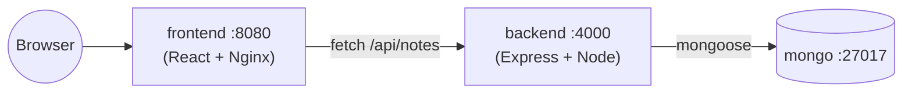

#### Key Concepts Reinforced

- **`depends_on` + `condition: service_healthy`** — the backend won't start until MongoDB reports healthy (Chapter 07, 08).
- **Container-name DNS** — the backend connects to MongoDB via `mongodb://mongo:27017`, using the service name, not an IP — only possible because Compose puts all services on a shared user-defined network automatically (Chapter 06).
- **Build args** — `VITE_API_URL` is baked into the frontend's static build at image build time (Chapter 04).
- **Named volume** for MongoDB data persistence (Chapter 05).

#### Build & Run Command

```bash
docker compose up -d --build
```

#### Verify It's Working

Visit `http://localhost:8080` — add a note through the form, refresh, and confirm it persisted (stored in MongoDB via the API).

```bash
docker compose ps         # all three services should be healthy/running
docker compose logs -f backend
curl http://localhost:4000/api/notes
```

#### Expected Output

A simple notes app UI where submitted notes appear in a list, backed by real persistence in MongoDB.

#### Common Errors

| Error | Cause | Fix |
|---|---|---|
| Frontend loads but can't fetch notes | `VITE_API_URL` baked in at build time doesn't match how you're accessing the API | Rebuild frontend with the correct `VITE_API_URL` build arg for your environment |
| Backend can't connect to Mongo | Backend started before Mongo was ready | Confirm `depends_on: condition: service_healthy` is present and Mongo's healthcheck is passing |
| `CORS error` in browser console | Backend `cors()` middleware missing or misconfigured | Confirm `app.use(cors())` is present in `backend/index.js` |

#### 💪 Improvements to Try

1. Add a `DELETE /api/notes/:id` route and wire up a delete button in the frontend.
2. Split into `compose.yaml` + `compose.override.yaml` for dev (bind-mounted source, hot reload) vs a leaner prod setup.
3. Add resource limits and a reverse proxy in front of both frontend and backend (see Project 13).


---

### Project 11 — Flask + MySQL 🌶️🗄️

**Difficulty:** Advanced
**Skills practiced:** App-to-database networking, connection retry logic, `depends_on` with healthchecks, environment-based configuration

#### What This Project Does

A Flask To-Do API backed by MySQL — two services (`api` and `db`) that must correctly network, initialize, and coordinate startup order.

#### Folder Structure

```
11-flask-mysql/
├── compose.yaml
├── Dockerfile
├── requirements.txt
├── init.sql
├── app.py
└── README.md
```

#### 📂 Key Source Files

**`compose.yaml`**
```yaml
services:
  db:
    image: mysql:8.4
    restart: unless-stopped
    environment:
      MYSQL_ROOT_PASSWORD: rootpass123
      MYSQL_DATABASE: sampledb
      MYSQL_USER: appuser
      MYSQL_PASSWORD: apppass123
    volumes:
      - db-data:/var/lib/mysql
      - ./init.sql:/docker-entrypoint-initdb.d/init.sql
    healthcheck:
      test: ["CMD", "mysqladmin", "ping", "-h", "localhost", "-u", "root", "-prootpass123"]
      interval: 10s
      timeout: 5s
      retries: 5

  api:
    build: .
    restart: unless-stopped
    environment:
      - DB_HOST=db
      - DB_USER=appuser
      - DB_PASSWORD=apppass123
      - DB_NAME=sampledb
    ports:
      - "5000:5000"
    depends_on:
      db:
        condition: service_healthy

volumes:
  db-data:
```

**`Dockerfile`**
```dockerfile
FROM python:3.12-slim
WORKDIR /app
COPY requirements.txt .
RUN pip install --no-cache-dir -r requirements.txt
COPY app.py .
RUN useradd -m appuser
USER appuser
EXPOSE 5000
HEALTHCHECK --interval=30s --timeout=3s --retries=3 \
  CMD python -c "import urllib.request; urllib.request.urlopen('http://localhost:5000/health')" || exit 1
CMD ["gunicorn", "--bind", "0.0.0.0:5000", "--workers", "2", "app:app"]
```

**`app.py`**
```python
import os
import time
from flask import Flask, jsonify, request
import mysql.connector
from mysql.connector import Error

app = Flask(__name__)

DB_CONFIG = {
    "host": os.environ.get("DB_HOST", "db"),
    "user": os.environ.get("DB_USER", "appuser"),
    "password": os.environ.get("DB_PASSWORD", "apppass123"),
    "database": os.environ.get("DB_NAME", "sampledb"),
}

def get_connection(retries=5, delay=3):
    last_error = None
    for attempt in range(retries):
        try:
            return mysql.connector.connect(**DB_CONFIG)
        except Error as e:
            last_error = e
            print(f"DB connection attempt {attempt+1} failed: {e}")
            time.sleep(delay)
    raise last_error

@app.route("/health")
def health():
    return jsonify({"status": "healthy"}), 200

@app.route("/todos", methods=["GET"])
def get_todos():
    conn = get_connection()
    cur = conn.cursor(dictionary=True)
    cur.execute("SELECT id, task, done FROM todos")
    rows = cur.fetchall()
    cur.close()
    conn.close()
    return jsonify(rows)

@app.route("/todos", methods=["POST"])
def add_todo():
    task = request.json.get("task")
    conn = get_connection()
    cur = conn.cursor()
    cur.execute("INSERT INTO todos (task, done) VALUES (%s, %s)", (task, False))
    conn.commit()
    cur.close()
    conn.close()
    return jsonify({"message": "created"}), 201

if __name__ == "__main__":
    app.run(host="0.0.0.0", port=5000)
```

**`init.sql`**
```sql
CREATE TABLE IF NOT EXISTS todos (
    id INT AUTO_INCREMENT PRIMARY KEY,
    task VARCHAR(255) NOT NULL,
    done BOOLEAN DEFAULT FALSE
);

INSERT INTO todos (task, done) VALUES ('Learn Docker Compose networking', TRUE);
```


#### Key Concepts Reinforced

- **Service-name networking** — `app.py` connects to `DB_HOST=db`, the Compose service name, not an IP or `localhost` (Chapter 06).
- **Connection retry logic** — even with `depends_on: condition: service_healthy`, well-written apps still retry their own connection attempts defensively; `get_connection()` retries 5 times with a delay, a real-world pattern worth internalizing.
- **`init.sql` auto-run** on first startup via MySQL's special init directory (Chapter 05, and Project 04).
- **Environment-based configuration** — the same `app.py` could point at a different database just by changing env vars, no code change (Chapter 00, 08).

#### Build & Run Command

```bash
docker compose up -d --build
```

#### Verify It's Working

```bash
docker compose ps
curl http://localhost:5000/todos
```

```bash
curl -X POST http://localhost:5000/todos \
  -H "Content-Type: application/json" \
  -d '{"task": "Write a Dockerfile"}'

curl http://localhost:5000/todos
```

#### Expected Output

```json
[
  {"id": 1, "task": "Learn Docker Compose networking", "done": 1},
  {"id": 2, "task": "Write a Dockerfile", "done": 0}
]
```

#### Common Errors

| Error | Cause | Fix |
|---|---|---|
| `2003: Can't connect to MySQL server on 'db'` | API started before MySQL was ready, or wrong `DB_HOST` | Confirm `depends_on: condition: service_healthy`; confirm `DB_HOST=db` matches the service name exactly |
| `init.sql` didn't create the table | Volume already existed from a previous run | `docker compose down -v` to reset, then `up -d --build` again |
| `Access denied for user 'appuser'` | Credential mismatch between `compose.yaml`'s MySQL env vars and the API's `DB_*` env vars | Make sure both sets of credentials match exactly |

#### 💪 Improvements to Try

1. Add a `/todos/<id>` `PATCH` route to mark a todo as done.
2. Move credentials into a `.env` file excluded from Git (Chapter 07).
3. Add resource limits and a non-root MySQL configuration for production hardening (Chapter 09).

---


---

### Project 12 — FastAPI + PostgreSQL ⚡🐘

**Difficulty:** Advanced
**Skills practiced:** Modern async Python stack, connection pooling, healthchecks, `depends_on`, lifespan startup hooks

#### What This Project Does

An async FastAPI service backed by PostgreSQL, using `asyncpg` for a connection pool and FastAPI's `lifespan` hook to initialize the database schema on startup.

#### Folder Structure

```
12-fastapi-postgres/
├── compose.yaml
├── Dockerfile
├── requirements.txt
├── .dockerignore
├── main.py
└── README.md
```

#### 📂 Key Source Files

**`compose.yaml`**
```yaml
services:
  db:
    image: postgres:16-alpine
    restart: unless-stopped
    environment:
      POSTGRES_USER: appuser
      POSTGRES_PASSWORD: apppass123
      POSTGRES_DB: appdb
    volumes:
      - pg-data:/var/lib/postgresql/data
    healthcheck:
      test: ["CMD-SHELL", "pg_isready -U appuser -d appdb"]
      interval: 5s
      timeout: 3s
      retries: 5

  api:
    build: .
    restart: unless-stopped
    environment:
      - DATABASE_URL=postgresql://appuser:apppass123@db:5432/appdb
    ports:
      - "8000:8000"
    depends_on:
      db:
        condition: service_healthy

volumes:
  pg-data:
```

**`Dockerfile`**
```dockerfile
FROM python:3.12-slim
WORKDIR /app
COPY requirements.txt .
RUN pip install --no-cache-dir -r requirements.txt
COPY main.py .
RUN useradd -m appuser
USER appuser
EXPOSE 8000
HEALTHCHECK --interval=30s --timeout=3s --retries=3 \
  CMD python -c "import urllib.request; urllib.request.urlopen('http://localhost:8000/health')" || exit 1
CMD ["uvicorn", "main:app", "--host", "0.0.0.0", "--port", "8000"]
```

**`main.py`**
```python
import os
from contextlib import asynccontextmanager
from fastapi import FastAPI
from pydantic import BaseModel
import asyncpg

DB_DSN = os.environ.get("DATABASE_URL", "postgresql://appuser:apppass123@db:5432/appdb")

pool = None

@asynccontextmanager
async def lifespan(app: FastAPI):
    global pool
    pool = await asyncpg.create_pool(dsn=DB_DSN, min_size=1, max_size=5)
    async with pool.acquire() as conn:
        await conn.execute("""
            CREATE TABLE IF NOT EXISTS items (
                id SERIAL PRIMARY KEY,
                name TEXT NOT NULL
            )
        """)
    yield
    await pool.close()

app = FastAPI(lifespan=lifespan)

class Item(BaseModel):
    name: str

@app.get("/health")
async def health():
    return {"status": "healthy"}

@app.get("/items")
async def list_items():
    async with pool.acquire() as conn:
        rows = await conn.fetch("SELECT id, name FROM items ORDER BY id")
        return [dict(r) for r in rows]

@app.post("/items", status_code=201)
async def create_item(item: Item):
    async with pool.acquire() as conn:
        row = await conn.fetchrow(
            "INSERT INTO items (name) VALUES ($1) RETURNING id, name", item.name
        )
        return dict(row)
```


#### Key Concepts Reinforced

- **Async connection pooling** — `asyncpg.create_pool()` is created once at startup (via `lifespan`) and reused across requests, rather than opening a new connection per request.
- **`depends_on: condition: service_healthy`** — the API waits for Postgres's `pg_isready` healthcheck before starting (Chapter 07, 08).
- **Uvicorn as the ASGI server**, bound to `0.0.0.0:8000` (Chapter 10's golden rule, same as every other project).
- **Non-root `USER`** (Chapter 09).

#### Build & Run Command

```bash
docker compose up -d --build
```

#### Verify It's Working

```bash
docker compose ps
curl http://localhost:8000/items

curl -X POST http://localhost:8000/items \
  -H "Content-Type: application/json" \
  -d '{"name": "Learn asyncpg"}'

curl http://localhost:8000/items
```

#### Expected Output

```json
[{"id": 1, "name": "Learn asyncpg"}]
```

FastAPI also gives you free interactive API docs at `http://localhost:8000/docs`.

#### Common Errors

| Error | Cause | Fix |
|---|---|---|
| `ConnectionRefusedError` on startup | API started before Postgres was ready | Confirm `depends_on: condition: service_healthy` is present and Postgres's healthcheck passes first |
| `relation "items" does not exist` | Lifespan startup hook didn't run, or ran against the wrong database | Check `DATABASE_URL` matches the Postgres service's credentials exactly |
| Slow first request | Connection pool warming up | Normal — subsequent requests reuse pooled connections and are much faster |

#### 💪 Improvements to Try

1. Add Alembic migrations instead of the inline `CREATE TABLE IF NOT EXISTS`.
2. Add a `GET /items/{id}` route with proper 404 handling.
3. Add a multi-stage build if you introduce a compiled dependency, and compare image sizes.

---


---

### Project 13 — Multi-Container Capstone 🏆

**Difficulty:** Advanced (Capstone)
**Skills practiced:** Everything in this repo, combined — reverse proxy routing, multiple networked services, cache-aside pattern, healthchecks, dependency ordering

#### What This Project Does

A reverse proxy (Nginx) routes traffic to either a static frontend or a Flask API, which itself talks to both a PostgreSQL database and a Redis cache using the **cache-aside pattern** (check cache → fall back to DB → populate cache).

#### Folder Structure

```
13-multi-container-compose/
├── compose.yaml
├── proxy/
│   ├── Dockerfile
│   └── nginx.conf
├── frontend/
│   ├── Dockerfile
│   └── index.html
└── api/
    ├── Dockerfile
    ├── requirements.txt
    └── app.py
```

#### 📂 Key Source Files

**`compose.yaml`**
```yaml
# Project 13 — Multi-Container Capstone
# Goal: combine everything — reverse proxy, frontend, API, database, and cache.

services:
  proxy:
    build: ./proxy
    restart: unless-stopped
    ports:
      - "80:80"
    depends_on:
      - frontend
      - api
    networks:
      - capstone-net

  frontend:
    build: ./frontend
    restart: unless-stopped
    networks:
      - capstone-net

  api:
    build: ./api
    restart: unless-stopped
    environment:
      - DATABASE_URL=postgresql://appuser:apppass123@db:5432/appdb
      - REDIS_HOST=cache
    depends_on:
      db:
        condition: service_healthy
      cache:
        condition: service_started
    networks:
      - capstone-net

  db:
    image: postgres:16-alpine
    restart: unless-stopped
    environment:
      POSTGRES_USER: appuser
      POSTGRES_PASSWORD: apppass123
      POSTGRES_DB: appdb
    volumes:
      - pg-data:/var/lib/postgresql/data
    healthcheck:
      test: ["CMD-SHELL", "pg_isready -U appuser -d appdb"]
      interval: 5s
      timeout: 3s
      retries: 5
    networks:
      - capstone-net

  cache:
    image: redis:7-alpine
    restart: unless-stopped
    volumes:
      - redis-data:/data
    networks:
      - capstone-net

networks:
  capstone-net:

volumes:
  pg-data:
  redis-data:
```

**`proxy/nginx.conf`**
```nginx
events {}
http {
  server {
    listen 80;

    location /api/ {
      proxy_pass http://api:5000/;
      proxy_set_header Host $host;
    }

    location / {
      proxy_pass http://frontend:80/;
      proxy_set_header Host $host;
    }
  }
}
```

**`proxy/Dockerfile`**
```dockerfile
FROM nginx:1.27-alpine
COPY nginx.conf /etc/nginx/nginx.conf
EXPOSE 80
```

**`api/Dockerfile`**
```dockerfile
FROM python:3.12-slim
WORKDIR /app
COPY requirements.txt .
RUN pip install --no-cache-dir -r requirements.txt
COPY app.py .
RUN useradd -m appuser
USER appuser
EXPOSE 5000
HEALTHCHECK --interval=30s --timeout=3s --retries=3 \
  CMD python -c "import urllib.request; urllib.request.urlopen('http://localhost:5000/health')" || exit 1
CMD ["gunicorn", "--bind", "0.0.0.0:5000", "--workers", "2", "app:app"]
```

**`api/app.py`**
```python
import os, json
from flask import Flask, jsonify, request
import psycopg2
import redis

app = Flask(__name__)

DB_DSN = os.environ.get("DATABASE_URL", "postgresql://appuser:apppass123@db:5432/appdb")
r = redis.Redis(host=os.environ.get("REDIS_HOST", "cache"), port=6379, decode_responses=True)

def get_conn():
    return psycopg2.connect(DB_DSN)

def init_db():
    conn = get_conn()
    cur = conn.cursor()
    cur.execute("CREATE TABLE IF NOT EXISTS items (id SERIAL PRIMARY KEY, name TEXT NOT NULL)")
    conn.commit()
    cur.close()
    conn.close()

@app.route("/health")
def health():
    return jsonify({"status": "healthy"})

@app.route("/items", methods=["GET"])
def list_items():
    cached = r.get("items_cache")
    if cached:
        return jsonify({"source": "cache", "items": json.loads(cached)})
    conn = get_conn()
    cur = conn.cursor()
    cur.execute("SELECT id, name FROM items ORDER BY id")
    rows = [{"id": i, "name": n} for i, n in cur.fetchall()]
    cur.close()
    conn.close()
    r.setex("items_cache", 30, json.dumps(rows))
    return jsonify({"source": "database", "items": rows})

@app.route("/items", methods=["POST"])
def add_item():
    name = request.json.get("name")
    conn = get_conn()
    cur = conn.cursor()
    cur.execute("INSERT INTO items (name) VALUES (%s)", (name,))
    conn.commit()
    cur.close()
    conn.close()
    r.delete("items_cache")
    return jsonify({"message": "created"}), 201

init_db()

if __name__ == "__main__":
    app.run(host="0.0.0.0", port=5000)
```

**`frontend/Dockerfile`**
```dockerfile
FROM nginx:1.27-alpine
RUN rm -rf /usr/share/nginx/html/*
COPY index.html /usr/share/nginx/html/
EXPOSE 80
```


#### Architecture

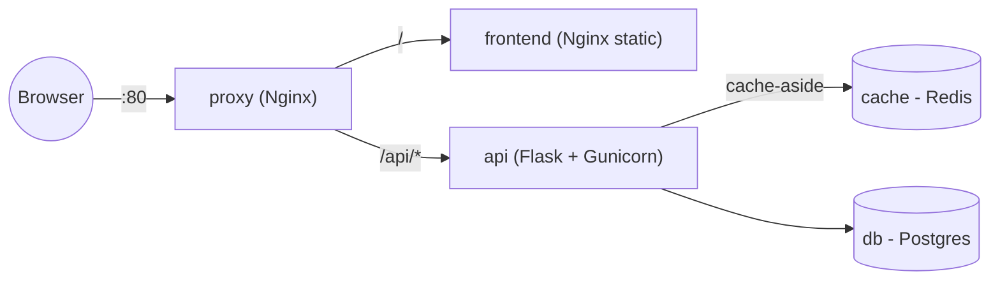

#### Key Concepts Reinforced (Everything, Combined)

- **Reverse proxy routing** (`proxy/nginx.conf`) — one public entry point (port 80) routes to internal, unpublished services by container name (Chapter 06).
- **Cache-aside pattern** — `api/app.py` checks Redis first; on a miss, it queries Postgres and populates the cache with a 30-second expiry; on a write, it invalidates the cache (Chapter 05, 11).
- **Multiple `depends_on` conditions** — the API waits for Postgres to be `service_healthy` and for Redis to simply be `service_started` (Chapter 07, 08).
- **Only the proxy publishes a port** — `frontend`, `api`, `db`, and `cache` are all reachable *only* from within the Docker network, not directly from your host — a real production pattern (Chapter 09: least privilege, minimal exposed surface).

#### Build & Run Command

```bash
docker compose up -d --build
```

#### Verify It's Working

```bash
docker compose ps           # 5 services: proxy, frontend, api, db, cache
curl http://localhost/                     # frontend, via the proxy
curl http://localhost/api/items            # API, via the proxy

curl -X POST http://localhost/api/items \
  -H "Content-Type: application/json" \
  -d '{"name": "Finished the whole roadmap!"}'

curl http://localhost/api/items            # "source": "database" (cache was invalidated)
curl http://localhost/api/items            # "source": "cache" (served from Redis this time)
```

#### Expected Output

```json
{"source": "database", "items": [{"id": 1, "name": "Finished the whole roadmap!"}]}
```
then, on the very next identical request within 30 seconds:
```json
{"source": "cache", "items": [{"id": 1, "name": "Finished the whole roadmap!"}]}
```

#### Common Errors

| Error | Cause | Fix |
|---|---|---|
| `502 Bad Gateway` from the proxy | `frontend` or `api` isn't up yet, or the proxy's `proxy_pass` target name doesn't match the Compose service name | Check `docker compose logs proxy` and confirm service names in `nginx.conf` match `compose.yaml` exactly |
| API can't reach Postgres/Redis | Not all services on the same Compose network | By default Compose puts everything in one project network automatically — confirm you didn't override `networks:` inconsistently |
| Stale data even after a POST | Cache invalidation logic skipped | Confirm `r.delete("items_cache")` runs in the `add_item` route |

#### 💪 Improvements to Try

1. Add TLS termination at the proxy layer (self-signed cert for local practice).
2. Add resource limits and non-default restart policies to every service (Chapter 08).
3. Recreate this exact architecture as Kubernetes manifests (Deployment + Service per component) as a bridge into Chapter 13's cloud/orchestration concepts.
4. Add a CI pipeline (Chapter 12) that builds, scans, and pushes all three custom images (`proxy`, `frontend`, `api`).

---

🎉 **If you've built all 13 projects, you've covered the full practical range of this repo — containerizing simple scripts, real frameworks, databases, caches, full stacks, and a proxied multi-service architecture. That's a genuinely strong, interview-ready Docker portfolio.**

---

---

<div align="center">

### 🎉 That's the Complete Roadmap

If you've read through every chapter and built all 13 projects, you have a genuinely strong, practical, interview-ready understanding of Docker — not just command memorization, but the reasoning behind *why* things work the way they do.

**Good luck — you've got this. 🐳**

</div>
