<div align="center">

# 🎯 Machine Learning Interview Handbook

### The Ultimate Guide to ML Algorithms for Data Science Interviews

Covering:
✔ Regression &nbsp;•&nbsp; ✔ Classification &nbsp;•&nbsp; ✔ Clustering &nbsp;•&nbsp; ✔ Ensemble Learning
✔ Dimensionality Reduction &nbsp;•&nbsp; ✔ Deep Learning &nbsp;•&nbsp; ✔ Interview Questions
✔ Hyperparameters &nbsp;•&nbsp; ✔ Real-World Use Cases &nbsp;•&nbsp; ✔ Comparisons


</div>

---

> [!TIP]
> **How to use this handbook:** Every algorithm follows the _exact same 25-part structure_, so once you're familiar with the layout for one algorithm, you can navigate any other algorithm instantly. Use the Quick Navigation table below to jump straight to what you need before an interview.

---

## 📖 Table of Contents

- [Introduction](#-introduction)
- [Quick Navigation](#-quick-navigation)
- [Progress Checklist](#-progress-checklist)
- [Part 1 — Regression](#part-1--regression)
  - [Linear Regression](#linear-regression)
  - [Ridge, Lasso \& Elastic Net (Brief Comparison)](#ridge-lasso--elastic-net-brief-comparison)
- [Part 2 — Classification](#part-2--classification)
  - [Logistic Regression](#logistic-regression)
  - [Decision Tree](#decision-tree)
  - [Random Forest](#random-forest)
  - [K-Nearest Neighbors (KNN)](#k-nearest-neighbors-knn)
  - [Naive Bayes](#naive-bayes)
  - [Support Vector Machine (SVM)](#support-vector-machine-svm)
- [Part 3 — Boosting Algorithms](#part-3--boosting-algorithms)
  - [Gradient Boosting](#gradient-boosting)
  - [XGBoost](#xgboost)
  - [LightGBM](#lightgbm)
  - [CatBoost](#catboost)
- [Part 4 — Clustering](#part-4--clustering)
  - [K-Means](#k-means)
  - [DBSCAN](#dbscan)
- [Part 5 — Dimensionality Reduction](#part-5--dimensionality-reduction)
  - [Principal Component Analysis (PCA)](#principal-component-analysis-pca)
- [Part 6 — Deep Learning](#part-6--deep-learning)
  - [Neural Networks](#neural-networks)
- [Part 7 — Comparison Chapters](#part-7--comparison-chapters)
- [Part 8 — Interview Cheat Sheets](#part-8--interview-cheat-sheets)
- [Part 9 — Final Interview Revision Tables](#part-9--final-interview-revision-tables)
- [Interview Preparation Tips](#-interview-preparation-tips)
- [References](#-references)

---

## 🧭 Introduction

Welcome to the **Machine Learning Interview Handbook** — a single-file, self-contained reference designed to take you from _"what is this algorithm?"_ to _"I can defend this algorithm in a live interview"_.

This handbook was built for:

- 🎓 Students preparing for **campus placements**
- 💼 Professionals preparing for **off-campus interviews** at product and service companies
- 🔁 Data Analysts **transitioning into ML/Data Science roles**
- 🧑‍💻 ML/AI Engineers refreshing fundamentals before onsite rounds

Every algorithm in this guide follows the **exact same 25-part structure**:

`Overview → Problem Type → Intuition → Math → Steps → Diagram → Real-World Example → Code → Visualization → Assumptions → Advantages → Disadvantages → Hyperparameters → Evaluation Metrics → Scaling → Missing Values → Categorical Features → Outliers → Complexity → When to Use → When Not to Use → Interview Questions → Common Mistakes → Tips → Summary Box`

> [!NOTE]
> This handbook is meant to be **revised, not just read once**. Bookmark the [Quick Navigation](#-quick-navigation) table and the [Final Interview Revision Tables](#part-9--final-interview-revision-tables) — they're designed for the night before an interview.

---

## 🚀 Quick Navigation

| #   | Algorithm                   | Category                  | Jump To                                            |
| --- | --------------------------- | ------------------------- | -------------------------------------------------- |
| 1   | Linear Regression           | Regression                | [Go →](#linear-regression)                         |
| 2   | Ridge / Lasso / Elastic Net | Regression                | [Go →](#ridge-lasso--elastic-net-brief-comparison) |
| 3   | Logistic Regression         | Classification            | [Go →](#logistic-regression)                       |
| 4   | Decision Tree               | Classification            | [Go →](#decision-tree)                             |
| 5   | Random Forest               | Classification / Ensemble | [Go →](#random-forest)                             |
| 6   | K-Nearest Neighbors         | Classification            | [Go →](#k-nearest-neighbors-knn)                   |
| 7   | Naive Bayes                 | Classification            | [Go →](#naive-bayes)                               |
| 8   | Support Vector Machine      | Classification            | [Go →](#support-vector-machine-svm)                |
| 9   | Gradient Boosting           | Ensemble / Boosting       | [Go →](#gradient-boosting)                         |
| 10  | XGBoost                     | Ensemble / Boosting       | [Go →](#xgboost)                                   |
| 11  | LightGBM                    | Ensemble / Boosting       | [Go →](#lightgbm)                                  |
| 12  | CatBoost                    | Ensemble / Boosting       | [Go →](#catboost)                                  |
| 13  | K-Means                     | Clustering                | [Go →](#k-means)                                   |
| 14  | DBSCAN                      | Clustering                | [Go →](#dbscan)                                    |
| 15  | PCA                         | Dimensionality Reduction  | [Go →](#principal-component-analysis-pca)          |
| 16  | Neural Networks             | Deep Learning             | [Go →](#neural-networks)                           |

---

## ✅ Progress Checklist

Copy this into your notes and check off algorithms as you revise them:

- [ ] Linear Regression
- [ ] Ridge / Lasso / Elastic Net
- [ ] Logistic Regression
- [ ] Decision Tree
- [ ] Random Forest
- [ ] K-Nearest Neighbors (KNN)
- [ ] Naive Bayes
- [ ] Support Vector Machine (SVM)
- [ ] Gradient Boosting
- [ ] XGBoost
- [ ] LightGBM
- [ ] CatBoost
- [ ] K-Means
- [ ] DBSCAN
- [ ] PCA
- [ ] Neural Networks
- [ ] Comparison Chapters
- [ ] Interview Cheat Sheets
- [ ] Final Revision Tables

---

# Part 1 — Regression

## Linear Regression

### 1. Overview

Linear Regression is the simplest supervised learning algorithm used to model the relationship between a dependent variable (target) and one or more independent variables (features) by fitting a straight line (or hyperplane) through the data.

It exists because many real-world relationships are approximately linear, and even when they aren't, Linear Regression gives a fast, interpretable baseline that every other model is compared against.

**Solves:** Regression problems — predicting a continuous numeric value.

### 2. Problem Type

`Regression`

### 3. Intuition

> Imagine plotting height vs. weight for 100 people on a graph. Linear Regression tries to draw **one straight line** through the cloud of points such that the line is, on average, as close as possible to every point. That line then becomes your prediction machine — give it a new height, it tells you the expected weight.

### 4. Mathematical Idea

For simple linear regression:

$$
\hat{y} = \beta_0 + \beta_1 x
$$

For multiple linear regression:

$$
\hat{y} = \beta_0 + \beta_1 x_1 + \beta_2 x_2 + \dots + \beta_n x_n
$$

The coefficients are found by minimizing the **Sum of Squared Errors (SSE)**:

$$
J(\beta) = \sum_{i=1}^{n} (y_i - \hat{y}_i)^2
$$

This is solved either via the **Normal Equation**:

$$
\beta = (X^TX)^{-1}X^Ty
$$

or iteratively via **Gradient Descent**, which repeatedly nudges the coefficients in the direction that reduces error.

### 5. How the Algorithm Works

1. Collect data with features `X` and continuous target `y`.
2. Assume a linear relationship between `X` and `y`.
3. Initialize coefficients (weights) — either randomly or as zeros.
4. Compute predictions and measure error using a loss function (usually Mean Squared Error).
5. Update coefficients using the Normal Equation (closed-form) or Gradient Descent (iterative) until error is minimized.
6. Use the final coefficients to predict on new/unseen data.

### 6. Workflow Diagram

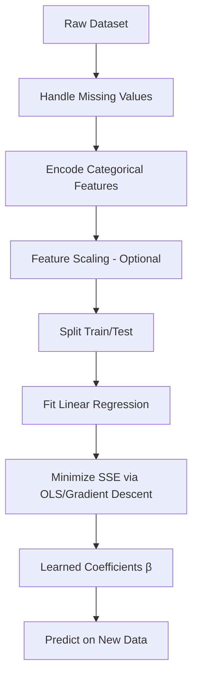

### 7. Real World Example

- 🏠 House Price Prediction (based on size, location, number of rooms)
- 📈 Sales Forecasting based on advertising spend
- 🌡️ Predicting temperature based on historical trends
- 💰 Salary prediction based on years of experience

### 8. Python Example

```python
import pandas as pd
import numpy as np
from sklearn.model_selection import train_test_split
from sklearn.linear_model import LinearRegression
from sklearn.metrics import mean_squared_error, r2_score

# Sample data
df = pd.read_csv("house_prices.csv")
X = df[["size_sqft", "num_rooms", "age_years"]]
y = df["price"]

X_train, X_test, y_train, y_test = train_test_split(
    X, y, test_size=0.2, random_state=42
)

model = LinearRegression()
model.fit(X_train, y_train)

y_pred = model.predict(X_test)

print("Coefficients:", model.coef_)
print("Intercept:", model.intercept_)
print("RMSE:", np.sqrt(mean_squared_error(y_test, y_pred)))
print("R² Score:", r2_score(y_test, y_pred))
```

### 9. Visualization

```
Price
  │                              ●
  │                       ●
  │                 ●        ●
  │           ●   ─────line of best fit─────
  │      ●
  │  ●
  └────────────────────────────────  Size (sqft)
```

### 10. Assumptions

| Assumption             | Meaning in Plain English                                         |
| ---------------------- | ---------------------------------------------------------------- |
| Linearity              | The relationship between X and y is a straight line, not a curve |
| Independence           | Each observation is unrelated to the others (no autocorrelation) |
| Homoscedasticity       | The spread of errors is roughly constant across all values of X  |
| Normality of residuals | The prediction errors are roughly normally distributed           |
| No multicollinearity   | Features aren't highly correlated with each other                |

### 11. Advantages

- **Highly interpretable** — coefficients directly show how much the target changes per unit change in a feature.
- **Fast to train** — closed-form solution exists, no iterative tuning needed for small/medium data.
- **Low computational cost** — works well even on modest hardware.
- **Good baseline** — almost every regression project starts here before trying complex models.
- **Well-understood statistics** — confidence intervals, p-values, and hypothesis tests are mature and well documented.

### 12. Disadvantages

- **Assumes linearity** — performs poorly if the true relationship is non-linear.
- **Sensitive to outliers** — a few extreme points can drastically shift the fitted line because squared error penalizes large deviations heavily.
- **Multicollinearity issues** — correlated features make coefficients unstable and hard to interpret.
- **Cannot capture interactions** automatically — you must manually engineer interaction terms.
- **Underfits complex data** — struggles when the underlying pattern is genuinely non-linear.

### 13. Important Hyperparameters

| Hyperparameter  | Purpose                                 | Effect                                                        | Typical Values        | Interview Notes                                                           |
| --------------- | --------------------------------------- | ------------------------------------------------------------- | --------------------- | ------------------------------------------------------------------------- |
| `fit_intercept` | Whether to calculate the intercept term | If False, forces line through origin                          | `True` (default)      | Rarely set to False unless data is known to pass through origin           |
| `positive`      | Forces coefficients to be positive      | Useful in domains where negative coefficients are meaningless | `False` (default)     | Interviewers may ask why you'd constrain signs — e.g. physical quantities |
| `n_jobs`        | Parallelism for computation             | Speeds up on large feature sets                               | `-1` to use all cores | Not a modeling hyperparameter, purely computational                       |

> [!NOTE]
> Vanilla Linear Regression has **no regularization hyperparameter** — that's exactly why Ridge/Lasso/Elastic Net exist (see next section).

### 14. Evaluation Metrics

- **MAE (Mean Absolute Error)** — average magnitude of errors, robust to outliers, easy to interpret in original units.
- **MSE (Mean Squared Error)** — penalizes large errors more heavily; used as the training loss.
- **RMSE (Root Mean Squared Error)** — same units as target, most commonly reported metric.
- **R² Score** — proportion of variance in target explained by the model (0 to 1, higher is better).
- **Adjusted R²** — like R² but penalizes adding useless features.

### 15. Feature Scaling Requirement

**NO** (not strictly required) — Linear Regression solved via the Normal Equation is scale-invariant in terms of fit quality, though scaling helps if you're using Gradient Descent (faster convergence) or want to directly compare coefficient magnitudes.

### 16. Missing Values

**Cannot handle missing values natively.** You must impute (mean/median/mode or model-based imputation) or drop rows/columns before training — scikit-learn's `LinearRegression` will throw an error on NaNs.

### 17. Categorical Features

**Cannot handle categorical variables directly.** They must be encoded first (One-Hot Encoding for nominal variables, Ordinal Encoding for ordinal variables) before fitting.

### 18. Outliers

**Highly sensitive.** Because the loss function squares the errors, a single extreme outlier can pull the entire regression line toward it, distorting predictions for all other points.

### 19. Computational Complexity

- **Training Complexity:** O(n·p² + p³) using the Normal Equation (p = features, n = samples) — becomes expensive when p is large.
- **Prediction Complexity:** O(p) — just a dot product, extremely fast.
- **Memory Complexity:** O(n·p) to store the design matrix.

### 20. When to Use

- The relationship between features and target is roughly linear.
- You need an interpretable model to explain to stakeholders.
- You want a fast baseline before trying complex models.
- Dataset is small to medium-sized with limited multicollinearity.

### 21. When NOT to Use

- The relationship is clearly non-linear (use polynomial features, trees, or boosting instead).
- Data has many correlated features (use Ridge/Lasso/Elastic Net instead).
- Dataset has many outliers (consider robust regression, Huber loss, or tree-based models).

### 22. Frequently Asked Interview Questions

<details>
<summary><b>Click to expand 12 interview questions</b></summary>

**Basic**

1. What is Linear Regression and when would you use it?
2. What is the difference between simple and multiple linear regression?
3. What does the R² value tell you?
4. Why do we minimize squared error instead of absolute error by default?

**Intermediate** 5. What happens if two features are highly correlated? 6. How do you detect multicollinearity? (VIF — Variance Inflation Factor) 7. What is heteroscedasticity and how would you detect it? 8. Difference between R² and Adjusted R²? 9. How does Linear Regression handle categorical variables?

**Advanced** 10. Derive the Normal Equation for Linear Regression. 11. Why is Linear Regression called a "parametric" and "linear" model even when using polynomial features? 12. What is the difference between Linear Regression solved via Normal Equation vs. Gradient Descent, and when would you prefer one over the other?

</details>

### 23. Common Mistakes

- Forgetting to check for multicollinearity before trusting coefficient interpretations.
- Not scaling features when using Gradient Descent, leading to slow/unstable convergence.
- Ignoring residual plots — a curved residual pattern means the linearity assumption is violated.
- Using R² alone to judge model quality without checking residuals or out-of-sample performance.

### 24. Tips

> [!TIP]
> In interviews, always mention that you'd **check residual plots** before trusting a linear model — this shows depth beyond just calling `.fit()`.

> [!TIP]
> If asked "how would you handle multicollinearity," mention **VIF, dropping correlated features, or switching to Ridge Regression** — this is a very common follow-up question.

### 25. Summary Box

| Topic          | Summary                                   |
| -------------- | ----------------------------------------- |
| Problem Type   | Regression                                |
| Scaling        | Not required (helps for Gradient Descent) |
| Missing Values | Not handled — must impute                 |
| Fast           | Yes                                       |
| Explainable    | Very High                                 |
| Best Use Case  | House Price Prediction, Sales Forecasting |

---

## Ridge, Lasso & Elastic Net (Brief Comparison)

These three are **regularized extensions of Linear Regression**, solving the same regression problem but adding a penalty term to control overfitting and multicollinearity.

| Aspect                    | Ridge (L2)                                     | Lasso (L1)                                               | Elastic Net (L1+L2)                                             |
| ------------------------- | ---------------------------------------------- | -------------------------------------------------------- | --------------------------------------------------------------- |
| Penalty Term              | $\lambda \sum \beta_i^2$                       | $\lambda \sum \lvert\beta_i\rvert$                       | $\lambda_1 \sum \lvert\beta_i\rvert + \lambda_2 \sum \beta_i^2$ |
| Feature Selection         | ❌ Shrinks coefficients but never to exactly 0 | ✅ Can shrink coefficients to exactly 0 (sparse)         | ✅ Partial — combines both behaviors                            |
| Best For                  | Many small/medium correlated features          | Few features truly matter (sparse signal)                | High-dimensional data with correlated groups of features        |
| Handles Multicollinearity | ✅ Very well                                   | ⚠️ Picks one feature from a correlated group arbitrarily | ✅ Best of both worlds                                          |
| Key Hyperparameter        | `alpha` (regularization strength)              | `alpha` (regularization strength)                        | `alpha` + `l1_ratio`                                            |

```python
from sklearn.linear_model import Ridge, Lasso, ElasticNet

ridge = Ridge(alpha=1.0).fit(X_train, y_train)
lasso = Lasso(alpha=0.1).fit(X_train, y_train)
enet  = ElasticNet(alpha=0.1, l1_ratio=0.5).fit(X_train, y_train)
```

> [!NOTE]
> **Interview one-liner:** _"Ridge shrinks coefficients smoothly and keeps all features; Lasso can zero out coefficients for automatic feature selection; Elastic Net blends both, which is useful when Lasso would arbitrarily drop one of several correlated important features."_

**Quick Interview Questions:**

1. Why does Lasso produce sparse solutions but Ridge doesn't? (Geometric interpretation — L1 diamond has corners on the axes, L2 circle doesn't.)
2. When would you prefer Elastic Net over pure Lasso?
3. What does increasing `alpha` do to the bias-variance tradeoff?
4. Can Ridge/Lasso be used for classification? (Yes — via Ridge/Logistic Regression with penalty, not directly, but the regularization concept carries over to Logistic Regression's `penalty` parameter.)

---

# Part 2 — Classification

## Logistic Regression

### 1. Overview

Despite the name, Logistic Regression is a **classification** algorithm. It models the probability that an input belongs to a particular class by passing a linear combination of features through the **sigmoid function**, squashing outputs into the [0, 1] range.

It exists because we often need not just a class label, but a **calibrated probability** — e.g., "there's an 87% chance this email is spam."

### 2. Problem Type

`Classification` (Binary and Multiclass via One-vs-Rest or Softmax)

### 3. Intuition

> Imagine a doctor deciding whether a tumor is malignant. Instead of drawing a straight line like Linear Regression, Logistic Regression draws an **S-shaped curve** that squeezes any input into a probability between 0 (definitely benign) and 1 (definitely malignant). A threshold (usually 0.5) then converts that probability into a class label.

### 4. Mathematical Idea

Linear combination:

$$
z = \beta_0 + \beta_1x_1 + \dots + \beta_nx_n
$$

Sigmoid function converts it to probability:

$$
p(y=1|x) = \frac{1}{1 + e^{-z}}
$$

Trained by minimizing **Log Loss (Binary Cross-Entropy)**:

$$
J(\beta) = -\frac{1}{n}\sum_{i=1}^{n}\left[y_i \log(\hat{p}_i) + (1-y_i)\log(1-\hat{p}_i)\right]
$$

### 5. How the Algorithm Works

1. Initialize coefficients (weights) to zero or small random values.
2. Compute the linear combination `z` of inputs and weights.
3. Pass `z` through the sigmoid function to get a probability.
4. Compute the log loss between predicted probability and actual label.
5. Update weights using Gradient Descent to reduce log loss.
6. Repeat until convergence; apply a threshold (default 0.5) to output final class.

### 6. Workflow Diagram

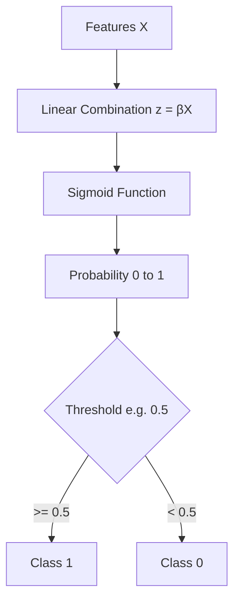

### 7. Real World Example

- 📧 Spam Detection (spam vs. not spam)
- 💳 Credit Default Prediction
- 🩺 Disease Diagnosis (positive vs. negative)
- 📉 Customer Churn Prediction

### 8. Python Example

```python
from sklearn.linear_model import LogisticRegression
from sklearn.model_selection import train_test_split
from sklearn.metrics import classification_report, roc_auc_score

X_train, X_test, y_train, y_test = train_test_split(X, y, test_size=0.2, random_state=42)

model = LogisticRegression(max_iter=1000)
model.fit(X_train, y_train)

y_pred = model.predict(X_test)
y_prob = model.predict_proba(X_test)[:, 1]

print(classification_report(y_test, y_pred))
print("ROC AUC:", roc_auc_score(y_test, y_prob))
```

### 9. Visualization

```
Probability
   1.0 ┤                     ●●●●●
       │                 ●●●
   0.5 ┤ ─ ─ ─ ─ ─ ─ ●─ ─ ─ ─ ─ ─ ─    ← decision boundary
       │        ●●●
   0.0 ┤●●●●●
       └───────────────────────────── z (linear combination)
```

### 10. Assumptions

| Assumption                   | Meaning in Plain English                                               |
| ---------------------------- | ---------------------------------------------------------------------- |
| Linearity of log-odds        | The log-odds (logit) of the outcome is a linear function of the inputs |
| Independence of observations | No autocorrelation between samples                                     |
| No severe multicollinearity  | Features shouldn't be highly correlated with each other                |
| Large sample size            | Works best with sufficiently large data per class                      |

### 11. Advantages

- **Probabilistic output** — gives calibrated probabilities, not just labels, useful for ranking/risk scoring.
- **Highly interpretable** — coefficients relate directly to odds ratios.
- **Fast and efficient** — trains quickly even on large datasets.
- **Regularization built-in** — L1/L2 penalties available out of the box in scikit-learn.
- **Good baseline classifier** for binary problems.

### 12. Disadvantages

- **Assumes linear decision boundary** — struggles with complex non-linear class boundaries.
- **Sensitive to outliers** in the feature space.
- **Requires feature engineering** for interactions/non-linearities.
- **Struggles with imbalanced classes** without adjustment (e.g., `class_weight`).

### 13. Important Hyperparameters

| Hyperparameter | Purpose                            | Effect                                                       | Typical Values               | Interview Notes                                                           |
| -------------- | ---------------------------------- | ------------------------------------------------------------ | ---------------------------- | ------------------------------------------------------------------------- |
| `C`            | Inverse of regularization strength | Smaller C = stronger regularization                          | 0.01 – 100                   | Frequently asked: "what happens as C → 0?" (coefficients shrink toward 0) |
| `penalty`      | Type of regularization             | `l1` for sparsity, `l2` for shrinkage, `elasticnet` for both | `l2` (default)               | Must pair with compatible `solver`                                        |
| `solver`       | Optimization algorithm             | Affects speed & penalty support                              | `lbfgs`, `liblinear`, `saga` | `saga` supports all penalty types                                         |
| `class_weight` | Handle class imbalance             | `balanced` reweights loss by class frequency                 | `None` or `balanced`         | Common interview scenario: imbalanced fraud data                          |
| `max_iter`     | Max iterations for convergence     | Too low → doesn't converge                                   | 100 – 1000                   | Watch for `ConvergenceWarning`                                            |

### 14. Evaluation Metrics

- **Precision** — of predicted positives, how many are truly positive (important when false positives are costly).
- **Recall** — of actual positives, how many were correctly identified (important when false negatives are costly).
- **F1 Score** — harmonic mean of precision and recall.
- **ROC AUC** — measures ranking quality across all thresholds.
- **Log Loss** — measures calibration quality of predicted probabilities.

### 15. Feature Scaling Requirement

**YES** — especially when using regularization (L1/L2) or `solver='saga'`/`liblinear`, since penalty terms are scale-sensitive; unscaled features with larger ranges get penalized disproportionately.

### 16. Missing Values

**Cannot handle missing values natively** — must be imputed beforehand (mean/median/mode, or advanced imputation techniques).

### 17. Categorical Features

**Cannot handle categorical variables directly** — require One-Hot or Ordinal Encoding before training.

### 18. Outliers

**Moderately sensitive** — since it relies on a linear decision boundary and log-loss, extreme outliers can shift the boundary, though less dramatically than Linear Regression since the sigmoid saturates at extremes.

### 19. Computational Complexity

- **Training Complexity:** O(n·p) per iteration (n = samples, p = features), multiplied by number of Gradient Descent iterations.
- **Prediction Complexity:** O(p) — a single dot product + sigmoid.
- **Memory Complexity:** O(p) to store coefficients — very lightweight.

### 20. When to Use

- Binary or multiclass classification with a roughly linear decision boundary.
- You need interpretable, probabilistic predictions.
- You need a fast, low-memory baseline for classification.

### 21. When NOT to Use

- The decision boundary is highly non-linear (use SVM with kernel, Trees, or Boosting instead).
- Features have complex interactions that aren't manually engineered.

### 22. Frequently Asked Interview Questions

<details>
<summary><b>Click to expand 11 interview questions</b></summary>

**Basic**

1. Why is Logistic Regression called "regression" if it's used for classification?
2. What is the sigmoid function and why is it used?
3. What does the coefficient in Logistic Regression represent (odds ratio)?

**Intermediate** 4. Why can't we use Mean Squared Error as the loss function for Logistic Regression? (Non-convex loss surface with MSE + sigmoid) 5. How do you handle multiclass classification with Logistic Regression? (One-vs-Rest vs Softmax/Multinomial) 6. What is the effect of regularization parameter `C`? 7. How would you handle class imbalance in Logistic Regression? 8. Difference between Logistic Regression and SVM?

**Advanced** 9. Derive the gradient of the log-loss function with respect to the weights. 10. Why is Log Loss a convex function while accuracy is not a good direct training objective? 11. How does Logistic Regression relate to a single-layer Neural Network with sigmoid activation?

</details>

### 23. Common Mistakes

- Using default threshold of 0.5 blindly, even when classes are imbalanced (should tune threshold based on business cost).
- Not scaling features before applying L1/L2 regularization.
- Confusing coefficient sign with feature importance magnitude without considering scale.

### 24. Tips

> [!TIP]
> Always mention **odds ratios** (`exp(coefficient)`) when explaining coefficient interpretation in interviews — it signals deeper statistical understanding.

### 25. Summary Box

| Topic          | Summary                        |
| -------------- | ------------------------------ |
| Problem Type   | Classification                 |
| Scaling        | Required (with regularization) |
| Missing Values | Not handled — must impute      |
| Fast           | Yes                            |
| Explainable    | Very High                      |
| Best Use Case  | Spam Detection, Credit Scoring |

---

## Decision Tree

### 1. Overview

A Decision Tree is a flowchart-like model that splits data into branches based on feature values, making decisions through a series of yes/no questions until it reaches a final prediction (a leaf node).

It exists because humans naturally reason in if-then rules, and Decision Trees mirror that logic while being fully interpretable and capable of modeling non-linear relationships.

### 2. Problem Type

`Classification` and `Regression` (this section focuses on classification)

### 3. Intuition

> Imagine playing "20 Questions" to guess an animal: "Does it have fur? → Does it bark? → It's a dog!" A Decision Tree does exactly this with your data — it asks a series of yes/no questions about feature values to arrive at a prediction.

### 4. Mathematical Idea

Trees split nodes to maximize **purity** of the resulting groups. Common purity measures:

**Gini Impurity:**

$$
Gini = 1 - \sum_{i=1}^{C} p_i^2
$$

**Entropy:**

$$
Entropy = -\sum_{i=1}^{C} p_i \log_2(p_i)
$$

**Information Gain** (used to pick the best split):

$$
IG = Entropy(parent) - \sum_{k} \frac{n_k}{n} Entropy(child_k)
$$

The tree picks, at each node, the feature and threshold that maximizes Information Gain (or minimizes Gini Impurity).

### 5. How the Algorithm Works

1. Start with all training data at the root node.
2. For every feature, evaluate every possible split point.
3. Choose the split that produces the highest Information Gain (or lowest Gini Impurity).
4. Split the data into child nodes based on that feature/threshold.
5. Recursively repeat the process for each child node.
6. Stop when a stopping condition is met (max depth, min samples per leaf, or pure node).
7. Assign the majority class (classification) to each leaf node.

### 6. Workflow Diagram

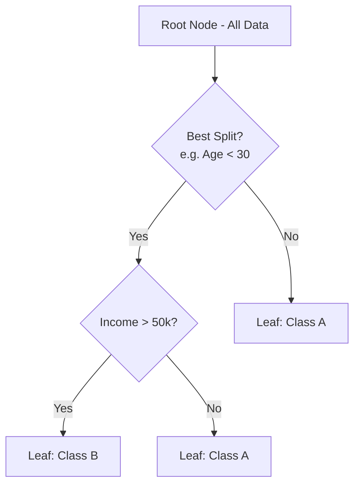

### 7. Real World Example

- 🏦 Loan Approval Decisions
- 🩺 Medical Diagnosis Rule Systems
- 📊 Customer Segmentation Rules
- 🎯 Fraud Flagging Rule Trees

### 8. Python Example

```python
from sklearn.tree import DecisionTreeClassifier, plot_tree
from sklearn.model_selection import train_test_split
from sklearn.metrics import accuracy_score

X_train, X_test, y_train, y_test = train_test_split(X, y, test_size=0.2, random_state=42)

model = DecisionTreeClassifier(max_depth=5, criterion="gini", random_state=42)
model.fit(X_train, y_train)

y_pred = model.predict(X_test)
print("Accuracy:", accuracy_score(y_test, y_pred))
print("Feature Importances:", model.feature_importances_)
```

### 9. Visualization

```
                 [Age < 30?]
                 /          \
              Yes            No
              /                \
     [Income > 50k?]        [Class: A]
       /         \
     Yes          No
     /              \
[Class: B]      [Class: A]
```

### 10. Assumptions

| Assumption                           | Meaning in Plain English                                           |
| ------------------------------------ | ------------------------------------------------------------------ |
| No strict distributional assumptions | Trees are non-parametric, they don't assume normality or linearity |
| Features are informative             | Splits only help if features actually correlate with the target    |
| Recursive partitioning is valid      | Assumes the data can be meaningfully split hierarchically          |

### 11. Advantages

- **Highly interpretable** — you can literally draw the decision path.
- **Handles non-linear relationships** naturally without transformation.
- **No feature scaling required** — splits are based on thresholds, not distances.
- **Handles both numerical and categorical data** with minimal preprocessing.
- **Captures feature interactions** automatically through hierarchical splits.

### 12. Disadvantages

- **Prone to overfitting** — a fully grown tree can memorize training data.
- **Unstable** — small changes in data can produce a completely different tree structure.
- **Biased toward features with more levels** when using Information Gain.
- **Poor extrapolation** — cannot predict beyond the range of training data.

### 13. Important Hyperparameters

| Hyperparameter      | Purpose                                 | Effect                                                       | Typical Values         | Interview Notes                      |
| ------------------- | --------------------------------------- | ------------------------------------------------------------ | ---------------------- | ------------------------------------ |
| `max_depth`         | Limits how deep the tree grows          | Shallower = less overfitting, more bias                      | 3 – 10                 | Most commonly tuned parameter        |
| `min_samples_split` | Min samples required to split a node    | Higher = more conservative splits                            | 2 – 20                 | Prevents splitting on noise          |
| `min_samples_leaf`  | Min samples required at a leaf          | Higher = smoother decision boundary                          | 1 – 10                 | Helps reduce variance                |
| `criterion`         | Split quality measure                   | `gini` (faster) vs `entropy` (slightly more balanced splits) | `gini` (default)       | Interviewers may ask to compare both |
| `max_features`      | Number of features considered per split | Lower = more randomness, less overfitting                    | `sqrt`, `log2`, `None` | Connects directly to Random Forest   |

### 14. Evaluation Metrics

- **Accuracy, Precision, Recall, F1** for classification.
- **Confusion Matrix** to see class-wise errors.
- **ROC AUC** for probability-based ranking (via `predict_proba`).

### 15. Feature Scaling Requirement

**NO** — Decision Trees split based on threshold comparisons, which are invariant to monotonic transformations like scaling.

### 16. Missing Values

**Partially handles missing values** depending on implementation — scikit-learn's implementation requires imputation, but some implementations (like XGBoost, LightGBM) handle missing values natively by learning the best direction to send them.

### 17. Categorical Features

**Conceptually handles categorical features well** (that's how trees are traditionally described), but scikit-learn's implementation requires numeric encoding first. Implementations like CatBoost handle categoricals natively.

### 18. Outliers

**Not sensitive** — since splits are based on order/threshold rather than raw magnitude, a single extreme value doesn't disproportionately affect the split point.

### 19. Computational Complexity

- **Training Complexity:** O(n·p·log n) typically, where n = samples, p = features.
- **Prediction Complexity:** O(depth) — very fast, just traversing the tree.
- **Memory Complexity:** O(number of nodes) — can grow large for deep trees.

### 20. When to Use

- You need a highly interpretable model that mirrors human decision-making.
- The relationship between features and target is non-linear.
- You want a base learner to build ensembles (Random Forest, Gradient Boosting).

### 21. When NOT to Use

- You need a stable, low-variance model on its own (use ensembles instead).
- The dataset is very small (trees overfit fast).

### 22. Frequently Asked Interview Questions

<details>
<summary><b>Click to expand 11 interview questions</b></summary>

**Basic**

1. What is a Decision Tree and how does it make predictions?
2. What is Gini Impurity vs Entropy?
3. What is Information Gain?

**Intermediate** 4. How do you prevent a Decision Tree from overfitting? (Pruning, max_depth, min_samples_leaf) 5. What is pre-pruning vs post-pruning? 6. Why don't Decision Trees need feature scaling? 7. How does a Decision Tree handle a continuous feature?

**Advanced** 8. Why are Decision Trees considered "high variance" models? 9. Explain how Decision Trees form the basis of Random Forest and Gradient Boosting. 10. What is the CART algorithm and how does it differ from ID3/C4.5? 11. Why do trees favor features with many unique values, and how is this bias mitigated?

</details>

### 23. Common Mistakes

- Not setting `max_depth`, leading to a fully-grown, overfit tree.
- Interpreting feature importance as causation.
- Ignoring class imbalance when using Gini/Entropy for splits.

### 24. Tips

> [!TIP]
> In interviews, always mention **pruning** and **max_depth** together — they show you understand the bias-variance tradeoff, not just the algorithm mechanics.

### 25. Summary Box

| Topic          | Summary                               |
| -------------- | ------------------------------------- |
| Problem Type   | Classification / Regression           |
| Scaling        | Not required                          |
| Missing Values | Not handled natively (in sklearn)     |
| Fast           | Yes (prediction), moderate (training) |
| Explainable    | Very High                             |
| Best Use Case  | Loan Approval, Rule-based Diagnosis   |

---

## Random Forest

### 1. Overview

Random Forest is an **ensemble learning method** that builds many Decision Trees on random subsets of data and features, then combines their predictions (majority vote for classification, average for regression) to produce a more robust, accurate result than any single tree.

It exists to fix Decision Trees' biggest weakness — high variance and overfitting — by averaging out the noise across many diverse trees.

### 2. Problem Type

`Classification` and `Regression` (Ensemble Method — Bagging)

### 3. Intuition

> Imagine asking **100 doctors** for a diagnosis instead of just one, where each doctor only saw a random subset of the patient's test results. Some doctors will make mistakes, but when you take the **majority vote** across all 100, the errors cancel out and the overall diagnosis becomes far more reliable.

### 4. Mathematical Idea

Random Forest uses **Bootstrap Aggregating (Bagging)**:

1. Draw `B` bootstrap samples (random sampling with replacement) from the training data.
2. Train a Decision Tree on each bootstrap sample, considering only a random subset of `m` features at each split (typically $m = \sqrt{p}$ for classification).
3. Final prediction:

$$
\hat{y} = \text{mode}\{T_1(x), T_2(x), \dots, T_B(x)\} \quad \text{(classification)}
$$

$$
\hat{y} = \frac{1}{B}\sum_{b=1}^{B} T_b(x) \quad \text{(regression)}
$$

### 5. How the Algorithm Works

1. Create `B` bootstrap samples from the original training set.
2. For each bootstrap sample, grow a Decision Tree, but at each split only consider a random subset of features.
3. Grow each tree deep, with little to no pruning (bagging reduces variance, so individual trees can overfit).
4. Repeat for all `B` trees to form the "forest".
5. For a new prediction, pass the input through every tree.
6. Aggregate results — majority vote (classification) or average (regression).

### 6. Workflow Diagram

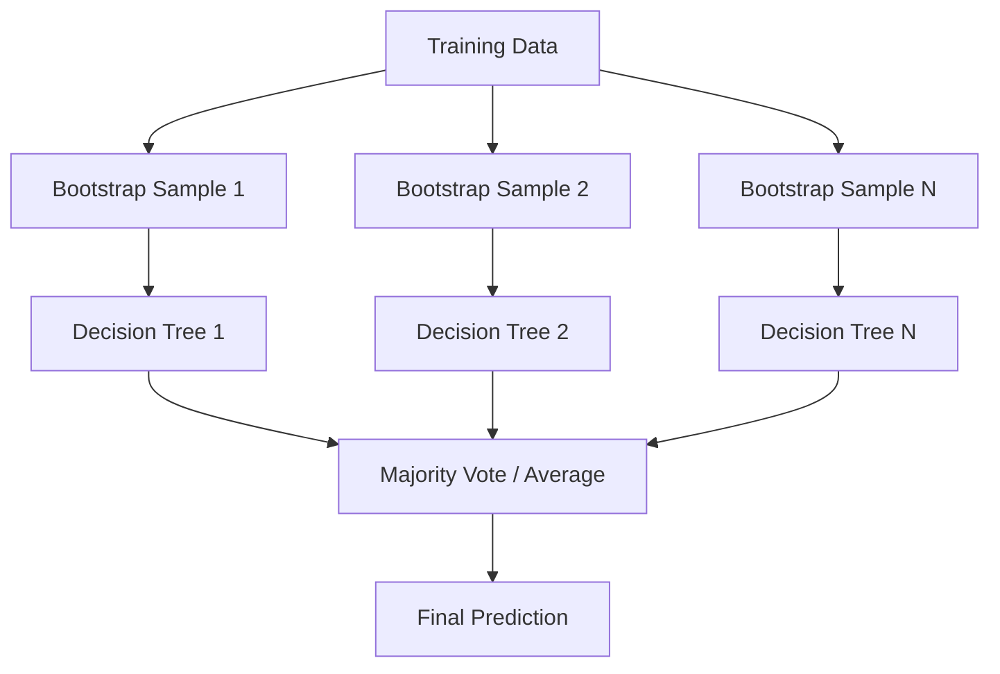

### 7. Real World Example

- 💳 Credit Risk Scoring
- 🩺 Disease Prediction from multiple biomarkers
- 🛒 E-commerce Recommendation Ranking Features
- 🌾 Crop Yield Prediction

### 8. Python Example

```python
from sklearn.ensemble import RandomForestClassifier
from sklearn.model_selection import train_test_split
from sklearn.metrics import accuracy_score, classification_report

X_train, X_test, y_train, y_test = train_test_split(X, y, test_size=0.2, random_state=42)

model = RandomForestClassifier(
    n_estimators=200, max_depth=10, max_features="sqrt", random_state=42, n_jobs=-1
)
model.fit(X_train, y_train)

y_pred = model.predict(X_test)
print("Accuracy:", accuracy_score(y_test, y_pred))
print(classification_report(y_test, y_pred))

importances = model.feature_importances_
```

### 9. Visualization

```
        Tree 1        Tree 2        Tree 3       ...     Tree N
       predicts A    predicts B    predicts A            predicts A
              \            |            /                    /
               \___________|___________/____________________/
                            |
                     Majority Vote → A
```

### 10. Assumptions

| Assumption                                   | Meaning in Plain English                                          |
| -------------------------------------------- | ----------------------------------------------------------------- |
| Trees are reasonably uncorrelated            | Random feature/sample selection should create diverse trees       |
| Bootstrap sampling represents the population | Sampling with replacement approximates the true data distribution |
| Enough trees for stability                   | Too few trees means high variance in the aggregated prediction    |

### 11. Advantages

- **Reduces overfitting** compared to a single Decision Tree by averaging many trees.
- **Handles non-linearity and interactions** automatically, like individual trees.
- **Robust to outliers and noise** because of averaging across many trees.
- **Provides feature importance** scores out of the box.
- **Works well with default hyperparameters** — very forgiving to tune.

### 12. Disadvantages

- **Less interpretable** than a single Decision Tree — it's a "black box" of hundreds of trees.
- **Slower prediction** than a single tree since it evaluates every tree in the forest.
- **Larger memory footprint** — storing hundreds of trees is expensive.
- **Can still overfit** on noisy datasets if trees are too deep and too correlated.

### 13. Important Hyperparameters

| Hyperparameter     | Purpose                           | Effect                                        | Typical Values   | Interview Notes                                       |
| ------------------ | --------------------------------- | --------------------------------------------- | ---------------- | ----------------------------------------------------- |
| `n_estimators`     | Number of trees in the forest     | More trees = more stable, diminishing returns | 100 – 500        | More trees never overfit more, only cost more compute |
| `max_depth`        | Depth of each tree                | Deeper = more complex individual trees        | `None` or 5–20   | Balances bias-variance per tree                       |
| `max_features`     | Features considered per split     | Fewer = more diverse (decorrelated) trees     | `sqrt`, `log2`   | Key to Random Forest's "randomness"                   |
| `min_samples_leaf` | Minimum samples at a leaf         | Higher = smoother predictions                 | 1 – 10           | Controls overfitting                                  |
| `bootstrap`        | Whether to use bootstrap sampling | `False` uses whole dataset for every tree     | `True` (default) | Turning off removes the "bagging" benefit             |

### 14. Evaluation Metrics

Same as classification/regression standard metrics — Accuracy, Precision, Recall, F1, ROC AUC (classification) or MAE, RMSE, R² (regression). Also commonly evaluated using **Out-of-Bag (OOB) Score**, a built-in cross-validation using samples not included in each tree's bootstrap.

### 15. Feature Scaling Requirement

**NO** — like Decision Trees, Random Forest is based on threshold splits and is invariant to feature scaling.

### 16. Missing Values

**Not handled natively in scikit-learn** — requires imputation beforehand, though some implementations support surrogate splits for missing data.

### 17. Categorical Features

**Requires encoding** in scikit-learn (One-Hot or Ordinal), though conceptually tree ensembles handle categorical splits well.

### 18. Outliers

**Not sensitive** — the same threshold-based splitting logic from Decision Trees applies, and averaging across many trees further dilutes any outlier's influence.

### 19. Computational Complexity

- **Training Complexity:** O(B · n·log(n) · p) where B = number of trees.
- **Prediction Complexity:** O(B · depth) — evaluates every tree.
- **Memory Complexity:** O(B · nodes per tree) — can be substantial for large forests.

### 20. When to Use

- You want strong out-of-the-box performance with minimal tuning.
- Interpretability is secondary to accuracy.
- You need robust feature importance rankings.
- Dataset has non-linear relationships and moderate size.

### 21. When NOT to Use

- You need a fully interpretable model (use a single Decision Tree or Logistic Regression instead).
- You need extremely fast inference on constrained hardware (a single tree or linear model is faster).
- Extremely high-dimensional sparse data (linear models often perform better and faster).

### 22. Frequently Asked Interview Questions

<details>
<summary><b>Click to expand 11 interview questions</b></summary>

**Basic**

1. What is Random Forest and how does it differ from a single Decision Tree?
2. What is bagging?
3. Why does Random Forest reduce overfitting compared to a single tree?

**Intermediate** 4. What is the Out-of-Bag (OOB) score and how is it computed? 5. How does `max_features` affect tree diversity? 6. Why do individual trees in a Random Forest tend to overfit while the ensemble doesn't? 7. Difference between Random Forest and Gradient Boosting?

**Advanced** 8. Explain the bias-variance tradeoff in the context of bagging. 9. Why does Random Forest not typically overfit as `n_estimators` increases? 10. How would you compute feature importance in Random Forest, and what are its limitations? (Mean Decrease Impurity vs Permutation Importance) 11. Can Random Forest be parallelized? Why or why not, compared to Gradient Boosting?

</details>

### 23. Common Mistakes

- Assuming more trees always overfit more (they don't — variance decreases, not increases, with more trees).
- Using default Gini-based feature importance without knowing it's biased toward high-cardinality features (permutation importance is more reliable).
- Ignoring training time/memory tradeoffs on very large datasets.

### 24. Tips

> [!TIP]
> If asked "does increasing `n_estimators` cause overfitting," confidently say **no** — more trees only reduce variance and increase compute cost, they don't increase overfitting risk (unlike `max_depth`).

### 25. Summary Box

| Topic          | Summary                                    |
| -------------- | ------------------------------------------ |
| Problem Type   | Classification / Regression                |
| Scaling        | Not required                               |
| Missing Values | Not handled natively                       |
| Fast           | Moderate (training), Moderate (prediction) |
| Explainable    | Medium (feature importance available)      |
| Best Use Case  | Credit Risk Scoring, Disease Prediction    |

---

## K-Nearest Neighbors (KNN)

### 1. Overview

K-Nearest Neighbors is a simple, **instance-based (lazy learning)** algorithm that classifies a new data point based on the majority class among its `k` closest points in the training data, using a distance metric like Euclidean distance.

It exists as one of the most intuitive non-parametric methods — it makes no assumptions about the underlying data distribution and instead lets the data itself define the decision boundary.

### 2. Problem Type

`Classification` and `Regression`

### 3. Intuition

> Imagine you move to a new neighborhood and want to guess someone's political affiliation. You look at their **5 nearest neighbors** and go with whatever the majority believes. KNN does exactly this — it looks at the `k` closest points to a new data point and assigns the majority label.

### 4. Mathematical Idea

Distance metric (commonly Euclidean):

$$
d(x, x') = \sqrt{\sum_{i=1}^{n}(x_i - x'_i)^2}
$$

Prediction for classification:

$$
\hat{y} = \text{mode}\{y_i : x_i \in N_k(x)\}
$$

where $N_k(x)$ is the set of `k` nearest neighbors to point `x`.

### 5. How the Algorithm Works

1. Store the entire training dataset (no explicit "training" phase — it's lazy learning).
2. For a new data point, compute the distance to every point in the training set.
3. Sort distances and select the `k` closest points.
4. For classification, take a majority vote among these `k` neighbors' labels.
5. For regression, take the average of the `k` neighbors' target values.
6. Return the prediction.

### 6. Workflow Diagram

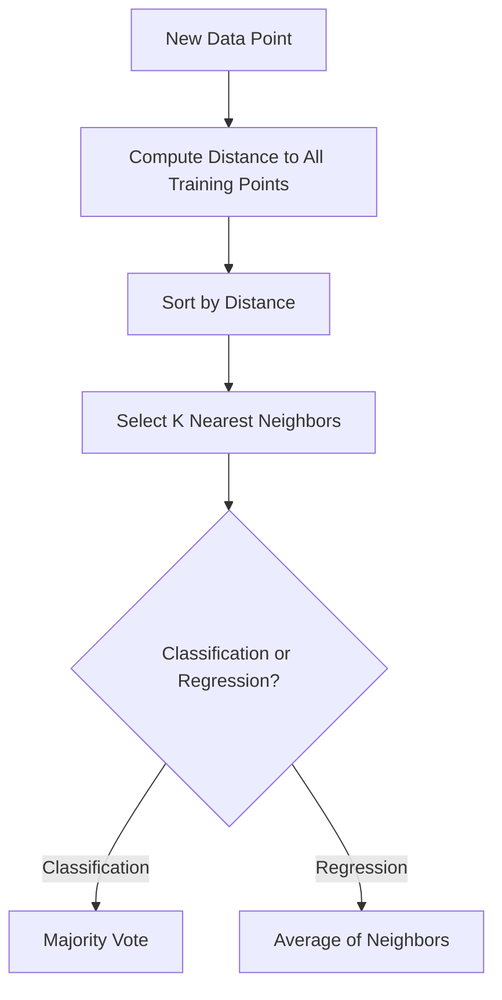

### 7. Real World Example

- 🎬 Recommendation Systems ("users like you also liked...")
- 🩺 Disease Classification based on similar patient profiles
- 🖐️ Handwriting/Digit Recognition
- 🏠 Real estate price estimation based on similar houses nearby

### 8. Python Example

```python
from sklearn.neighbors import KNeighborsClassifier
from sklearn.preprocessing import StandardScaler
from sklearn.model_selection import train_test_split
from sklearn.metrics import accuracy_score

scaler = StandardScaler()
X_scaled = scaler.fit_transform(X)

X_train, X_test, y_train, y_test = train_test_split(X_scaled, y, test_size=0.2, random_state=42)

model = KNeighborsClassifier(n_neighbors=5, metric="minkowski", p=2)
model.fit(X_train, y_train)

y_pred = model.predict(X_test)
print("Accuracy:", accuracy_score(y_test, y_pred))
```

### 9. Visualization

```
        ▲ Feature 2
        │      ●A   ●A
        │  ●B      ★? ← new point
        │      ●A     ●B
        │  ●B
        └──────────────────► Feature 1

  ★ is surrounded mostly by ●A → classified as A
```

### 10. Assumptions

| Assumption                         | Meaning in Plain English                                                  |
| ---------------------------------- | ------------------------------------------------------------------------- |
| Similar points have similar labels | The core assumption — nearby points in feature space share the same class |
| Meaningful distance metric         | Features must be scaled/comparable for distance to make sense             |
| Low dimensionality preferred       | High dimensions make "nearness" less meaningful (curse of dimensionality) |

### 11. Advantages

- **Simple and intuitive** — easy to explain to non-technical stakeholders.
- **No training phase** — new data can be incorporated instantly.
- **Naturally handles multi-class classification.**
- **Non-parametric** — makes no assumption about the underlying data distribution, so it can model complex decision boundaries.

### 12. Disadvantages

- **Slow at prediction time** — must compute distance to every training point (unless using KD-Tree/Ball-Tree optimizations).
- **Suffers from the curse of dimensionality** — distance becomes less meaningful in high-dimensional space.
- **Sensitive to irrelevant features and feature scale.**
- **Memory-intensive** — must store the entire training dataset.

### 13. Important Hyperparameters

| Hyperparameter    | Purpose                         | Effect                                                             | Typical Values                         | Interview Notes                                           |
| ----------------- | ------------------------------- | ------------------------------------------------------------------ | -------------------------------------- | --------------------------------------------------------- |
| `n_neighbors` (k) | Number of neighbors to consider | Small k = low bias/high variance; large k = high bias/low variance | 3 – 15                                 | Classic bias-variance question                            |
| `metric`          | Distance metric used            | Euclidean, Manhattan, Minkowski                                    | `minkowski` (default, p=2 = Euclidean) | Manhattan often better for high-dimensional sparse data   |
| `weights`         | Weighting of neighbors          | `uniform` (equal) vs `distance` (closer points weigh more)         | `uniform` (default)                    | `distance` helps when neighbors vary greatly in proximity |
| `algorithm`       | Search algorithm                | `ball_tree`, `kd_tree`, `brute`                                    | `auto`                                 | Affects speed, not accuracy                               |

### 14. Evaluation Metrics

Standard classification metrics: Accuracy, Precision, Recall, F1, ROC AUC. For regression KNN: MAE, RMSE, R².

### 15. Feature Scaling Requirement

**YES — absolutely required.** Since KNN relies entirely on distance calculations, features with larger numeric ranges would dominate the distance metric unless all features are scaled (e.g., StandardScaler or MinMaxScaler).

### 16. Missing Values

**Cannot handle missing values natively** — distance cannot be computed with NaNs present, so imputation is mandatory.

### 17. Categorical Features

**Struggles with categorical variables** — distance metrics don't naturally apply to categories; requires encoding (One-Hot) and even then, Euclidean distance on one-hot vectors can be misleading (Hamming distance is sometimes preferred instead).

### 18. Outliers

**Sensitive to outliers**, especially with small `k`, since a single outlier neighbor can flip the majority vote.

### 19. Computational Complexity

- **Training Complexity:** O(1) — technically no training, just storing data ("lazy learner").
- **Prediction Complexity:** O(n·p) per query using brute force (n = training samples, p = features); can be reduced with KD-Tree/Ball-Tree to O(log n) in low dimensions.
- **Memory Complexity:** O(n·p) — must store the entire training set.

### 20. When to Use

- Small to medium datasets with meaningful distance metrics.
- Low-dimensional feature space.
- You need a simple, explainable baseline for classification/regression.

### 21. When NOT to Use

- Large datasets where prediction-time latency matters.
- High-dimensional data (curse of dimensionality degrades performance).
- Data with many irrelevant/noisy features.

### 22. Frequently Asked Interview Questions

<details>
<summary><b>Click to expand 10 interview questions</b></summary>

**Basic**

1. How does KNN make predictions?
2. Why is KNN called a "lazy learner"?
3. Why is feature scaling critical for KNN?

**Intermediate** 4. What happens with a very small vs. very large value of `k`? 5. How do you choose the optimal value of `k`? (Cross-validation, elbow method) 6. What is the curse of dimensionality and how does it affect KNN? 7. Difference between KD-Tree and Brute Force search?

**Advanced** 8. How would you speed up KNN for a dataset with millions of rows? 9. Why might Manhattan distance outperform Euclidean distance in high dimensions? 10. How does KNN handle imbalanced classes, and how would you fix it? (Distance weighting, resampling)

</details>

### 23. Common Mistakes

- Forgetting to scale features before applying KNN — the single most common beginner mistake.
- Choosing an even value of `k` for binary classification, leading to tie-breaking issues.
- Applying KNN blindly to high-dimensional data without dimensionality reduction.

### 24. Tips

> [!TIP]
> Always mention that you'd use **odd values of k** for binary classification to avoid ties, and that you'd tune `k` via cross-validation, not guess it.

### 25. Summary Box

| Topic          | Summary                                   |
| -------------- | ----------------------------------------- |
| Problem Type   | Classification / Regression               |
| Scaling        | Required                                  |
| Missing Values | Not handled — must impute                 |
| Fast           | Slow at prediction time                   |
| Explainable    | High (conceptually simple)                |
| Best Use Case  | Recommendation Systems, Similarity Search |

---

## Naive Bayes

### 1. Overview

Naive Bayes is a probabilistic classifier based on **Bayes' Theorem**, which assumes that all features are conditionally independent given the class label — an assumption that is "naive" (rarely true in reality) but works remarkably well in practice, especially for text classification.

### 2. Problem Type

`Classification`

### 3. Intuition

> Imagine guessing whether an email is spam just by checking whether it contains words like "free," "winner," or "click here" — independently of each other. Naive Bayes multiplies the probability of each word appearing in spam vs. non-spam emails to arrive at an overall probability, ignoring any relationship between the words themselves.

### 4. Mathematical Idea

Bayes' Theorem:

$$
P(y|x_1,\dots,x_n) = \frac{P(y)\prod_{i=1}^{n}P(x_i|y)}{P(x_1,\dots,x_n)}
$$

Since the denominator is constant across classes, the prediction rule becomes:

$$
\hat{y} = \arg\max_y \; P(y)\prod_{i=1}^{n}P(x_i|y)
$$

### 5. How the Algorithm Works

1. Calculate the prior probability of each class, `P(y)`, from the training data.
2. Calculate the likelihood `P(x_i|y)` for each feature given each class (using Gaussian, Multinomial, or Bernoulli distributions depending on data type).
3. For a new data point, multiply the prior by the likelihoods of each feature (assuming independence).
4. Repeat for every class.
5. Predict the class with the highest resulting probability.

### 6. Workflow Diagram

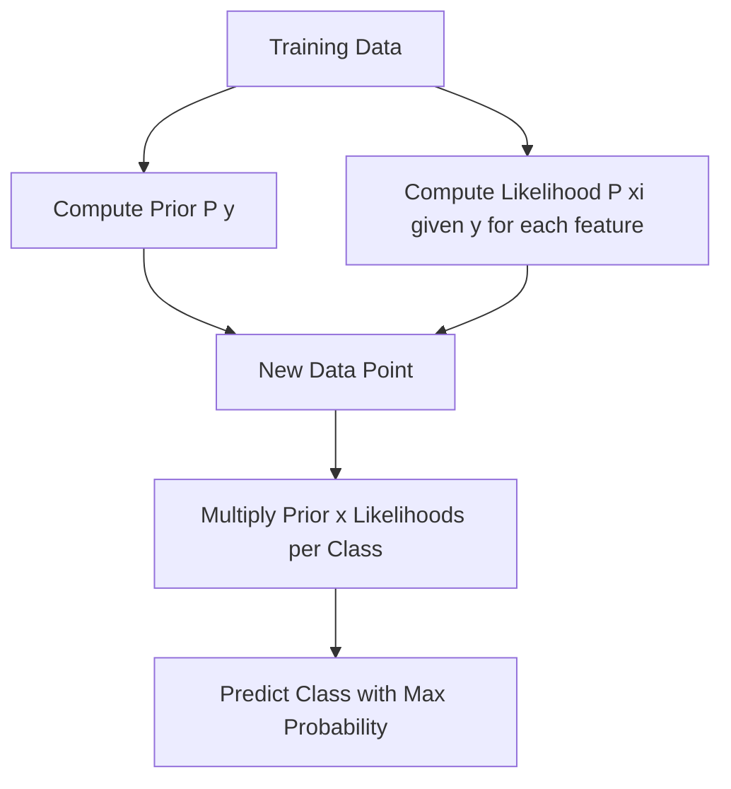

### 7. Real World Example

- 📧 Spam Filtering (the classic use case)
- 📰 News Article Categorization
- 😊 Sentiment Analysis
- 🩺 Medical Diagnosis with independent symptom indicators

### 8. Python Example

```python
from sklearn.naive_bayes import GaussianNB, MultinomialNB
from sklearn.model_selection import train_test_split
from sklearn.metrics import accuracy_score

X_train, X_test, y_train, y_test = train_test_split(X, y, test_size=0.2, random_state=42)

model = GaussianNB()
model.fit(X_train, y_train)

y_pred = model.predict(X_test)
print("Accuracy:", accuracy_score(y_test, y_pred))

# For text data (word counts / TF-IDF)
# model = MultinomialNB()
```

### 9. Visualization

```
P(spam | "free","winner") ∝ P(spam) × P("free"|spam) × P("winner"|spam)
P(ham  | "free","winner") ∝ P(ham)  × P("free"|ham)  × P("winner"|ham)

→ Predict whichever probability is higher
```

### 10. Assumptions

| Assumption                         | Meaning in Plain English                                                |
| ---------------------------------- | ----------------------------------------------------------------------- |
| Conditional independence           | Features are assumed independent given the class — the "naive" part     |
| Distributional assumption          | Gaussian NB assumes numeric features are normally distributed per class |
| Sufficient training data per class | Needed to reliably estimate probabilities                               |

### 11. Advantages

- **Extremely fast** to train and predict — just counting/probability calculations.
- **Works great on high-dimensional data** like text (bag-of-words, TF-IDF).
- **Requires relatively little training data** to estimate parameters.
- **Naturally handles multi-class classification.**

### 12. Disadvantages

- **The independence assumption is almost always violated** in real data, which can hurt accuracy when features are correlated.
- **Zero-frequency problem** — if a category never appears in training, its probability becomes 0 (mitigated with Laplace smoothing).
- **Not ideal for numeric features with complex distributions** unless the Gaussian assumption roughly holds.

### 13. Important Hyperparameters

| Hyperparameter                     | Purpose                                 | Effect                           | Typical Values   | Interview Notes                                                  |
| ---------------------------------- | --------------------------------------- | -------------------------------- | ---------------- | ---------------------------------------------------------------- |
| `alpha` (Multinomial/Bernoulli NB) | Laplace/Lidstone smoothing              | Prevents zero probabilities      | 1.0 (default)    | Ask: "what happens if alpha=0?" (zero-frequency problem returns) |
| `var_smoothing` (Gaussian NB)      | Stability constant added to variance    | Prevents division-by-zero issues | 1e-9 (default)   | Rarely tuned but good to know it exists                          |
| `fit_prior`                        | Whether to learn class priors from data | `False` uses uniform priors      | `True` (default) | Useful when you want to override with domain priors              |

### 14. Evaluation Metrics

Precision, Recall, F1 (especially important since NB is heavily used for imbalanced text classification like spam detection), ROC AUC, Log Loss (probability calibration is often imperfect for NB).

### 15. Feature Scaling Requirement

**NO** (for Multinomial/Bernoulli NB used on counts) — but **Gaussian NB is technically scale-invariant** in terms of decision boundary since it models per-feature Gaussian distributions independently.

### 16. Missing Values

**Not handled natively** — requires imputation, though some implementations can skip missing features during probability calculation.

### 17. Categorical Features

**Handles categorical features very well** conceptually (Bernoulli/Multinomial variants are built for categorical/count data); numeric features need Gaussian NB or discretization.

### 18. Outliers

**Gaussian NB is sensitive to outliers** since extreme values distort the estimated mean/variance for a feature within a class.

### 19. Computational Complexity

- **Training Complexity:** O(n·p) — just computing means/variances or counts per class.
- **Prediction Complexity:** O(p·C) where C = number of classes — extremely fast.
- **Memory Complexity:** O(p·C) — very lightweight.

### 20. When to Use

- Text classification (spam, sentiment, topic categorization).
- You need a fast, simple baseline for high-dimensional data.
- Training data is limited.

### 21. When NOT to Use

- Features are strongly correlated (violates the core independence assumption significantly).
- You need well-calibrated probabilities (NB probabilities tend to be overconfident/skewed).

### 22. Frequently Asked Interview Questions

<details>
<summary><b>Click to expand 10 interview questions</b></summary>

**Basic**

1. What is Bayes' Theorem and how does Naive Bayes use it?
2. Why is Naive Bayes called "naive"?
3. What is Laplace Smoothing and why is it needed?

**Intermediate** 4. Difference between Gaussian, Multinomial, and Bernoulli Naive Bayes? 5. Why does Naive Bayes work well for text classification despite its unrealistic assumption? 6. How does Naive Bayes handle unseen words/categories at prediction time?

**Advanced** 7. Why can Naive Bayes still perform well even when features are correlated? 8. How would you calibrate Naive Bayes probabilities? (Platt scaling, isotonic regression) 9. Compare Naive Bayes vs Logistic Regression as generative vs discriminative models. 10. How does class imbalance affect the prior probability term, and how would you address it?

</details>

### 23. Common Mistakes

- Using Gaussian NB on clearly non-normal numeric features without checking distribution.
- Forgetting Laplace smoothing, causing zero-probability issues on unseen categories.
- Assuming NB probabilities are well-calibrated when they're often overconfident.

### 24. Tips

> [!TIP]
> In interviews, contrast Naive Bayes as a **generative model** (models P(x|y) and P(y)) vs Logistic Regression as a **discriminative model** (models P(y|x) directly) — this comparison is a favorite interview question.

### 25. Summary Box

| Topic          | Summary                             |
| -------------- | ----------------------------------- |
| Problem Type   | Classification                      |
| Scaling        | Not required                        |
| Missing Values | Not handled — must impute           |
| Fast           | Extremely Fast                      |
| Explainable    | High                                |
| Best Use Case  | Spam Filtering, Text Classification |

---

## Support Vector Machine (SVM)

### 1. Overview

Support Vector Machine finds the **optimal hyperplane** that separates classes with the **maximum margin** — the widest possible gap between the closest points of each class (called support vectors). For non-linear data, SVM uses the **kernel trick** to project data into higher dimensions where a linear separator becomes possible.

### 2. Problem Type

`Classification` (and Regression via SVR)

### 3. Intuition

> Imagine separating red and blue marbles on a table with a ruler. There are many possible lines that separate them, but SVM finds the **one line that leaves the widest possible gap** on both sides — this maximizes confidence in future classifications, especially for marbles near the boundary.

### 4. Mathematical Idea

For linearly separable data, SVM maximizes the margin:

$$
\min_{w,b} \frac{1}{2}\|w\|^2 \quad \text{subject to} \quad y_i(w \cdot x_i + b) \geq 1
$$

For non-linearly separable data, a **soft margin** with slack variables and penalty `C` is used, plus the **kernel trick**:

$$
K(x_i, x_j) = \phi(x_i) \cdot \phi(x_j)
$$

Common kernels: Linear, Polynomial, RBF (Gaussian) — allowing SVM to draw non-linear boundaries without explicitly computing the high-dimensional transformation.

### 5. How the Algorithm Works

1. Map input data into feature space (optionally via a kernel function for non-linear cases).
2. Find the hyperplane that maximizes the margin between classes.
3. Identify the "support vectors" — the closest points to the hyperplane that define the margin.
4. Allow some misclassification via the soft-margin parameter `C` to handle noisy/overlapping data.
5. For prediction, determine which side of the hyperplane a new point falls on.

### 6. Workflow Diagram

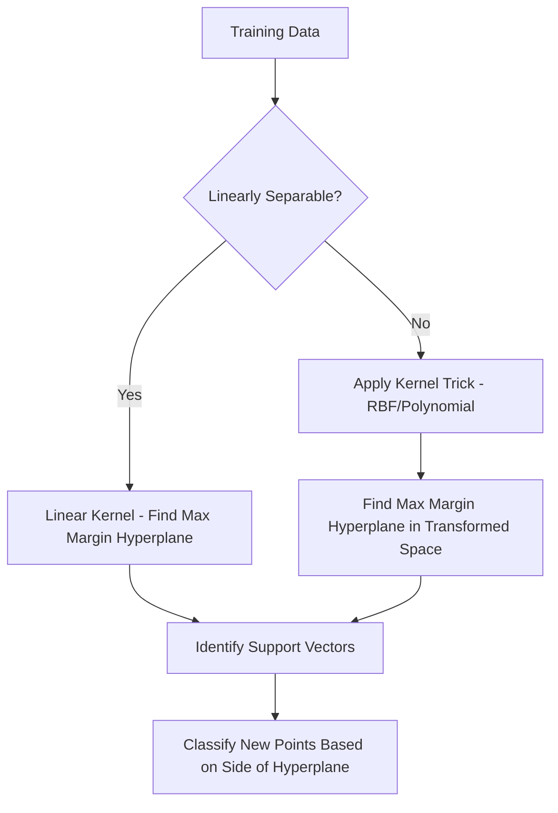

### 7. Real World Example

- 🖼️ Image Classification (face detection)
- 📄 Text Categorization
- 🧬 Bioinformatics — Protein/Gene classification
- ✍️ Handwriting Recognition

### 8. Python Example

```python
from sklearn.svm import SVC
from sklearn.preprocessing import StandardScaler
from sklearn.model_selection import train_test_split
from sklearn.metrics import accuracy_score

scaler = StandardScaler()
X_scaled = scaler.fit_transform(X)

X_train, X_test, y_train, y_test = train_test_split(X_scaled, y, test_size=0.2, random_state=42)

model = SVC(kernel="rbf", C=1.0, gamma="scale")
model.fit(X_train, y_train)

y_pred = model.predict(X_test)
print("Accuracy:", accuracy_score(y_test, y_pred))
```

### 9. Visualization

```
   ●A       ●A
        \        margin
         \  ●A
──────────\────────────  ← hyperplane (max margin)
           \
     ●B     \    ●B
        ●B
   (support vectors are the closest ●A and ●B to the line)
```

### 10. Assumptions

| Assumption                                  | Meaning in Plain English                                                               |
| ------------------------------------------- | -------------------------------------------------------------------------------------- |
| Margin maximization improves generalization | A wider margin between classes leads to better generalization on unseen data           |
| Kernel choice reflects true data structure  | RBF/polynomial kernels assume the data becomes separable in a higher-dimensional space |
| Features are on comparable scales           | Distance-based margin calculations require scaled features                             |

### 11. Advantages

- **Effective in high-dimensional spaces**, even when dimensions exceed sample count.
- **Memory efficient** — only support vectors are used in the decision function, not the whole dataset.
- **Versatile** via different kernel functions to handle non-linear boundaries.
- **Robust to overfitting** in high-dimensional space when properly regularized (`C`).

### 12. Disadvantages

- **Doesn't scale well to very large datasets** — training complexity grows quickly with sample size.
- **Sensitive to choice of kernel and hyperparameters** — requires careful tuning.
- **No direct probability estimates** — requires an extra calibration step (Platt scaling) to get probabilities.
- **Hard to interpret** compared to Logistic Regression or Decision Trees.

### 13. Important Hyperparameters

| Hyperparameter | Purpose                          | Effect                                                                                                  | Typical Values    | Interview Notes                                    |
| -------------- | -------------------------------- | ------------------------------------------------------------------------------------------------------- | ----------------- | -------------------------------------------------- |
| `C`            | Regularization / margin softness | Small C = wider margin, more tolerance for misclassification; Large C = narrower margin, less tolerance | 0.1 – 100         | Classic bias-variance tradeoff question            |
| `kernel`       | Transformation function          | `linear`, `poly`, `rbf`, `sigmoid`                                                                      | `rbf` (default)   | Must justify kernel choice based on data structure |
| `gamma`        | Kernel coefficient (RBF/poly)    | High gamma = tighter fit around points (overfitting risk); low gamma = smoother boundary                | `scale` (default) | Often asked alongside `C` in tuning questions      |
| `degree`       | Degree of polynomial kernel      | Higher degree = more complex boundary                                                                   | 2 – 4             | Only relevant when `kernel='poly'`                 |

### 14. Evaluation Metrics

Accuracy, Precision, Recall, F1, ROC AUC (using `probability=True` for calibrated probabilities via Platt Scaling), Confusion Matrix.

### 15. Feature Scaling Requirement

**YES — strongly required.** SVM relies on distance-based margin computations, so unscaled features (especially with the RBF kernel) will dominate the decision boundary unfairly.

### 16. Missing Values

**Cannot handle missing values** — must be imputed prior to training.

### 17. Categorical Features

**Cannot handle categorical variables directly** — must be One-Hot or Ordinal encoded first.

### 18. Outliers

**Sensitive to outliers**, especially with a small `C` — since the margin optimization tries to correctly classify all points, extreme outliers near the boundary can significantly shift the hyperplane.

### 19. Computational Complexity

- **Training Complexity:** O(n²) to O(n³) depending on kernel and implementation — becomes very slow on large datasets (>50k rows).
- **Prediction Complexity:** O(s·p) where s = number of support vectors — fast if s is small.
- **Memory Complexity:** O(s·p) — stores only support vectors, not the whole dataset.

### 20. When to Use

- Small to medium-sized datasets with clear margin separation.
- High-dimensional data (e.g., text, gene expression) where dimensions may exceed samples.
- You need a robust classifier resistant to overfitting with proper regularization.

### 21. When NOT to Use

- Very large datasets (training time becomes prohibitive).
- You need fast, easily interpretable models.
- Data has significant class overlap and noise without clear margins.

### 22. Frequently Asked Interview Questions

<details>
<summary><b>Click to expand 11 interview questions</b></summary>

**Basic**

1. What is a support vector?
2. What is the "margin" in SVM and why is it maximized?
3. What is the kernel trick?

**Intermediate** 4. Difference between hard margin and soft margin SVM? 5. What is the role of the `C` parameter? 6. What is the role of `gamma` in the RBF kernel? 7. Why does SVM require feature scaling?

**Advanced** 8. Derive the dual form of the SVM optimization problem (conceptually). 9. How does SVM handle multi-class classification? (One-vs-One, One-vs-Rest) 10. Compare SVM vs Logistic Regression — when would each be preferred? 11. Why does SVM training complexity make it unsuitable for very large datasets, and how would you address that? (Linear SVM / SGDClassifier / kernel approximation)

</details>

### 23. Common Mistakes

- Forgetting to scale features before training an SVM.
- Blindly using the RBF kernel without checking if a linear kernel suffices (linear kernel is much faster and often adequate for high-dimensional sparse data like text).
- Not tuning `C` and `gamma` together — they interact strongly.

### 24. Tips

> [!TIP]
> When asked to compare kernels, mention: **Linear kernel for high-dimensional/text data, RBF for general non-linear problems, Polynomial rarely used in practice due to instability at high degrees.**

### 25. Summary Box

| Topic          | Summary                                          |
| -------------- | ------------------------------------------------ |
| Problem Type   | Classification / Regression (SVR)                |
| Scaling        | Required                                         |
| Missing Values | Not handled — must impute                        |
| Fast           | Slow on large datasets                           |
| Explainable    | Low-Medium                                       |
| Best Use Case  | Text/Image Classification, High-Dimensional Data |

---

# Part 3 — Boosting Algorithms

## Gradient Boosting

### 1. Overview

Gradient Boosting is an ensemble technique that builds trees **sequentially**, where each new tree corrects the errors (residuals) of the previous trees by fitting to the **gradient of the loss function**. Unlike Random Forest (parallel, independent trees), boosting builds trees one at a time, each one learning from the last.

### 2. Problem Type

`Classification` and `Regression` (Ensemble — Boosting)

### 3. Intuition

> Imagine a student solving a hard exam by iteratively reviewing mistakes: the first attempt gets a rough estimate, then a tutor points out exactly what was wrong, the student corrects it, and this repeats — each round the estimate gets a little closer to the true answer. Gradient Boosting builds each new tree specifically to fix the errors left by the previous trees.

### 4. Mathematical Idea

Start with an initial prediction $F_0(x)$. At each iteration `m`, fit a new tree $h_m(x)$ to the **negative gradient** (residuals) of the loss function:

$$
F_m(x) = F_{m-1}(x) + \eta \cdot h_m(x)
$$

where $\eta$ is the learning rate, and $h_m(x)$ is trained to predict:

$$
r_{im} = -\left[\frac{\partial L(y_i, F(x_i))}{\partial F(x_i)}\right]_{F=F_{m-1}}
$$

For squared error loss, this residual simplifies to just $y_i - F_{m-1}(x_i)$.

### 5. How the Algorithm Works

1. Initialize the model with a simple prediction (e.g., the mean of `y`).
2. Compute residuals (errors) between actual values and current predictions.
3. Train a new Decision Tree to predict these residuals.
4. Scale the new tree's contribution by a learning rate `η` and add it to the running prediction.
5. Repeat steps 2–4 for a fixed number of iterations (`n_estimators`).
6. Final prediction is the sum of the initial guess plus all weighted tree corrections.

### 6. Workflow Diagram

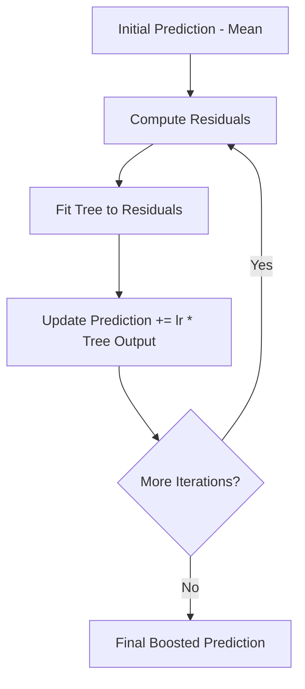

### 7. Real World Example

- 🏆 Kaggle competition-winning models on tabular data
- 💳 Credit Scoring & Risk Modeling
- 🎯 Click-Through Rate (CTR) Prediction in ad systems
- 🏥 Predicting patient readmission risk

### 8. Python Example

```python
from sklearn.ensemble import GradientBoostingClassifier
from sklearn.model_selection import train_test_split
from sklearn.metrics import accuracy_score

X_train, X_test, y_train, y_test = train_test_split(X, y, test_size=0.2, random_state=42)

model = GradientBoostingClassifier(
    n_estimators=200, learning_rate=0.05, max_depth=3, random_state=42
)
model.fit(X_train, y_train)

y_pred = model.predict(X_test)
print("Accuracy:", accuracy_score(y_test, y_pred))
```

### 9. Visualization

```
Prediction Error over Boosting Rounds

Error │●
      │ ●
      │  ●●
      │    ●●●
      │       ●●●●●●●●●───────  (converges as trees are added)
      └─────────────────────────► Number of Trees
```

### 10. Assumptions

| Assumption                         | Meaning in Plain English                                                 |
| ---------------------------------- | ------------------------------------------------------------------------ |
| Weak learners can be combined      | Individual shallow trees are weak, but their weighted sum becomes strong |
| Loss function is differentiable    | Gradient Boosting requires computing gradients of the loss               |
| Sequential correction improves fit | Each new tree meaningfully reduces remaining error                       |

### 11. Advantages

- **Very high predictive accuracy** — often state-of-the-art on structured/tabular data.
- **Flexible loss functions** — can optimize for MAE, MSE, Log Loss, custom objectives, etc.
- **Handles non-linear relationships and feature interactions** naturally.
- **Feature importance** available out of the box.

### 12. Disadvantages

- **Prone to overfitting** if not carefully tuned (too many trees, too high learning rate, too deep trees).
- **Sequential training** means it can't be parallelized across trees like Random Forest — slower to train.
- **Sensitive to hyperparameters** — needs more careful tuning than Random Forest.
- **Harder to interpret** than a single tree.

### 13. Important Hyperparameters

| Hyperparameter  | Purpose                           | Effect                                                 | Typical Values | Interview Notes                                                      |
| --------------- | --------------------------------- | ------------------------------------------------------ | -------------- | -------------------------------------------------------------------- |
| `n_estimators`  | Number of boosting rounds (trees) | More trees = more complex model, risk of overfitting   | 100 – 1000     | Must be tuned together with `learning_rate`                          |
| `learning_rate` | Shrinks contribution of each tree | Lower = more robust but needs more trees               | 0.01 – 0.3     | Classic tradeoff: low LR + high n_estimators = better generalization |
| `max_depth`     | Depth of each individual tree     | Shallow trees (weak learners) are standard in boosting | 3 – 8          | Boosting trees are usually shallower than Random Forest trees        |
| `subsample`     | Fraction of data used per tree    | <1.0 introduces stochasticity, reduces overfitting     | 0.5 – 1.0      | Known as Stochastic Gradient Boosting                                |

### 14. Evaluation Metrics

Same as classification/regression: Accuracy, Precision, Recall, F1, ROC AUC, Log Loss (classification); MAE, RMSE, R² (regression).

### 15. Feature Scaling Requirement

**NO** — tree-based, so threshold splits are invariant to scaling.

### 16. Missing Values

**Not handled in classic scikit-learn GBM** — requires imputation (unlike XGBoost/LightGBM/CatBoost which handle missing values natively).

### 17. Categorical Features

**Requires encoding** in scikit-learn's implementation.

### 18. Outliers

**Moderately sensitive** — since it fits residuals, extreme outliers can produce large gradients that disproportionately influence early trees, though less so than Linear Regression.

### 19. Computational Complexity

- **Training Complexity:** O(n_estimators · n·p·log n) — sequential, so training time scales linearly with number of trees.
- **Prediction Complexity:** O(n_estimators · depth) — sums contributions from every tree.
- **Memory Complexity:** O(n_estimators · nodes per tree).

### 20. When to Use

- Structured/tabular data where maximum predictive accuracy matters.
- You have time/compute budget to tune hyperparameters carefully.

### 21. When NOT to Use

- You need fast training on very large datasets (consider LightGBM instead).
- You need a highly interpretable model.
- Limited time for hyperparameter tuning (Random Forest is more forgiving).

### 22. Frequently Asked Interview Questions

<details>
<summary><b>Click to expand 10 interview questions</b></summary>

**Basic**

1. How does Gradient Boosting differ from Random Forest?
2. What is a "weak learner" in boosting?
3. What is the role of the learning rate?

**Intermediate** 4. Why are boosting trees usually shallow (low `max_depth`)? 5. What is the bias-variance effect of increasing `n_estimators`? 6. How does Gradient Boosting handle different loss functions?

**Advanced** 7. Derive how residuals correspond to negative gradients for squared error loss. 8. Why can't Gradient Boosting trees be trained in parallel like Random Forest? 9. What is Stochastic Gradient Boosting and how does `subsample` help prevent overfitting? 10. Compare Gradient Boosting vs AdaBoost — how do they differ in how they weight errors?

</details>

### 23. Common Mistakes

- Using a high learning rate with too many estimators, causing severe overfitting.
- Not using early stopping / validation set to control the number of boosting rounds.
- Forgetting that boosting is sequential — can't just throw more CPU cores at training like Random Forest.

### 24. Tips

> [!TIP]
> Always mention the **learning_rate vs n_estimators tradeoff** — interviewers love this question: lower learning rate + more trees generally generalizes better but costs more compute.

### 25. Summary Box

| Topic          | Summary                                   |
| -------------- | ----------------------------------------- |
| Problem Type   | Classification / Regression               |
| Scaling        | Not required                              |
| Missing Values | Not handled (sklearn version)             |
| Fast           | Slower training (sequential)              |
| Explainable    | Medium                                    |
| Best Use Case  | Tabular Data Competitions, Credit Scoring |

---

## XGBoost

### 1. Overview

XGBoost (Extreme Gradient Boosting) is an optimized, regularized, and highly efficient implementation of Gradient Boosting that adds L1/L2 regularization, handles missing values natively, and uses second-order gradient information (Newton boosting) for faster, more accurate convergence.

### 2. Problem Type

`Classification` and `Regression` (Ensemble — Boosting)

### 3. Intuition

> Think of XGBoost as Gradient Boosting with a **turbocharger and a seatbelt** — the turbocharger being algorithmic and systems-level optimizations (parallel tree construction, cache-awareness) and the seatbelt being built-in regularization that prevents runaway overfitting.

### 4. Mathematical Idea

XGBoost optimizes a regularized objective using a second-order Taylor approximation:

$$
\mathcal{L}^{(t)} \approx \sum_{i=1}^n \left[g_i f_t(x_i) + \frac{1}{2}h_i f_t(x_i)^2\right] + \Omega(f_t)
$$

where $g_i$ and $h_i$ are the first and second derivatives (gradient and Hessian) of the loss, and the regularization term is:

$$
\Omega(f) = \gamma T + \frac{1}{2}\lambda\sum_{j=1}^{T}w_j^2
$$

(`T` = number of leaves, `w_j` = leaf weights) — this explicitly penalizes model complexity, unlike vanilla Gradient Boosting.

### 5. How the Algorithm Works

1. Start with an initial prediction.
2. Compute first-order gradient (`g`) and second-order Hessian (`h`) of the loss for every sample.
3. Build a tree that best fits these gradients/Hessians using a regularized split-finding criterion (Gain formula).
4. Apply built-in L1/L2 regularization and pruning (via `gamma`) to control complexity.
5. Add the new tree's predictions (scaled by learning rate) to the running total.
6. Repeat for `n_estimators` rounds, optionally using early stopping on a validation set.

### 6. Workflow Diagram

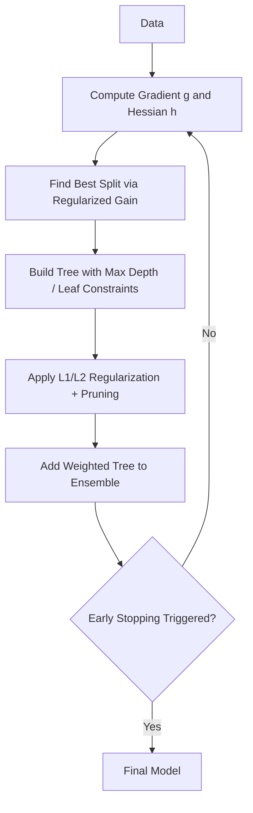

### 7. Real World Example

- 🏆 Most Kaggle tabular-data competition winners (pre-deep-learning era dominance)
- 💰 Financial Fraud Detection
- 🏥 Clinical Risk Prediction Models
- 📊 Insurance Claim Prediction

### 8. Python Example

```python
import xgboost as xgb
from sklearn.model_selection import train_test_split
from sklearn.metrics import accuracy_score

X_train, X_test, y_train, y_test = train_test_split(X, y, test_size=0.2, random_state=42)

model = xgb.XGBClassifier(
    n_estimators=300, learning_rate=0.05, max_depth=6,
    subsample=0.8, colsample_bytree=0.8, reg_lambda=1.0,
    eval_metric="logloss", random_state=42
)
model.fit(X_train, y_train, eval_set=[(X_test, y_test)], verbose=False)

y_pred = model.predict(X_test)
print("Accuracy:", accuracy_score(y_test, y_pred))
```

### 9. Visualization

```
Vanilla GBM:   fits residuals using 1st-order gradient only
XGBoost:       fits residuals using 1st (g) AND 2nd order (h) gradient
               + explicit regularization term Ω(f) = γT + ½λΣw²
               → faster convergence, less overfitting
```

### 10. Assumptions

Same core boosting assumptions as Gradient Boosting (weak learners combine into a strong learner, differentiable loss), plus an implicit assumption that regularization hyperparameters are tuned to match dataset complexity.

### 11. Advantages

- **Regularization (L1/L2)** built directly into the objective — reduces overfitting more than vanilla GBM.
- **Handles missing values natively** — learns the optimal default direction for NaNs at each split.
- **Extremely fast** due to parallelized tree construction, cache-aware access, and approximate split-finding algorithms.
- **Built-in cross-validation and early stopping** support.
- **Highly customizable** — supports custom objective and evaluation functions.

### 12. Disadvantages

- **More hyperparameters to tune** than Random Forest, increasing tuning complexity.
- **Still sequential at its core** — less parallelizable across trees than bagging methods.
- **Can overfit on small/noisy datasets** if regularization isn't tuned properly.
- **Slower than LightGBM** on very large datasets (level-wise vs leaf-wise growth).

### 13. Important Hyperparameters

| Hyperparameter          | Purpose                                    | Effect                                     | Typical Values | Interview Notes                     |
| ----------------------- | ------------------------------------------ | ------------------------------------------ | -------------- | ----------------------------------- |
| `eta` / `learning_rate` | Shrinks each tree's contribution           | Lower = more robust, needs more rounds     | 0.01 – 0.3     | Same tradeoff as GBM                |
| `max_depth`             | Tree depth                                 | Deeper = more complex, risk of overfitting | 3 – 10         | XGBoost grows level-wise by default |
| `reg_lambda` (L2)       | Ridge-style regularization on leaf weights | Higher = smoother, simpler trees           | 1 – 10         | Key differentiator from vanilla GBM |
| `reg_alpha` (L1)        | Lasso-style regularization                 | Encourages sparsity in leaf weights        | 0 – 1          | Less commonly tuned than lambda     |
| `subsample`             | Row sampling ratio per tree                | <1.0 adds randomness, reduces overfitting  | 0.6 – 1.0      | Similar to Random Forest bagging    |
| `colsample_bytree`      | Column sampling ratio per tree             | <1.0 decorrelates trees                    | 0.6 – 1.0      | Borrowed from Random Forest idea    |
| `gamma`                 | Minimum loss reduction to make a split     | Higher = more conservative tree growth     | 0 – 5          | Acts as a pruning mechanism         |

### 14. Evaluation Metrics

Log Loss, AUC, Error Rate (classification); RMSE, MAE (regression) — all natively supported via `eval_metric`.

### 15. Feature Scaling Requirement

**NO** — tree-based splits are scale-invariant.

### 16. Missing Values

**YES, handled natively** — XGBoost learns the optimal default split direction for missing values during training, a major advantage over scikit-learn's GBM.

### 17. Categorical Features

**Partial native support** in recent versions (`enable_categorical=True`), though One-Hot/Target Encoding is still commonly used for compatibility and performance.

### 18. Outliers

**Moderately robust** due to regularization, but extreme outliers can still influence gradient/Hessian calculations, especially early in training.

### 19. Computational Complexity

- **Training Complexity:** O(n_estimators · n·p·log n), optimized with histogram-based approximate split finding for speed.
- **Prediction Complexity:** O(n_estimators · depth).
- **Memory Complexity:** Moderate — optimized with compressed column (CSC) block storage.

### 20. When to Use

- Structured/tabular data competitions or production systems needing top accuracy.
- You need native missing-value handling and strong regularization.

### 21. When NOT to Use

- Extremely large datasets where LightGBM's speed advantage matters more.
- Unstructured data (images, text, audio) — deep learning is more appropriate.

### 22. Frequently Asked Interview Questions

<details>
<summary><b>Click to expand 10 interview questions</b></summary>

**Basic**

1. What does XGBoost stand for and how does it differ from vanilla Gradient Boosting?
2. Why is XGBoost considered "regularized" boosting?

**Intermediate** 3. How does XGBoost handle missing values? 4. What is the role of `gamma` in controlling tree complexity? 5. Explain `subsample` and `colsample_bytree` and why they help prevent overfitting.

**Advanced** 6. Why does XGBoost use second-order gradients (Hessian) instead of just first-order gradients? 7. Explain the regularized objective function of XGBoost. 8. Compare XGBoost's level-wise tree growth vs LightGBM's leaf-wise growth. 9. How does XGBoost achieve parallelization if boosting is inherently sequential? (Parallelized at the split-finding level within each tree, not across trees) 10. What is early stopping and how do you implement it in XGBoost?

</details>

### 23. Common Mistakes

- Not using early stopping, leading to overfitting on the training set.
- Ignoring `scale_pos_weight` for imbalanced classification problems.
- Confusing XGBoost's parallelization (within-tree) with Random Forest's parallelization (across trees).

### 24. Tips

> [!TIP]
> When asked "why is XGBoost faster than plain Gradient Boosting," emphasize **second-order optimization, regularization, and system-level engineering (cache-aware access, parallel split-finding, histogram-based binning)** — not just "it's an optimized version."

### 25. Summary Box

| Topic          | Summary                              |
| -------------- | ------------------------------------ |
| Problem Type   | Classification / Regression          |
| Scaling        | Not required                         |
| Missing Values | Handled natively                     |
| Fast           | Very Fast                            |
| Explainable    | Medium (via SHAP/feature importance) |
| Best Use Case  | Kaggle Competitions, Fraud Detection |

---

## LightGBM

### 1. Overview

LightGBM (Light Gradient Boosting Machine), developed by Microsoft, is a fast, distributed, high-performance implementation of Gradient Boosting that uses **histogram-based binning** and **leaf-wise (best-first) tree growth** instead of level-wise growth, making it significantly faster on large datasets than XGBoost while maintaining comparable accuracy.

### 2. Problem Type

`Classification` and `Regression` (Ensemble — Boosting)

### 3. Intuition

> While XGBoost grows a tree level by level (like filling a book shelf row by row), LightGBM grows the tree leaf by leaf, always splitting the leaf that will reduce loss the most (like always fixing the biggest crack in a wall first) — this converges faster but can create deeper, more unbalanced trees.

### 4. Mathematical Idea

LightGBM uses the same gradient boosting framework as XGBoost but introduces two key innovations:

**GOSS (Gradient-based One-Side Sampling):** keeps instances with large gradients (poorly predicted) and randomly samples instances with small gradients, since large-gradient samples contribute more to information gain.

**EFB (Exclusive Feature Bundling):** bundles mutually exclusive sparse features together to reduce effective feature dimensionality without losing information, speeding up histogram construction.

Leaf-wise split selection maximizes:

$$
\text{Gain} = \frac{1}{2}\left[\frac{G_L^2}{H_L+\lambda} + \frac{G_R^2}{H_R+\lambda} - \frac{(G_L+G_R)^2}{H_L+H_R+\lambda}\right] - \gamma
$$

(same gain formula family as XGBoost, applied leaf-wise instead of level-wise).

### 5. How the Algorithm Works

1. Bin continuous features into discrete histograms (default 255 bins) for fast split-finding.
2. Apply GOSS to sample the most informative gradients, reducing computation.
3. Apply EFB to bundle sparse mutually-exclusive features together.
4. Grow the tree **leaf-wise**: always split the leaf with the highest potential loss reduction, rather than growing all leaves at a given depth.
5. Add the new tree's contribution to the running prediction (scaled by learning rate).
6. Repeat for the specified number of boosting rounds, using early stopping if configured.

### 6. Workflow Diagram

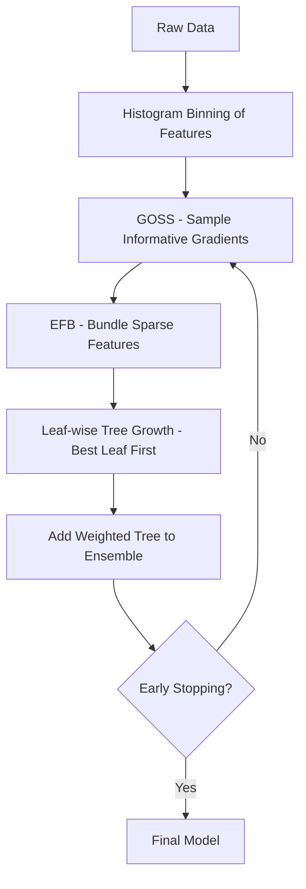

### 7. Real World Example

- 📱 Large-scale ad Click-Through-Rate prediction (billions of rows)
- 🛒 E-commerce ranking and recommendation systems
- 💳 Real-time fraud detection at scale
- 🏦 Large-scale credit risk models in fintech

### 8. Python Example

```python
import lightgbm as lgb
from sklearn.model_selection import train_test_split
from sklearn.metrics import accuracy_score

X_train, X_test, y_train, y_test = train_test_split(X, y, test_size=0.2, random_state=42)

model = lgb.LGBMClassifier(
    n_estimators=300, learning_rate=0.05, num_leaves=31,
    subsample=0.8, colsample_bytree=0.8, random_state=42
)
model.fit(X_train, y_train, eval_set=[(X_test, y_test)])

y_pred = model.predict(X_test)
print("Accuracy:", accuracy_score(y_test, y_pred))
```

### 9. Visualization

```
Level-wise (XGBoost):        Leaf-wise (LightGBM):
        o                            o
       / \                          / \
      o   o                        o   o
     /|   |\                      /|
    o o   o o                    o o
                                  |
                                  o  ← keeps splitting the best leaf
```

### 10. Assumptions

Same fundamental boosting assumptions as XGBoost/GBM, plus an assumption that leaf-wise growth (prioritizing the highest-gain split) generalizes well given proper regularization (`num_leaves`, `min_child_samples`) to avoid overly deep, overfit trees.

### 11. Advantages

- **Extremely fast training** — often 10x+ faster than XGBoost on large datasets due to histogram binning, GOSS, and EFB.
- **Lower memory usage** thanks to histogram-based binning and feature bundling.
- **Great accuracy**, especially on large-scale tabular data.
- **Supports categorical features natively** without manual encoding (using an optimized split-finding method for categories).
- **Supports distributed and GPU training** for massive datasets.

### 12. Disadvantages

- **Prone to overfitting on small datasets** because leaf-wise growth can create deep, complex trees quickly.
- **Sensitive to hyperparameters** (`num_leaves`, `min_child_samples`) — needs careful tuning to avoid overfitting.
- **Less mature ecosystem/documentation** compared to XGBoost historically.

### 13. Important Hyperparameters

| Hyperparameter      | Purpose                          | Effect                                                 | Typical Values | Interview Notes                                                  |
| ------------------- | -------------------------------- | ------------------------------------------------------ | -------------- | ---------------------------------------------------------------- |
| `num_leaves`        | Max leaves per tree              | The primary complexity control (not max_depth)         | 20 – 60        | Key interview question: why num_leaves instead of max_depth here |
| `learning_rate`     | Shrinks each tree's contribution | Lower = more robust, needs more rounds                 | 0.01 – 0.3     | Same as other boosting methods                                   |
| `min_child_samples` | Min samples per leaf             | Higher = prevents overly specific leaves (overfitting) | 10 – 50        | Critical to control leaf-wise overfitting risk                   |
| `feature_fraction`  | Fraction of features per tree    | <1.0 decorrelates trees                                | 0.6 – 1.0      | Equivalent to XGBoost's colsample_bytree                         |
| `bagging_fraction`  | Fraction of data per iteration   | <1.0 adds randomness                                   | 0.6 – 1.0      | Equivalent to subsample                                          |

### 14. Evaluation Metrics

Log Loss, AUC, Error (classification); RMSE, MAE (regression) — same as other boosting frameworks.

### 15. Feature Scaling Requirement

**NO** — tree-based, scale-invariant.

### 16. Missing Values

**YES, handled natively** — LightGBM automatically learns the best direction to send missing values during splits.

### 17. Categorical Features

**YES, best-in-class native support** — pass categorical columns directly (as integer-encoded categories) without One-Hot Encoding; LightGBM uses an optimized algorithm for finding categorical splits.

### 18. Outliers

**Moderately robust**, similar to XGBoost, though leaf-wise growth can occasionally overfit to outlier-driven splits if `min_child_samples` is too low.

### 19. Computational Complexity

- **Training Complexity:** Much lower constant factor than XGBoost due to histogram binning — effectively O(n_estimators · n·bins) instead of scanning all raw feature values.
- **Prediction Complexity:** O(n_estimators · depth).
- **Memory Complexity:** Lower than XGBoost due to histogram compression.

### 20. When to Use

- Very large datasets (millions of rows) where training speed matters.
- You have native categorical features and want to avoid manual encoding.
- You need production-grade speed for real-time or near-real-time systems.

### 21. When NOT to Use

- Small datasets (leaf-wise growth can overfit quickly — consider XGBoost or Random Forest instead).
- You need maximum interpretability without extra tooling (SHAP still works though).

### 22. Frequently Asked Interview Questions

<details>
<summary><b>Click to expand 10 interview questions</b></summary>

**Basic**

1. What makes LightGBM "light" / faster than XGBoost?
2. What is leaf-wise vs level-wise tree growth?

**Intermediate** 3. What is GOSS (Gradient-based One-Side Sampling)? 4. What is EFB (Exclusive Feature Bundling)? 5. Why is `num_leaves` a more important hyperparameter than `max_depth` in LightGBM? 6. How does LightGBM handle categorical features natively?

**Advanced** 7. Why does leaf-wise growth risk overfitting more than level-wise growth, and how do you mitigate it? 8. Explain histogram-based binning and how it speeds up split-finding. 9. When would you choose XGBoost over LightGBM despite LightGBM's speed advantage? (Small datasets, more mature tooling/interpretability needs) 10. How does LightGBM support distributed/GPU training for massive datasets?

</details>

### 23. Common Mistakes

- Using LightGBM on very small datasets without tightly constraining `num_leaves`/`min_child_samples`, leading to overfitting.
- Manually One-Hot Encoding categorical features instead of leveraging LightGBM's native categorical support (which is more efficient).
- Confusing `num_leaves` with `max_depth` when tuning — they need to be considered jointly (`num_leaves` < `2^max_depth`).

### 24. Tips

> [!TIP]
> If asked to justify LightGBM over XGBoost, lead with **leaf-wise growth + histogram binning + GOSS/EFB = faster training with comparable accuracy**, then note the overfitting risk on small data as the tradeoff.

### 25. Summary Box

| Topic          | Summary                                     |
| -------------- | ------------------------------------------- |
| Problem Type   | Classification / Regression                 |
| Scaling        | Not required                                |
| Missing Values | Handled natively                            |
| Fast           | Extremely Fast (best-in-class)              |
| Explainable    | Medium (via SHAP/feature importance)        |
| Best Use Case  | Large-Scale Tabular Data, Real-Time Ranking |

---

## CatBoost

### 1. Overview

CatBoost (Category Boosting), developed by Yandex, is a gradient boosting library built specifically to handle **categorical features natively and effectively**, using a technique called **Ordered Target Statistics** to avoid target leakage, and **Symmetric (Oblivious) Trees** for faster, more regularized predictions.

### 2. Problem Type

`Classification` and `Regression` (Ensemble — Boosting)

### 3. Intuition

> Imagine trying to encode a "City" column with hundreds of unique values into numbers, without accidentally leaking information about the target during training. CatBoost solves this cleverly by calculating category statistics **using only the data seen so far** (like a running average), which prevents the model from "cheating" by peeking at future information — a problem called target leakage.

### 4. Mathematical Idea

**Ordered Target Statistics** encode a categorical value using the target statistic computed only from _previous_ rows in a random permutation:

$$
\hat{x}_i^k = \frac{\sum_{j=1}^{p-1}[x_j^k = x_i^k]\cdot y_j + a\cdot P}{\sum_{j=1}^{p-1}[x_j^k = x_i^k] + a}
$$

where `a` is a smoothing prior and `P` is the global target mean — this avoids the leakage that naive target encoding introduces.

**Symmetric Trees:** every node at the same depth splits on the same feature/threshold, resulting in balanced, regularized trees that are fast to evaluate.

### 5. How the Algorithm Works

1. Randomly permute the training data (multiple times for robustness).
2. For each categorical feature, compute Ordered Target Statistics using only prior rows in the permutation (preventing leakage).
3. Build **Oblivious (Symmetric) Decision Trees** where the same split condition is applied across an entire depth level.
4. Use gradient boosting to sequentially add trees that correct residual errors, similar to XGBoost/LightGBM.
5. Apply built-in regularization and ordered boosting (a technique to reduce prediction shift/bias from using the same data for both statistics and gradient estimation).
6. Combine all trees for the final prediction.

### 6. Workflow Diagram

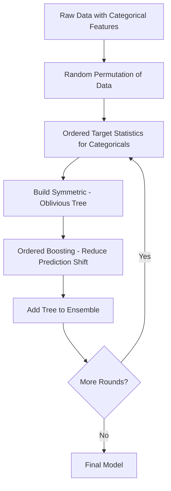

### 7. Real World Example

- 🏬 Retail demand forecasting with many categorical SKUs/stores
- 🚕 Ride-hailing ETA and pricing models (heavy categorical features)
- 🏦 Credit scoring with categorical demographic data
- 🎯 Ad recommendation systems with high-cardinality categorical IDs

### 8. Python Example

```python
from catboost import CatBoostClassifier
from sklearn.model_selection import train_test_split
from sklearn.metrics import accuracy_score

X_train, X_test, y_train, y_test = train_test_split(X, y, test_size=0.2, random_state=42)
cat_features = ["city", "device_type"]  # column names or indices

model = CatBoostClassifier(
    iterations=300, learning_rate=0.05, depth=6,
    cat_features=cat_features, verbose=False, random_state=42
)
model.fit(X_train, y_train, eval_set=(X_test, y_test))

y_pred = model.predict(X_test)
print("Accuracy:", accuracy_score(y_test, y_pred))
```

### 9. Visualization

```
Symmetric (Oblivious) Tree — same split at every node of a given depth:

           [Feature A < 5?]
          /                \
   [Feature B < 2?]   [Feature B < 2?]     ← same condition, both sides
      /      \             /      \
    Leaf    Leaf         Leaf    Leaf
```

### 10. Assumptions

Same core boosting assumptions as XGBoost/LightGBM, with an added implicit assumption that ordered statistics/permutation-based encoding faithfully represents categorical relationships without needing manual feature engineering.

### 11. Advantages

- **Best-in-class native categorical feature handling** — no need for One-Hot or Target Encoding.
- **Reduces target leakage** via Ordered Target Statistics and Ordered Boosting, a problem that plagues naive target encoding approaches.
- **Robust default hyperparameters** — performs well even with minimal tuning, unlike LightGBM which needs careful tuning.
- **Symmetric trees are fast at inference time** and act as a natural regularizer.
- **Built-in support for text features** and GPU training.

### 12. Disadvantages

- **Can be slower to train** than LightGBM on purely numerical, low-cardinality datasets.
- **Symmetric trees may be less flexible** than asymmetric trees for capturing highly irregular patterns.
- **Larger model size** in some configurations compared to LightGBM.
- **Smaller community/ecosystem** compared to XGBoost historically.

### 13. Important Hyperparameters

| Hyperparameter  | Purpose                          | Effect                                   | Typical Values               | Interview Notes                                                     |
| --------------- | -------------------------------- | ---------------------------------------- | ---------------------------- | ------------------------------------------------------------------- |
| `iterations`    | Number of boosting rounds        | More rounds = more complex model         | 200 – 1000                   | Equivalent to `n_estimators`                                        |
| `learning_rate` | Shrinks each tree's contribution | Lower = more robust, needs more rounds   | 0.01 – 0.3                   | Same tradeoff as other boosting methods                             |
| `depth`         | Depth of symmetric trees         | Deeper = more complex                    | 4 – 10                       | CatBoost trees are symmetric, so depth affects all branches equally |
| `cat_features`  | Specifies categorical columns    | Enables native categorical handling      | List of column names/indices | Essential — must be explicitly declared                             |
| `l2_leaf_reg`   | L2 regularization on leaf values | Higher = simpler, more regularized trees | 1 – 10                       | Prevents overfitting on high-cardinality categoricals               |

### 14. Evaluation Metrics

Log Loss, AUC, Accuracy (classification); RMSE, MAE (regression) — CatBoost also supports many domain-specific metrics like NDCG for ranking tasks.

### 15. Feature Scaling Requirement

**NO** — tree-based, scale-invariant.

### 16. Missing Values

**YES, handled natively** — CatBoost automatically processes missing numerical values with a dedicated split strategy.

### 17. Categorical Features

**YES — best native support of all boosting libraries.** Just pass column names via `cat_features`; no manual encoding required, and it avoids the target leakage risk of naive target encoding.

### 18. Outliers

**Moderately robust**, similar to other boosting methods, aided further by symmetric tree regularization.

### 19. Computational Complexity

- **Training Complexity:** Comparable to XGBoost/LightGBM, though can be higher due to ordered boosting's multiple permutation passes.
- **Prediction Complexity:** O(n_estimators · depth) — symmetric trees are actually very fast at inference since the same split logic applies uniformly, enabling vectorized evaluation.
- **Memory Complexity:** Moderate to high, depending on categorical cardinality.

### 20. When to Use

- Datasets with many high-cardinality categorical features.
- You want strong performance without extensive hyperparameter tuning.
- You want to avoid target leakage risks from manual target encoding.

### 21. When NOT to Use

- Purely numerical, low-cardinality datasets where LightGBM's speed advantage matters more.
- Extremely large-scale datasets where LightGBM's training speed is a hard requirement.

### 22. Frequently Asked Interview Questions

<details>
<summary><b>Click to expand 10 interview questions</b></summary>

**Basic**

1. What does CatBoost do differently from XGBoost/LightGBM?
2. Why is manual target encoding risky, and how does CatBoost solve this?

**Intermediate** 3. What are Symmetric (Oblivious) Trees and why are they used? 4. What is Ordered Boosting and what problem does it solve? 5. Why doesn't CatBoost require One-Hot Encoding for categorical variables?

**Advanced** 6. Explain Ordered Target Statistics mathematically. 7. What is "prediction shift" in gradient boosting, and how does Ordered Boosting address it? 8. Compare CatBoost, XGBoost, and LightGBM in terms of categorical feature handling, speed, and default robustness. 9. Why might symmetric trees generalize better despite being less flexible than asymmetric trees? 10. When would CatBoost's default hyperparameters outperform a heavily-tuned XGBoost model?

</details>

### 23. Common Mistakes

- Manually One-Hot Encoding categorical features before using CatBoost — this defeats the purpose and can hurt performance.
- Forgetting to declare `cat_features`, causing CatBoost to treat categoricals as plain numbers.
- Assuming CatBoost is always faster — it can be slower than LightGBM on large numerical-only datasets.

### 24. Tips

> [!TIP]
> When comparing all three boosting libraries in an interview, use this mental model: **XGBoost = regularized and reliable, LightGBM = fastest on large data, CatBoost = best for categorical-heavy data with minimal tuning.**

### 25. Summary Box

| Topic          | Summary                                     |
| -------------- | ------------------------------------------- |
| Problem Type   | Classification / Regression                 |
| Scaling        | Not required                                |
| Missing Values | Handled natively                            |
| Fast           | Fast (slower than LightGBM on numeric data) |
| Explainable    | Medium (via SHAP/feature importance)        |
| Best Use Case  | High-Cardinality Categorical Data           |

---

# Part 4 — Clustering

## K-Means

### 1. Overview

K-Means is an **unsupervised** algorithm that partitions data into `k` clusters by iteratively assigning points to the nearest cluster centroid and then recomputing centroids as the mean of assigned points, until the clusters stabilize.

### 2. Problem Type

`Clustering` (Unsupervised Learning)

### 3. Intuition

> Imagine dropping `k` flags randomly on a map, then repeatedly: (1) assigning every city to its nearest flag, and (2) moving each flag to the average location of the cities assigned to it. After a few rounds, the flags settle into natural "centers of gravity" for groups of cities — those groups are your clusters.

### 4. Mathematical Idea

K-Means minimizes the **Within-Cluster Sum of Squares (WCSS)**:

$$
J = \sum_{k=1}^{K}\sum_{x_i \in C_k} \|x_i - \mu_k\|^2
$$

where $\mu_k$ is the centroid of cluster $C_k$.

### 5. How the Algorithm Works

1. Choose the number of clusters `k`.
2. Randomly initialize `k` centroids (or use K-Means++ for smarter initialization).
3. Assign each data point to its nearest centroid based on Euclidean distance.
4. Recompute each centroid as the mean of all points assigned to it.
5. Repeat steps 3–4 until centroids stop moving significantly (convergence) or max iterations reached.

### 6. Workflow Diagram

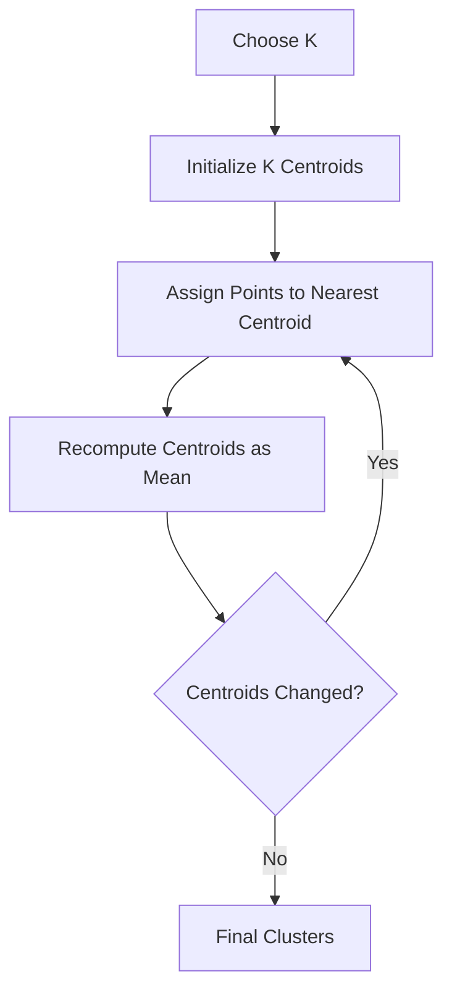

### 7. Real World Example

- 🛍️ Customer Segmentation for targeted marketing
- 🖼️ Image Compression (color quantization)
- 📄 Document/Topic Clustering
- 🚨 Anomaly detection via distance from cluster centroids

### 8. Python Example

```python
from sklearn.cluster import KMeans
from sklearn.preprocessing import StandardScaler
import matplotlib.pyplot as plt

X_scaled = StandardScaler().fit_transform(X)

model = KMeans(n_clusters=4, init="k-means++", n_init=10, random_state=42)
labels = model.fit_predict(X_scaled)

print("Cluster Centers:", model.cluster_centers_)
print("Inertia (WCSS):", model.inertia_)
```

### 9. Visualization

```
   ▲
   │   ●●●        ▲▲▲
   │   ●●●        ▲▲▲    ← two well-separated clusters
   │   ●●          ▲▲
   │        ■■■
   │        ■■■           ← a third cluster
   └───────────────────►
```

### 10. Assumptions

| Assumption                       | Meaning in Plain English                                             |
| -------------------------------- | -------------------------------------------------------------------- |
| Clusters are roughly spherical   | K-Means assumes convex, blob-like clusters of similar size           |
| Similar variance across clusters | Clusters with very different spread can be split incorrectly         |
| K is known or estimable          | The algorithm requires you to specify the number of clusters upfront |

### 11. Advantages

- **Simple, fast, and scalable** to large datasets.
- **Easy to interpret** — cluster centroids provide a clear summary of each group.
- **Works well when clusters are roughly spherical and evenly sized.**

### 12. Disadvantages

- **Must specify `k` in advance** — not always obvious what the "right" number of clusters is.
- **Sensitive to initialization** — poor starting centroids can lead to suboptimal clusters (mitigated by K-Means++).
- **Assumes spherical, similarly-sized clusters** — struggles with irregular shapes or varying densities.
- **Sensitive to outliers**, since centroids are means, which outliers can skew.

### 13. Important Hyperparameters

| Hyperparameter   | Purpose                                             | Effect                                     | Typical Values                                 | Interview Notes                             |
| ---------------- | --------------------------------------------------- | ------------------------------------------ | ---------------------------------------------- | ------------------------------------------- |
| `n_clusters` (k) | Number of clusters                                  | Core parameter — must be chosen carefully  | Determined via Elbow Method / Silhouette Score | Most-asked question: "how do you choose k?" |
| `init`           | Centroid initialization method                      | `k-means++` avoids poor random starts      | `k-means++` (default)                          | Always mention K-Means++ over random init   |
| `n_init`         | Number of times algorithm runs with different seeds | Higher = more robust to bad initialization | 10 (default)                                   | Best result (lowest inertia) is kept        |
| `max_iter`       | Max iterations per run                              | Too low may stop before convergence        | 300 (default)                                  | Rarely an issue in practice                 |

### 14. Evaluation Metrics

- **Silhouette Score** — measures how similar a point is to its own cluster vs. other clusters (-1 to 1, higher is better).
- **Davies-Bouldin Index** — ratio of within-cluster to between-cluster distances (lower is better).
- **Inertia / WCSS** — used mainly for the Elbow Method, not for comparing across different `k` fairly since it always decreases with more clusters.

### 15. Feature Scaling Requirement

**YES — required.** Since K-Means relies on Euclidean distance, unscaled features with larger ranges will dominate cluster assignment.

### 16. Missing Values

**Cannot handle missing values** — must be imputed before clustering, since distance calculations require complete feature vectors.

### 17. Categorical Features

**Not well-suited for categorical variables** — Euclidean distance doesn't meaningfully apply to categories; consider K-Modes or K-Prototypes for mixed/categorical data instead.

### 18. Outliers

**Highly sensitive** — since centroids are computed as means, a single extreme outlier can significantly pull a centroid away from the true cluster center.

### 19. Computational Complexity

- **Training Complexity:** O(n·k·i·p) where n = samples, k = clusters, i = iterations, p = features — scales well to large `n`.
- **Prediction Complexity:** O(k·p) — just compute distance to each centroid.
- **Memory Complexity:** O(n·p + k·p) — lightweight.

### 20. When to Use

- Data forms roughly spherical, well-separated clusters.
- You need a fast, scalable clustering solution for large datasets.
- You have a reasonable estimate (or method to determine) the number of clusters.

### 21. When NOT to Use

- Clusters are non-spherical or have varying density (use DBSCAN instead).
- The dataset has significant outliers/noise you don't want influencing cluster centers.
- The number of clusters is genuinely unknown and hard to estimate.

### 22. Frequently Asked Interview Questions

<details>
<summary><b>Click to expand 10 interview questions</b></summary>

**Basic**

1. How does K-Means work?
2. How do you choose the optimal value of `k`? (Elbow Method, Silhouette Score)
3. Why does K-Means require feature scaling?

**Intermediate** 4. What is K-Means++ and why is it better than random initialization? 5. What is inertia (WCSS) and why can't it be used alone to select `k`? 6. Why is K-Means sensitive to outliers?

**Advanced** 7. Why does K-Means struggle with non-spherical or unevenly-sized clusters? 8. Compare K-Means vs Hierarchical Clustering. 9. Is K-Means guaranteed to converge? Is it guaranteed to find the global optimum? (Converges to local optimum, not guaranteed global) 10. How would you cluster mixed categorical + numerical data? (K-Prototypes, Gower distance)

</details>

### 23. Common Mistakes

- Forgetting to scale features before clustering.
- Choosing `k` arbitrarily without using the Elbow Method or Silhouette analysis.
- Interpreting inertia values across different `k` values as directly comparable (it always decreases as `k` increases).

### 24. Tips

> [!TIP]
> When asked how to choose `k`, mention **both** the Elbow Method (visual, WCSS vs k) **and** Silhouette Score (quantitative) — combining both shows deeper understanding than mentioning just one.

### 25. Summary Box

| Topic          | Summary                                  |
| -------------- | ---------------------------------------- |
| Problem Type   | Clustering                               |
| Scaling        | Required                                 |
| Missing Values | Not handled — must impute                |
| Fast           | Yes, scales well                         |
| Explainable    | High                                     |
| Best Use Case  | Customer Segmentation, Image Compression |

---

## DBSCAN

### 1. Overview

DBSCAN (Density-Based Spatial Clustering of Applications with Noise) groups together points that are closely packed (high density), while marking points in low-density regions as **outliers/noise**. Unlike K-Means, it doesn't require specifying the number of clusters and can find arbitrarily shaped clusters.

### 2. Problem Type

`Clustering` (Unsupervised Learning, Density-Based)

### 3. Intuition

> Imagine looking at a satellite image of city lights at night. Densely lit areas (cities) naturally stand out as clusters, while a few isolated lights in the countryside (noise) don't belong to any city. DBSCAN finds clusters the same way — by looking for dense "blobs" of points and treating sparse, isolated points as noise, without needing to know the number of cities beforehand.

### 4. Mathematical Idea

DBSCAN relies on two parameters:

- **eps (ε):** the radius within which to search for neighboring points.
- **min_samples:** the minimum number of points required within `eps` to consider a region "dense" (a core point).

A point is a **core point** if it has at least `min_samples` points (including itself) within radius `eps`. A **border point** is within `eps` of a core point but doesn't itself meet the density threshold. A **noise point** is neither.

### 5. How the Algorithm Works

1. For each unvisited point, find all neighboring points within radius `eps`.
2. If the point has at least `min_samples` neighbors, mark it as a core point and start a new cluster.
3. Recursively add all density-reachable points (neighbors of neighbors, etc.) to this cluster.
4. Points that are within `eps` of a core point but don't meet `min_samples` themselves become border points of that cluster.
5. Points that are not reachable from any core point are labeled as noise (outliers).
6. Repeat until every point has been visited.

### 6. Workflow Diagram

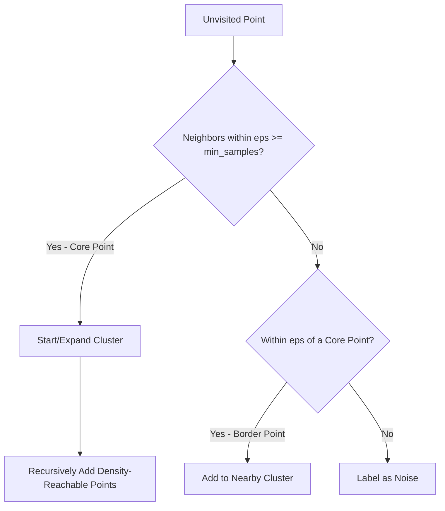

### 7. Real World Example

- 🚨 Anomaly/Fraud Detection (outliers naturally flagged as "noise")
- 🗺️ Geospatial clustering (e.g., identifying hotspots of activity)
- 🌌 Astronomy — identifying galaxy clusters in spatial data
- 🚦 Detecting traffic congestion hotspots from GPS data

### 8. Python Example

```python
from sklearn.cluster import DBSCAN
from sklearn.preprocessing import StandardScaler

X_scaled = StandardScaler().fit_transform(X)

model = DBSCAN(eps=0.5, min_samples=5)
labels = model.fit_predict(X_scaled)

n_clusters = len(set(labels)) - (1 if -1 in labels else 0)
n_noise = list(labels).count(-1)
print(f"Clusters: {n_clusters}, Noise Points: {n_noise}")
```

### 9. Visualization

```
   ●●●●              ▲▲▲
   ●●●●●              ▲▲▲▲       ×  ← isolated noise point
    ●●●                ▲▲

   (two irregularly-shaped dense clusters + noise, no fixed 'k' needed)
```

### 10. Assumptions

| Assumption                      | Meaning in Plain English                                                 |
| ------------------------------- | ------------------------------------------------------------------------ |
| Clusters are density-connected  | Clusters are regions of high density separated by regions of low density |
| Uniform density within clusters | Struggles when clusters have widely varying densities                    |
| Meaningful distance metric      | Requires scaled, meaningful feature space for `eps` to make sense        |

### 11. Advantages

- **No need to specify the number of clusters** upfront, unlike K-Means.
- **Can find arbitrarily shaped clusters**, not just spherical ones.
- **Naturally identifies outliers/noise** as a byproduct of the algorithm.
- **Robust to outliers** in the sense that they don't distort cluster shapes (they're simply excluded).

### 12. Disadvantages

- **Struggles with varying density clusters** — a single `eps` may not suit clusters of different densities.
- **Sensitive to `eps` and `min_samples`** — poor parameter choices can merge distinct clusters or classify everything as noise.
- **Doesn't scale as well** to very high-dimensional data (distance becomes less meaningful).
- **Not fully deterministic for border points** — a border point close to two clusters may be assigned differently depending on processing order.

### 13. Important Hyperparameters

| Hyperparameter | Purpose                               | Effect                                                      | Typical Values                  | Interview Notes                                                      |
| -------------- | ------------------------------------- | ----------------------------------------------------------- | ------------------------------- | -------------------------------------------------------------------- |
| `eps`          | Neighborhood radius                   | Too small = everything is noise; too large = clusters merge | Tuned via k-distance graph      | Most critical parameter — always mention the k-distance elbow method |
| `min_samples`  | Minimum points to form a dense region | Higher = more conservative, requires denser clusters        | Rule of thumb: `2 × n_features` | Also affects noise sensitivity                                       |
| `metric`       | Distance metric                       | Euclidean is default, others available                      | `euclidean`                     | Can be changed for non-Euclidean spaces                              |

### 14. Evaluation Metrics

Silhouette Score, Davies-Bouldin Index (same as K-Means), though care must be taken since these metrics assume convex clusters — visual inspection and domain validation are also important for DBSCAN.

### 15. Feature Scaling Requirement

**YES — required.** Since `eps` is a fixed radius in feature space, unscaled features distort what "nearby" means.

### 16. Missing Values

**Cannot handle missing values** — must be imputed before clustering.

### 17. Categorical Features

**Not naturally suited** for categorical data — requires an appropriate distance metric (e.g., Gower distance) if mixing categorical and numerical features.

### 18. Outliers

**Not sensitive in the traditional sense** — DBSCAN's core design explicitly separates outliers into a "noise" label rather than letting them distort cluster centers (unlike K-Means).

### 19. Computational Complexity

- **Training Complexity:** O(n log n) with spatial indexing (KD-Tree/Ball-Tree) or O(n²) in the worst case without indexing.
- **Prediction Complexity:** DBSCAN doesn't naturally support predicting new points (no centroid concept) — typically requires refitting or approximate nearest-neighbor lookup.
- **Memory Complexity:** O(n) for storing point labels, plus indexing structure overhead.

### 20. When to Use

- Clusters have irregular shapes or varying sizes.
- You expect noise/outliers in the data and want them explicitly flagged.
- You don't know the number of clusters in advance.

### 21. When NOT to Use

- Clusters have significantly varying densities (consider HDBSCAN instead).
- High-dimensional data where distance metrics become less meaningful.
- You need to assign every point to a cluster (DBSCAN explicitly leaves some as noise).

### 22. Frequently Asked Interview Questions

<details>
<summary><b>Click to expand 10 interview questions</b></summary>

**Basic**

1. How does DBSCAN differ from K-Means?
2. What are core points, border points, and noise points?
3. Why doesn't DBSCAN require specifying the number of clusters?

**Intermediate** 4. How do you choose `eps` and `min_samples`? (k-distance graph / elbow method) 5. Why is DBSCAN good at identifying outliers? 6. Can DBSCAN find non-spherical clusters? Why does this matter?

**Advanced** 7. Why does DBSCAN struggle with clusters of varying density? How does HDBSCAN address this? 8. How would you handle predicting cluster membership for new, unseen points with DBSCAN? 9. Compare DBSCAN vs K-Means vs Hierarchical Clustering in terms of assumptions and use cases. 10. What happens if `eps` is too small or too large?

</details>

### 23. Common Mistakes

- Not scaling features before applying DBSCAN, making `eps` meaningless.
- Using default `eps`/`min_samples` values blindly without using a k-distance plot to tune them.
- Applying DBSCAN to high-dimensional data without considering dimensionality reduction first.

### 24. Tips

> [!TIP]
> Mention the **k-distance graph** method for choosing `eps`: plot the distance to the k-th nearest neighbor for all points sorted in ascending order, and look for the "elbow" — this is a strong, specific answer that stands out in interviews.

### 25. Summary Box

| Topic          | Summary                                  |
| -------------- | ---------------------------------------- |
| Problem Type   | Clustering                               |
| Scaling        | Required                                 |
| Missing Values | Not handled — must impute                |
| Fast           | Moderate (depends on indexing)           |
| Explainable    | Medium                                   |
| Best Use Case  | Anomaly Detection, Geospatial Clustering |

---

# Part 5 — Dimensionality Reduction

## Principal Component Analysis (PCA)

### 1. Overview

PCA is an **unsupervised** dimensionality reduction technique that transforms a dataset with many correlated features into a smaller set of **uncorrelated variables (principal components)** that capture as much of the original variance as possible.

### 2. Problem Type

`Dimensionality Reduction` (Unsupervised)

### 3. Intuition

> Imagine taking a 3D object and finding the single best 2D shadow (angle) that preserves the most detail about its shape. PCA does this mathematically — it finds the directions (principal components) along which your data varies the most, and projects the data onto those directions, discarding directions with little variation (and thus little information).

### 4. Mathematical Idea

1. Standardize the data.
2. Compute the **covariance matrix** of the features.
3. Compute **eigenvectors and eigenvalues** of the covariance matrix — eigenvectors define the principal component directions, eigenvalues indicate how much variance each component explains.
4. Sort eigenvectors by descending eigenvalue and select the top `k` to form the new feature space.

$$
Z = XW
$$

where `W` contains the top `k` eigenvectors, and `Z` is the transformed, lower-dimensional data.

### 5. How the Algorithm Works

1. Standardize the dataset (mean = 0, variance = 1) — critical since PCA is variance-based.
2. Compute the covariance matrix of the standardized features.
3. Perform eigendecomposition (or SVD) to obtain eigenvectors and eigenvalues.
4. Rank eigenvectors by their eigenvalues (amount of variance explained).
5. Select the top `k` eigenvectors to form the principal components.
6. Project the original data onto these `k` components to get the reduced-dimensional dataset.

### 6. Workflow Diagram

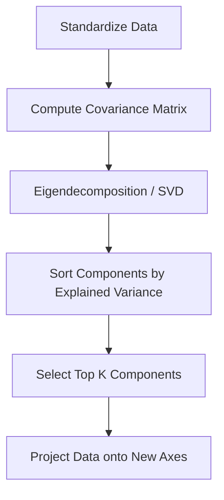

### 7. Real World Example

- 🖼️ Image compression (reducing pixel dimensionality while preserving structure)
- 📊 Visualizing high-dimensional data in 2D/3D
- 🧬 Gene expression analysis (reducing thousands of genes to key components)
- 🚀 Preprocessing step before clustering/modeling to reduce noise and speed up training

### 8. Python Example

```python
from sklearn.decomposition import PCA
from sklearn.preprocessing import StandardScaler

X_scaled = StandardScaler().fit_transform(X)

pca = PCA(n_components=2)
X_reduced = pca.fit_transform(X_scaled)

print("Explained Variance Ratio:", pca.explained_variance_ratio_)
print("Cumulative Variance:", pca.explained_variance_ratio_.cumsum())
```

### 9. Visualization

```
Original (3 features) ──PCA──► Reduced (2 principal components)

  Feature3                     PC2
    │  ●●●                      │  ●●●
    │ ●●●●●        ──────►      │ ●●●●●
    │●●●●●                      │●●●●●
    └────────Feature1                └────────PC1
   (hard to visualize)         (captures most variance, easy to plot)
```

### 10. Assumptions

| Assumption                 | Meaning in Plain English                                                      |
| -------------------------- | ----------------------------------------------------------------------------- |
| Linearity                  | PCA assumes principal components are linear combinations of original features |
| Large variance = important | Directions with more spread are assumed to carry more information             |
| Features are standardized  | PCA is sensitive to scale, so standardization is assumed before applying it   |

### 11. Advantages

- **Reduces dimensionality** while retaining most of the variance/information.
- **Removes multicollinearity** — resulting principal components are uncorrelated by construction.
- **Speeds up downstream models** and reduces overfitting risk from high-dimensional data.
- **Useful for visualization** of high-dimensional data in 2D/3D.

### 12. Disadvantages

- **Loses interpretability** — principal components are linear combinations of original features, not directly meaningful.
- **Only captures linear relationships** — struggles with non-linear structure (consider t-SNE, UMAP, or Kernel PCA instead).
- **Sensitive to scaling** — must standardize data first, or high-variance features will dominate.
- **Variance ≠ always relevance** — the directions of highest variance aren't guaranteed to be the most predictive for a specific downstream task.

### 13. Important Hyperparameters

| Hyperparameter | Purpose                                | Effect                                                       | Typical Values                                       | Interview Notes                                        |
| -------------- | -------------------------------------- | ------------------------------------------------------------ | ---------------------------------------------------- | ------------------------------------------------------ |
| `n_components` | Number of principal components to keep | Determines how much variance/information is retained         | Chosen via cumulative explained variance (e.g., 95%) | Most-asked: "how do you choose n_components?"          |
| `svd_solver`   | Algorithm used for decomposition       | Affects speed on large datasets                              | `auto`, `full`, `randomized`                         | `randomized` is faster for large high-dimensional data |
| `whiten`       | Normalizes component variance to 1     | Useful for downstream algorithms sensitive to variance scale | `False` (default)                                    | Rarely asked, but shows depth if mentioned             |

### 14. Evaluation Metrics

- **Explained Variance Ratio** — proportion of total variance captured by each component.
- **Cumulative Explained Variance** — used to decide how many components to retain (commonly 90-95%).
- **Reconstruction Error** — difference between original and reconstructed data after inverse-transforming from reduced components.

### 15. Feature Scaling Requirement

**YES — absolutely required.** PCA is based on variance, so unscaled features with larger numeric ranges will dominate the principal components regardless of their actual importance.

### 16. Missing Values

**Cannot handle missing values** — must be imputed before computing the covariance matrix.

### 17. Categorical Features

**Not designed for categorical variables** — PCA assumes continuous, numeric data; categorical variables need encoding first, though PCA on one-hot encoded categoricals is often not very meaningful (consider MCA — Multiple Correspondence Analysis — for categorical data instead).

### 18. Outliers

**Sensitive to outliers** — since PCA is variance-based, extreme values can dominate a principal component's direction, skewing the transformation.

### 19. Computational Complexity

- **Training (fit) Complexity:** O(min(n²p, np²)) for full SVD, or faster with randomized SVD for large datasets.
- **Transform Complexity:** O(n·p·k) — projecting data onto `k` components.
- **Memory Complexity:** O(p²) to store the covariance matrix, or O(np) for the data itself.

### 20. When to Use

- You have many correlated features and want to reduce dimensionality.
- You need to visualize high-dimensional data.
- You want to speed up downstream models or reduce overfitting from too many features.

### 21. When NOT to Use

- You need to preserve full interpretability of original features.
- The relationships in your data are highly non-linear (use t-SNE, UMAP, or Kernel PCA instead).
- Your features are already few and largely independent.

### 22. Frequently Asked Interview Questions

<details>
<summary><b>Click to expand 11 interview questions</b></summary>

**Basic**

1. What is PCA and why is it used?
2. What is a principal component?
3. Why is feature scaling important before PCA?

**Intermediate** 4. How do you decide how many principal components to keep? 5. What is explained variance ratio? 6. Why are principal components always uncorrelated with each other?

**Advanced** 7. Explain the relationship between PCA and Singular Value Decomposition (SVD). 8. Why does PCA maximize variance rather than some other criterion? 9. What are the limitations of PCA for non-linear data, and what alternatives exist? (Kernel PCA, t-SNE, UMAP) 10. Difference between PCA and Feature Selection? (PCA creates new features; Feature Selection keeps a subset of original features) 11. Can PCA be used for supervised feature reduction? Why is LDA sometimes preferred for classification tasks instead?

</details>

### 23. Common Mistakes

- Forgetting to scale features before applying PCA.
- Choosing `n_components` arbitrarily instead of using cumulative explained variance.
- Assuming principal components retain the interpretability of original features.
- Applying PCA on data with strong non-linear structure and expecting good separation.

### 24. Tips

> [!TIP]
> A great way to answer "how many components should you keep" is: _"I'd plot cumulative explained variance and pick the smallest number of components that explains ~90-95% of the variance, potentially validated with a downstream model's performance."_

### 25. Summary Box

| Topic          | Summary                                        |
| -------------- | ---------------------------------------------- |
| Problem Type   | Dimensionality Reduction                       |
| Scaling        | Required                                       |
| Missing Values | Not handled — must impute                      |
| Fast           | Yes (especially with randomized SVD)           |
| Explainable    | Low (components aren't directly interpretable) |
| Best Use Case  | Visualization, Noise Reduction, Preprocessing  |

---

# Part 6 — Deep Learning

## Neural Networks

### 1. Overview

A Neural Network is a computational model loosely inspired by the human brain, composed of layers of interconnected "neurons" that learn to map inputs to outputs by adjusting connection weights through **backpropagation** and **gradient descent**. It can model highly complex, non-linear relationships that simpler algorithms cannot.

### 2. Problem Type

`Deep Learning` — applicable to Classification, Regression, and beyond (images, text, sequences)

### 3. Intuition

> Imagine a team of employees passing a task through several departments, where each department applies its own small transformation before passing it along. Each "neuron" applies a simple weighted transformation followed by a non-linear twist (activation function), but when you stack thousands of these together in layers, the network as a whole can learn extremely complex patterns — like recognizing a cat in an image or translating a sentence.

### 4. Mathematical Idea

A single neuron computes:

$$
z = \sum_{i=1}^{n} w_i x_i + b, \qquad a = \sigma(z)
$$

where $\sigma$ is a non-linear activation function (ReLU, Sigmoid, Tanh). Stacking layers of neurons gives:

$$
a^{[l]} = \sigma(W^{[l]}a^{[l-1]} + b^{[l]})
$$

Training minimizes a loss function (e.g., Cross-Entropy or MSE) using **Backpropagation**, which applies the chain rule to compute gradients of the loss with respect to every weight, then updates weights via Gradient Descent:

$$
W := W - \eta \frac{\partial L}{\partial W}
$$

### 5. How the Algorithm Works

1. Initialize weights and biases randomly (e.g., Xavier/He initialization).
2. **Forward Propagation:** pass input data through each layer, applying weighted sums and activation functions, to produce a prediction.
3. Compute the loss between the prediction and the true label using a loss function.
4. **Backpropagation:** compute the gradient of the loss with respect to every weight using the chain rule, propagating errors backward from the output layer to the input layer.
5. Update all weights using an optimizer (SGD, Adam, RMSProp) based on these gradients.
6. Repeat forward + backward passes over many epochs until the loss converges.

### 6. Workflow Diagram

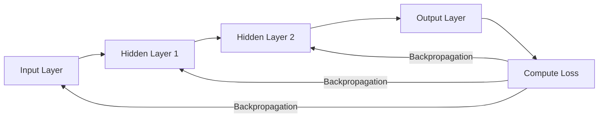

### 7. Real World Example

- 🖼️ Image Recognition (CNNs for object/face detection)
- 🗣️ Speech Recognition & Natural Language Processing (Transformers, RNNs)
- 🎮 Game-Playing AI (Reinforcement Learning with deep networks)
- 💊 Drug Discovery via molecular property prediction
- 🚗 Self-driving car perception systems

### 8. Python Example

```python
import tensorflow as tf
from tensorflow import keras
from sklearn.preprocessing import StandardScaler
from sklearn.model_selection import train_test_split

X_scaled = StandardScaler().fit_transform(X)
X_train, X_test, y_train, y_test = train_test_split(X_scaled, y, test_size=0.2, random_state=42)

model = keras.Sequential([
    keras.layers.Dense(64, activation="relu", input_shape=(X_train.shape[1],)),
    keras.layers.Dropout(0.3),
    keras.layers.Dense(32, activation="relu"),
    keras.layers.Dense(1, activation="sigmoid")
])

model.compile(optimizer="adam", loss="binary_crossentropy", metrics=["accuracy"])
history = model.fit(X_train, y_train, epochs=30, batch_size=32,
                     validation_split=0.2, verbose=0)

test_loss, test_acc = model.evaluate(X_test, y_test, verbose=0)
print("Test Accuracy:", test_acc)
```

### 9. Visualization

```
Input Layer      Hidden Layer(s)       Output Layer
   ○ ─┐          ○   ○   ○
   ○ ─┼─────►    ○   ○   ○   ──────►      ○  → prediction
   ○ ─┤          ○   ○   ○
   ○ ─┘

(each connection has a weight, each node applies an activation function)
```

### 10. Assumptions

| Assumption                      | Meaning in Plain English                                                        |
| ------------------------------- | ------------------------------------------------------------------------------- |
| Sufficient data                 | Neural networks are data-hungry and need large datasets to generalize well      |
| Differentiable loss/activations | Backpropagation requires the loss and activation functions to be differentiable |
| Appropriate architecture        | The network's depth/width must be suited to the complexity of the problem       |

### 11. Advantages

- **Can model extremely complex, non-linear relationships** that simpler algorithms cannot capture.
- **Highly flexible architecture** — can be adapted for images (CNNs), sequences (RNNs/Transformers), and tabular data.
- **Automatic feature learning** — especially powerful for unstructured data (images, text, audio), removing the need for manual feature engineering.
- **Scales well with data and compute** — performance generally improves with more data, unlike many classical ML models that plateau.

### 12. Disadvantages

- **Requires large amounts of data** to perform well and avoid overfitting.
- **Computationally expensive** — often requires GPUs/TPUs for reasonable training times.
- **"Black box" nature** — much harder to interpret than trees or linear models.
- **Many hyperparameters to tune** (architecture, learning rate, batch size, regularization) — significant tuning effort required.
- **Prone to overfitting** on small datasets without proper regularization.

### 13. Important Hyperparameters

| Hyperparameter  | Purpose                                                    | Effect                                                                    | Typical Values                                | Interview Notes                                                               |
| --------------- | ---------------------------------------------------------- | ------------------------------------------------------------------------- | --------------------------------------------- | ----------------------------------------------------------------------------- |
| `learning_rate` | Step size for weight updates                               | Too high = unstable training; too low = slow convergence                  | 0.0001 – 0.01                                 | Often tuned with learning rate schedulers                                     |
| `batch_size`    | Number of samples per gradient update                      | Smaller = noisier but more frequent updates; larger = smoother but slower | 16 – 256                                      | Affects both speed and generalization                                         |
| `epochs`        | Number of full passes through training data                | Too many = overfitting; too few = underfitting                            | Tuned with early stopping                     | Always pair with early stopping in interviews                                 |
| `dropout`       | Regularization — randomly disables neurons during training | Reduces overfitting by preventing co-adaptation                           | 0.2 – 0.5                                     | Classic regularization technique to mention                                   |
| `activation`    | Non-linearity applied at each neuron                       | ReLU is standard for hidden layers; Sigmoid/Softmax for output            | `relu` (hidden), `sigmoid`/`softmax` (output) | Know why ReLU is preferred over Sigmoid in deep networks (vanishing gradient) |
| `optimizer`     | Algorithm for updating weights                             | Adam adapts learning rate per parameter                                   | `adam` (most common default)                  | Compare SGD vs Adam vs RMSProp if asked                                       |

### 14. Evaluation Metrics

Same as classification/regression depending on the task: Accuracy, Precision, Recall, F1, ROC AUC, Log Loss/Cross-Entropy (classification); MAE, MSE, RMSE (regression). Training/validation loss curves are also critical for diagnosing overfitting.

### 15. Feature Scaling Requirement

**YES — strongly required.** Neural networks train via gradient descent, and unscaled features cause uneven gradients, slow/unstable convergence, and poor performance.

### 16. Missing Values

**Cannot handle missing values natively** — must be imputed or explicitly encoded (e.g., with a missingness indicator feature) before training.

### 17. Categorical Features

**Cannot handle raw categorical variables directly** — require encoding, commonly via **Embeddings** (for high-cardinality categories) or One-Hot Encoding (for low-cardinality categories).

### 18. Outliers

**Sensitive to outliers**, especially with MSE-based loss functions, since large errors produce large gradients that can destabilize training; robust scaling or loss functions (e.g., Huber loss) can help mitigate this.

### 19. Computational Complexity

- **Training Complexity:** O(epochs · n·p·(architecture size)) — highly dependent on network depth/width; benefits massively from GPU parallelization.
- **Prediction Complexity:** O(architecture size) — a single forward pass, typically fast even for large networks on modern hardware.
- **Memory Complexity:** O(number of parameters) — can range from thousands to billions of parameters depending on architecture.

### 20. When to Use

- Large datasets with complex, non-linear patterns.
- Unstructured data: images, text, audio, video.
- You have sufficient compute resources (GPU/TPU) and time for training/tuning.

### 21. When NOT to Use

- Small datasets (classical ML models like Random Forest/XGBoost often outperform NNs on small tabular data).
- You need high interpretability (regulatory/compliance-heavy domains).
- Limited compute budget or need for very fast, lightweight inference.

### 22. Frequently Asked Interview Questions

<details>
<summary><b>Click to expand 12 interview questions</b></summary>

**Basic**

1. What is a neural network and how does it learn?
2. What is backpropagation?
3. Why do we need activation functions (why can't a network just be linear layers stacked together)?

**Intermediate** 4. What is the vanishing gradient problem and why does ReLU help mitigate it? 5. What is dropout and how does it prevent overfitting? 6. Difference between batch, mini-batch, and stochastic gradient descent? 7. Why is feature scaling important for neural networks? 8. What is the role of the learning rate, and what happens if it's too high or too low?

**Advanced** 9. Explain the chain rule's role in backpropagation. 10. Compare Adam vs SGD as optimizers — why does Adam often converge faster? 11. What is batch normalization and why does it help training stability? 12. Why do small tabular datasets often favor XGBoost/Random Forest over Neural Networks?

</details>

### 23. Common Mistakes

- Not scaling input features before training.
- Using too complex an architecture for a small dataset, leading to severe overfitting.
- Ignoring learning rate tuning and using a default value blindly.
- Not using early stopping or validation curves to detect overfitting during training.

### 24. Tips

> [!TIP]
> When asked "why not just use a neural network for everything," give a balanced answer: _"Neural networks excel with large, unstructured data (images, text) but often underperform gradient boosting methods on small-to-medium structured/tabular data, and sacrifice interpretability."_ This nuanced answer signals real-world experience.

### 25. Summary Box

| Topic          | Summary                                                     |
| -------------- | ----------------------------------------------------------- |
| Problem Type   | Classification / Regression / Unstructured Data Tasks       |
| Scaling        | Required                                                    |
| Missing Values | Not handled — must impute                                   |
| Fast           | Slow to train, fast to predict (with hardware acceleration) |
| Explainable    | Low                                                         |
| Best Use Case  | Image Recognition, NLP, Speech Recognition                  |

---

# Part 7 — Comparison Chapters

> [!NOTE]
> These chapters are designed for the **"compare X vs Y"** style questions that come up constantly in interviews. Each table covers the dimensions interviewers care about most.

## Linear Regression vs Logistic Regression

| Dimension          | Linear Regression                           | Logistic Regression                       |
| ------------------ | ------------------------------------------- | ----------------------------------------- |
| Accuracy           | High for linear numeric targets             | High for linear decision boundaries       |
| Speed              | Very fast                                   | Very fast                                 |
| Interpretability   | Very high                                   | Very high                                 |
| Scalability        | Excellent                                   | Excellent                                 |
| Memory Usage       | Low                                         | Low                                       |
| Training Time      | Very fast (closed-form)                     | Fast (iterative, convex)                  |
| Feature Scaling    | Not required                                | Required (with regularization)            |
| Missing Values     | Not handled                                 | Not handled                               |
| Best Use Cases     | House prices, sales forecasting             | Spam detection, churn prediction          |
| Pros               | Simple, interpretable, statistically mature | Probabilistic output, interpretable, fast |
| Cons               | Can't classify, sensitive to outliers       | Assumes linear decision boundary          |
| Interview Takeaway | Predicts continuous values                  | Predicts class probabilities via sigmoid  |

---

## Decision Tree vs Random Forest

| Dimension          | Decision Tree                   | Random Forest                                    |
| ------------------ | ------------------------------- | ------------------------------------------------ |
| Accuracy           | Moderate (prone to overfitting) | High                                             |
| Speed              | Very fast                       | Moderate                                         |
| Interpretability   | Very high                       | Medium                                           |
| Scalability        | Good                            | Good                                             |
| Memory Usage       | Low                             | High (many trees)                                |
| Training Time      | Fast                            | Slower (many trees, though parallelizable)       |
| Feature Scaling    | Not required                    | Not required                                     |
| Missing Values     | Not handled (sklearn)           | Not handled (sklearn)                            |
| Best Use Cases     | Simple rule-based decisions     | Robust general-purpose classification/regression |
| Pros               | Fully interpretable, fast       | Reduces overfitting via averaging                |
| Cons               | High variance, unstable         | Less interpretable, slower prediction            |
| Interview Takeaway | One tree = high variance        | Many trees + bagging = lower variance            |

---

## Random Forest vs XGBoost

| Dimension          | Random Forest                          | XGBoost                                          |
| ------------------ | -------------------------------------- | ------------------------------------------------ |
| Accuracy           | High                                   | Often higher (with tuning)                       |
| Speed              | Fast (parallel trees)                  | Fast (optimized, but sequential boosting)        |
| Interpretability   | Medium                                 | Medium                                           |
| Scalability        | Good                                   | Excellent (optimized for large data)             |
| Memory Usage       | High                                   | Moderate (optimized storage)                     |
| Training Time      | Moderate                               | Moderate to slow (needs tuning)                  |
| Feature Scaling    | Not required                           | Not required                                     |
| Missing Values     | Not handled (sklearn)                  | Handled natively                                 |
| Best Use Cases     | General-purpose robust baseline        | Competitions, maximum accuracy needs             |
| Pros               | Easy to tune, robust defaults          | Regularized, handles missing data, very accurate |
| Cons               | Can plateau in accuracy                | Needs more careful hyperparameter tuning         |
| Interview Takeaway | Bagging (parallel, variance reduction) | Boosting (sequential, bias reduction)            |

---

## XGBoost vs LightGBM

| Dimension          | XGBoost                            | LightGBM                                         |
| ------------------ | ---------------------------------- | ------------------------------------------------ |
| Accuracy           | Very high                          | Very high (comparable)                           |
| Speed              | Fast                               | Faster (especially on large data)                |
| Interpretability   | Medium                             | Medium                                           |
| Scalability        | Very good                          | Excellent (built for huge datasets)              |
| Memory Usage       | Moderate                           | Lower (histogram-based)                          |
| Training Time      | Moderate                           | Faster (leaf-wise growth, GOSS, EFB)             |
| Feature Scaling    | Not required                       | Not required                                     |
| Missing Values     | Handled natively                   | Handled natively                                 |
| Best Use Cases     | General tabular data, competitions | Very large datasets, production ranking systems  |
| Pros               | Mature, regularized, reliable      | Extremely fast, native categorical support       |
| Cons               | Slower on huge datasets            | Can overfit on small datasets (leaf-wise growth) |
| Interview Takeaway | Level-wise tree growth             | Leaf-wise tree growth (faster, riskier)          |

---

## LightGBM vs CatBoost

| Dimension          | LightGBM                              | CatBoost                                          |
| ------------------ | ------------------------------------- | ------------------------------------------------- |
| Accuracy           | Very high                             | Very high                                         |
| Speed              | Fastest on large numeric data         | Fast, slightly slower on pure numeric data        |
| Interpretability   | Medium                                | Medium                                            |
| Scalability        | Excellent                             | Very good                                         |
| Memory Usage       | Low                                   | Moderate to high (categorical statistics)         |
| Training Time      | Fastest                               | Fast, more overhead from ordered boosting         |
| Feature Scaling    | Not required                          | Not required                                      |
| Missing Values     | Handled natively                      | Handled natively                                  |
| Best Use Cases     | Large-scale numeric/tabular data      | High-cardinality categorical-heavy data           |
| Pros               | Speed, low memory, great for big data | Best native categorical handling, robust defaults |
| Cons               | Can overfit on small data             | Slower on huge purely numeric datasets            |
| Interview Takeaway | Best raw speed                        | Best out-of-the-box categorical handling          |

---

## KNN vs SVM

| Dimension          | KNN                                      | SVM                                          |
| ------------------ | ---------------------------------------- | -------------------------------------------- |
| Accuracy           | Moderate to high (low-dim data)          | High (especially high-dimensional data)      |
| Speed              | Slow at prediction                       | Slow to train on large data, fast prediction |
| Interpretability   | High (conceptually simple)               | Low to medium                                |
| Scalability        | Poor (large datasets)                    | Poor (large datasets)                        |
| Memory Usage       | High (stores all data)                   | Low to moderate (stores support vectors)     |
| Training Time      | None (lazy learner)                      | Slow (quadratic-ish complexity)              |
| Feature Scaling    | Required                                 | Required                                     |
| Missing Values     | Not handled                              | Not handled                                  |
| Best Use Cases     | Recommendation, similarity search        | Text/image classification, high-dim data     |
| Pros               | Simple, no training phase                | Effective in high dimensions, robust margins |
| Cons               | Slow prediction, curse of dimensionality | Hard to tune, doesn't scale to huge datasets |
| Interview Takeaway | Distance-based, lazy learning            | Margin-based, kernel trick for non-linearity |

---

## K-Means vs DBSCAN

| Dimension          | K-Means                                       | DBSCAN                                               |
| ------------------ | --------------------------------------------- | ---------------------------------------------------- |
| Accuracy           | Good for spherical clusters                   | Good for arbitrary-shaped clusters                   |
| Speed              | Fast, scales well                             | Moderate (depends on indexing)                       |
| Interpretability   | High                                          | Medium                                               |
| Scalability        | Excellent                                     | Moderate                                             |
| Memory Usage       | Low                                           | Low to moderate                                      |
| Training Time      | Fast                                          | Moderate                                             |
| Feature Scaling    | Required                                      | Required                                             |
| Missing Values     | Not handled                                   | Not handled                                          |
| Best Use Cases     | Customer segmentation, compression            | Anomaly detection, irregular clusters                |
| Pros               | Simple, fast, scalable                        | No need to specify k, handles noise/outliers         |
| Cons               | Needs k specified, assumes spherical clusters | Sensitive to eps/min_samples, varying density issues |
| Interview Takeaway | Centroid-based                                | Density-based                                        |

---

## PCA vs Feature Selection

| Dimension          | PCA                                                 | Feature Selection                                  |
| ------------------ | --------------------------------------------------- | -------------------------------------------------- |
| Accuracy           | Can preserve variance well                          | Depends on selection method quality                |
| Speed              | Fast                                                | Varies (filter methods fast, wrapper methods slow) |
| Interpretability   | Low (new synthetic features)                        | High (keeps original features)                     |
| Scalability        | Good                                                | Good                                               |
| Memory Usage       | Moderate                                            | Low                                                |
| Training Time      | Fast                                                | Varies by method                                   |
| Feature Scaling    | Required                                            | Depends on method                                  |
| Missing Values     | Not handled                                         | Depends on method                                  |
| Best Use Cases     | Visualization, noise reduction, correlated features | When interpretability of original features matters |
| Pros               | Removes multicollinearity, reduces dimensions       | Keeps original, interpretable features             |
| Cons               | Loses interpretability                              | Doesn't reduce feature correlation                 |
| Interview Takeaway | PCA creates new features                            | Feature Selection keeps a subset of existing ones  |

---

## Gradient Boosting vs Random Forest

| Dimension          | Gradient Boosting                          | Random Forest                             |
| ------------------ | ------------------------------------------ | ----------------------------------------- |
| Accuracy           | Often higher (with tuning)                 | High, more consistent out-of-the-box      |
| Speed              | Slower (sequential)                        | Faster (parallel)                         |
| Interpretability   | Medium                                     | Medium                                    |
| Scalability        | Moderate                                   | Good                                      |
| Memory Usage       | Moderate                                   | High                                      |
| Training Time      | Slower                                     | Faster                                    |
| Feature Scaling    | Not required                               | Not required                              |
| Missing Values     | Not handled (sklearn)                      | Not handled (sklearn)                     |
| Best Use Cases     | Maximum accuracy on tabular data           | Robust general-purpose baseline           |
| Pros               | Reduces bias sequentially, very accurate   | Reduces variance, easy to tune            |
| Cons               | Prone to overfitting, needs careful tuning | Can plateau, less flexible loss functions |
| Interview Takeaway | Boosting reduces bias                      | Bagging reduces variance                  |

---

## Neural Networks vs Tree Models (XGBoost/Random Forest)

| Dimension          | Neural Networks                                              | Tree Models                                         |
| ------------------ | ------------------------------------------------------------ | --------------------------------------------------- |
| Accuracy           | Excellent on unstructured data                               | Excellent on structured/tabular data                |
| Speed              | Slow to train                                                | Faster to train (especially RF)                     |
| Interpretability   | Low                                                          | Medium (feature importance, SHAP)                   |
| Scalability        | Excellent (with GPU)                                         | Good                                                |
| Memory Usage       | High (many parameters)                                       | Moderate                                            |
| Training Time      | Slow, needs many epochs                                      | Faster in most tabular cases                        |
| Feature Scaling    | Required                                                     | Not required                                        |
| Missing Values     | Not handled                                                  | Handled natively (XGBoost/LightGBM/CatBoost)        |
| Best Use Cases     | Images, text, audio, video                                   | Structured/tabular business data                    |
| Pros               | Captures highly complex patterns, automatic feature learning | Fast, interpretable, minimal preprocessing          |
| Cons               | Data-hungry, compute-intensive, hard to interpret            | Weaker on unstructured/raw signal data              |
| Interview Takeaway | NN dominates unstructured data                               | Trees still dominate most tabular business problems |

---

# Part 8 — Interview Cheat Sheets

> [!TIP]
> Read these the night before an interview — each one condenses an entire category into a 60-second refresher.

<details>
<summary><b>📘 Regression Cheat Sheet</b></summary>

- **Core idea:** predict a continuous value by fitting coefficients that minimize squared error.
- **Key formula:** $\hat{y} = \beta_0 + \beta_1x_1 + \dots + \beta_nx_n$, minimized via $J(\beta) = \sum(y_i - \hat{y}_i)^2$
- **Assumptions:** linearity, independence, homoscedasticity, normal residuals, no multicollinearity.
- **Strengths:** interpretable, fast, statistically mature.
- **Weaknesses:** can't capture non-linearity, sensitive to outliers and multicollinearity.
- **Regularization:** Ridge (L2, shrinks), Lasso (L1, selects), Elastic Net (both).
- **Common interview Qs:** "How do you detect multicollinearity?" "Difference between R² and Adjusted R²?" "When would you use Ridge over Lasso?"

</details>

<details>
<summary><b>📗 Classification Cheat Sheet</b></summary>

- **Core idea:** predict a discrete class label, often with an associated probability.
- **Key algorithms:** Logistic Regression (linear boundary + sigmoid), Decision Tree (rule-based splits), Random Forest (bagged trees), KNN (distance-based), Naive Bayes (probabilistic, independence assumption), SVM (max-margin hyperplane).
- **Key metrics:** Precision, Recall, F1, ROC AUC — choose based on whether false positives or false negatives are costlier.
- **Common interview Qs:** "Precision vs Recall tradeoff?" "How do you handle class imbalance?" "Bagging vs Boosting?"

</details>

<details>
<summary><b>📙 Clustering Cheat Sheet</b></summary>

- **Core idea:** group unlabeled data into clusters based on similarity/density.
- **Key algorithms:** K-Means (centroid-based, needs k), DBSCAN (density-based, finds arbitrary shapes + noise).
- **Key metrics:** Silhouette Score, Davies-Bouldin Index.
- **Choosing k for K-Means:** Elbow Method (WCSS) + Silhouette Score.
- **Choosing eps for DBSCAN:** k-distance graph, look for the elbow.
- **Common interview Qs:** "How do you choose k?" "K-Means vs DBSCAN?" "Why does K-Means need feature scaling?"

</details>

<details>
<summary><b>📕 Ensemble (Bagging & Boosting) Cheat Sheet</b></summary>

- **Bagging (Random Forest):** trains trees in _parallel_ on bootstrap samples → reduces **variance**.
- **Boosting (Gradient Boosting, XGBoost, LightGBM, CatBoost):** trains trees _sequentially_, each correcting the previous one's errors → reduces **bias**.
- **XGBoost:** regularized, handles missing values, 2nd-order gradients.
- **LightGBM:** leaf-wise growth, histogram binning, fastest on huge datasets.
- **CatBoost:** best native categorical handling, symmetric trees, minimal tuning needed.
- **Common interview Qs:** "Bagging vs Boosting?" "Why is boosting sequential?" "XGBoost vs LightGBM vs CatBoost — when would you pick each?"

</details>

<details>
<summary><b>📔 PCA / Dimensionality Reduction Cheat Sheet</b></summary>

- **Core idea:** project data onto directions (principal components) of maximum variance.
- **Key formula:** eigendecomposition of the covariance matrix; components ranked by eigenvalue (explained variance).
- **Requires:** feature scaling (critical), continuous numeric data.
- **Choosing n_components:** cumulative explained variance plot, typically retain ~90-95%.
- **Limitation:** only captures linear structure — use Kernel PCA/t-SNE/UMAP for non-linear data.
- **Common interview Qs:** "How do you choose the number of components?" "PCA vs Feature Selection?" "Why must you scale before PCA?"

</details>

<details>
<summary><b>📓 Neural Network Cheat Sheet</b></summary>

- **Core idea:** stacked layers of weighted, non-linear transformations trained via backpropagation + gradient descent.
- **Key formula:** $a^{[l]} = \sigma(W^{[l]}a^{[l-1]} + b^{[l]})$, weights updated via $W := W - \eta \frac{\partial L}{\partial W}$
- **Key concepts:** activation functions (ReLU standard), dropout (regularization), batch normalization, optimizers (Adam most common).
- **Strengths:** unstructured data (images, text, audio), automatic feature learning.
- **Weaknesses:** data-hungry, compute-intensive, low interpretability, often loses to boosting on small tabular data.
- **Common interview Qs:** "What is backpropagation?" "Why ReLU over Sigmoid?" "Why might XGBoost beat a Neural Network on tabular data?"

</details>

---

# Part 9 — Final Interview Revision Tables

> [!IMPORTANT]
> These are the "night before the interview" tables — quick yes/no lookups across all 16 algorithms.

## Which Algorithms Need Feature Scaling?

| Needs Scaling ✅                          | Doesn't Need Scaling ❌                           |
| ----------------------------------------- | ------------------------------------------------- |
| Logistic Regression (with regularization) | Linear Regression (unless using Gradient Descent) |
| KNN                                       | Decision Tree                                     |
| SVM                                       | Random Forest                                     |
| PCA                                       | Gradient Boosting / XGBoost / LightGBM / CatBoost |
| K-Means                                   | Naive Bayes                                       |
| DBSCAN                                    | —                                                 |
| Neural Networks                           | —                                                 |

## Which Handle Missing Values Natively?

| Handles Missing Values ✅ | Does Not ❌                                                  |
| ------------------------- | ------------------------------------------------------------ |
| XGBoost                   | Linear Regression                                            |
| LightGBM                  | Logistic Regression                                          |
| CatBoost                  | Decision Tree (sklearn)                                      |
| —                         | Random Forest (sklearn)                                      |
| —                         | KNN, SVM, Naive Bayes, K-Means, DBSCAN, PCA, Neural Networks |

## Which Handle Categorical Variables Natively?

| Handles Categoricals ✅                                              | Requires Encoding ❌                        |
| -------------------------------------------------------------------- | ------------------------------------------- |
| LightGBM (best-in-class)                                             | Linear/Logistic Regression                  |
| CatBoost (best-in-class)                                             | KNN, SVM                                    |
| Decision Tree / Random Forest (conceptually; sklearn needs encoding) | PCA, K-Means, DBSCAN                        |
| Naive Bayes (Multinomial/Bernoulli)                                  | Neural Networks (needs embeddings/encoding) |

## Which Are Tree-Based?

Decision Tree, Random Forest, Gradient Boosting, XGBoost, LightGBM, CatBoost

## Which Are Ensemble Methods?

| Bagging       | Boosting          |
| ------------- | ----------------- |
| Random Forest | Gradient Boosting |
| —             | XGBoost           |
| —             | LightGBM          |
| —             | CatBoost          |

## Which Are Linear Models?

Linear Regression, Ridge, Lasso, Elastic Net, Logistic Regression, (Linear-kernel) SVM

## Which Are Distance-Based?

KNN, K-Means, DBSCAN, SVM (margin is distance-based)

## Which Are Parametric?

Linear Regression, Ridge/Lasso/Elastic Net, Logistic Regression, Naive Bayes, Neural Networks

## Which Are Non-Parametric?

Decision Tree, Random Forest, KNN, SVM (with kernel), Gradient Boosting/XGBoost/LightGBM/CatBoost, K-Means (loosely), DBSCAN

## Which Are Most Asked in Interviews?

Linear Regression, Logistic Regression, Decision Tree, Random Forest, XGBoost, K-Means, PCA, Neural Networks (these form the backbone of almost every ML interview)

## Which Are Fastest?

| Fastest Training                      | Fastest Prediction         |
| ------------------------------------- | -------------------------- |
| Naive Bayes                           | Linear/Logistic Regression |
| Linear Regression                     | Naive Bayes                |
| LightGBM (relative to boosting peers) | Decision Tree              |

## Which Are Best for Large Datasets?

LightGBM, XGBoost, Random Forest, Linear/Logistic Regression, Neural Networks (with GPU)

## Which Are Best for Small Datasets?

Linear/Logistic Regression, Naive Bayes, KNN, Decision Tree, SVM

## Which Are Explainable?

| High Explainability | Medium                    | Low                     |
| ------------------- | ------------------------- | ----------------------- |
| Linear Regression   | Random Forest             | SVM (non-linear kernel) |
| Logistic Regression | XGBoost/LightGBM/CatBoost | PCA                     |
| Decision Tree       | DBSCAN                    | Neural Networks         |
| Naive Bayes         | K-Means                   | —                       |
| KNN                 | Gradient Boosting         | —                       |

## Which Algorithms Overfit Easily?

Decision Tree (unpruned), KNN (small k), SVM (small C, complex kernel), LightGBM (small data, high num_leaves), Neural Networks (small data, complex architecture), Gradient Boosting/XGBoost (too many estimators + high learning rate)

## Which Algorithms Need Hyperparameter Tuning?

| Needs Heavy Tuning | Works Well with Defaults   |
| ------------------ | -------------------------- |
| SVM                | Naive Bayes                |
| Neural Networks    | Linear/Logistic Regression |
| XGBoost / LightGBM | Random Forest              |
| Gradient Boosting  | CatBoost (robust defaults) |

---

## 🎯 Interview Preparation Tips

> [!TIP]
> **General strategy for any ML interview:**

1. **Always start with intuition, then math, then code.** Interviewers want to see you can explain a concept simply before diving into formulas — this mirrors how you'd explain it to a non-technical stakeholder on the job.
2. **Know the assumptions of every algorithm.** A huge share of "gotcha" interview questions are really just "what happens when this assumption is violated?"
3. **Always be ready to compare algorithms.** "X vs Y" questions are extremely common — use the [Comparison Chapters](#part-7--comparison-chapters) in this handbook to prepare crisp, structured answers.
4. **Practice explaining bias-variance tradeoff** in the context of every algorithm — it's one of the most universally asked concepts.
5. **Know your metrics cold.** Be ready to explain _why_ you'd choose Precision over Recall (or vice versa) for a specific business scenario, not just define them.
6. **Prepare real project stories.** Interviewers love hearing how you handled missing values, encoded categoricals, tuned hyperparameters, or diagnosed overfitting in an actual project.
7. **Don't memorize — understand.** If asked to derive something (e.g., the Normal Equation or gradient of log-loss), understanding the _why_ behind each step matters more than memorizing the final formula.
8. **Be honest about tradeoffs.** No algorithm is universally "best" — showing you understand when _not_ to use an algorithm is often more impressive than listing its strengths.
9. **Revise using the checklists.** Use the [Progress Checklist](#-progress-checklist) and [Final Interview Revision Tables](#part-9--final-interview-revision-tables) as your last-minute review before walking into an interview.
10. **Practice coding from scratch occasionally.** Even though libraries like scikit-learn abstract most of this away, being able to sketch a basic Gradient Descent loop or K-Means loop on a whiteboard signals strong fundamentals.

---

## 📚 References

- [Scikit-learn Documentation](https://scikit-learn.org/stable/)
- [XGBoost Documentation](https://xgboost.readthedocs.io/)
- [LightGBM Documentation](https://lightgbm.readthedocs.io/)
- [CatBoost Documentation](https://catboost.ai/docs/)
- [TensorFlow / Keras Documentation](https://www.tensorflow.org/api_docs)
- _An Introduction to Statistical Learning_ — James, Witten, Hastie, Tibshirani
- _The Elements of Statistical Learning_ — Hastie, Tibshirani, Friedman
- _Hands-On Machine Learning with Scikit-Learn, Keras & TensorFlow_ — Aurélien Géron
- [StatQuest with Josh Starmer (YouTube)](https://www.youtube.com/c/joshstarmer) — excellent intuition-first explanations

---

<div align="center">

### ⭐ If this handbook helped you crack an interview, consider starring the repo and sharing it with fellow job-seekers!

**Good luck — you've got this. 🚀**

</div>
